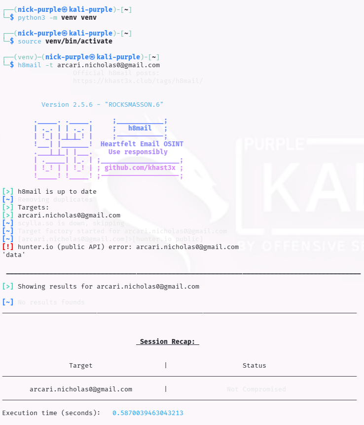

> [English](README.en.md) | **Italiano**

# OSINT Passive: Breach Data Analysis

> - **Fase:** Reconnaissance - Passive Information Gathering
> - **Visibilita:** Zero - nessun pacchetto inviato al target, ricerca su database pubblici di terze parti
> - **Prerequisiti:** Email o dominio target, account HaveIBeenPwned, Python 3 per h8mail
> - **Output:** OSINT-001 - Identificazione credenziali compromesse associate al target in data breach pubblici

---

Obiettivo: Identificare credenziali compromesse (Email/Password) esposte in data breach pubblici per valutare il rischio di Credential Reuse.

Strumenti: h8mail, HaveIBeenPwned (HIBP).

---

## 1 Introduzione Teorica

I Breach Data sono collezioni di informazioni riservate (credenziali, PII) esfiltrate durante attacchi informatici e rese pubbliche.

Per un Red Team, l'analisi di questi dati è fondamentale per il Credential Stuffing: gli utenti tendono a riutilizzare la stessa password su più servizi. Se un attaccante trova una password di un dipendente in un vecchio leak di LinkedIn, potrebbe tentare di usarla per accedere alla VPN aziendale.

Concetti Chiave:

- Combo List: Liste di `email:password` pronte per l'uso in attacchi automatici.
- Hash: La password spesso non è leggibile (es. `5e884898da28...`), ma se è un hash comune (es. MD5) può essere "craccata" (riportata in chiaro).

---

## 2 Attività di Ricerca (Esercizio Pratico)

**ID Finding:** `OSINT-001` | **Severity:** `Alto`

È stata effettuata una verifica su un target campione per identificare l'esposizione in incidenti di sicurezza noti.

### Scansione con h8mail

Lo strumento `h8mail` interroga servizi di OSINT e Breach Data per trovare corrispondenze.

```Bash
python3 -m venv venv
source venv/bin/activate
pip3 install h8mail
h8mail -t <TARGET_EMAIL>
```



```Bash
deactivate                  # eseguire quando si è finito
```

### Scansione manuale con HaveIBeenPwned

Per la validazione dei risultati, è stata effettuata una ricerca manuale tramite il portale web ufficiale di HIBP, fonte autorevole per i data breach.

- Accesso al portale: `https://haveibeenpwned.com/`
- Input del target: `<TARGET_EMAIL>`
- Verifica dei risultati.

---

## 3 Approfondimento Tecnico: Digital Footprint vs Breach

1. Differenza Concettuale

|Tipologia|Descrizione|Esempio|Strumenti|
|-------|-------------|---------|--------|
|Digital footprint|Indica che l'utente esiste e opera online. Non implica necessariamente un rischio di sicurezza, ma fornisce informazioni per il Social Engineering|Profilo LinkedIn, Commit su GitHub, Recensioni Amazon|Google Dorks, Sherlock, TheHarvester|
|Brench Data|Indica che i dati dell'utente sono stati RUBATI e resi pubblici illegalmente. Comporta un rischio critico immediato|Password presente in un dump di database (es. LinkedIn 2012 leak)|h8mail, HaveIBeenPwned, Intelligence X|

2. Differenze Metodologiche

La discrepanza tra i risultati ottenuti via web e via riga di comando (CLI) è dovuta al metodo di accesso ai dati:

- Have I Been Pwned (Sito Web): È la fonte originale ("Source of Truth"). Interroga direttamente il database "Master" gestito dai manutentori. È sempre aggiornato e gratuito per la consultazione manuale.
- h8mail (Tool CLI): Funziona come un "connettore" o aggregatore. Non possiede i dati, ma interroga servizi terzi tramite API.
    - Limitazione: Per interrogare il database HIBP tramite script, è necessaria una Chiave API a pagamento.
    - Fallback: In assenza di chiavi, il tool tenta di usare motori gratuiti (es. scylla.so), che possono essere offline o incompleti, portando a falsi negativi.

---

## 4 Analisi Critica: Limiti degli Strumenti Automatizzati

Durante l'attività è stata riscontrata una discrepanza significativa tra i risultati degli strumenti:

1. Tool Automatico (`h8mail`): Ha restituito 0 risultati (Falso Negativo).
    - Causa: Il motore di ricerca gratuito integrato (`scylla.so`) era offline durante il test e non erano configurate le API Key proprietarie.
2. Verifica Manuale (HIBP Web): Ha confermato che l'email è presente in database di breach.

Lezione Appresa:

Gli strumenti di OSINT automatici dipendono dalla disponibilità delle fonti esterne (API). Un risultato "Not Compromised" da un tool da riga di comando non garantisce la sicurezza. È fondamentale eseguire una Cross-Validation manuale sulle fonti autoritarie (Source of Truth) come il portale web di Have I Been Pwned.

---

## Analisi a Basso Livello: Meccanica del Credential Stuffing e Formato Hash nei Breach

Il Credential Stuffing si distingue dal Brute Force per un aspetto fondamentale: l'attaccante non genera combinazioni casuali, ma utilizza coppie `email:password` gia validate in un breach precedente. Il tasso di successo medio e compreso tra l'1% e il 3% (fonte: Akamai State of the Internet Report 2024) - un valore apparentemente basso che diventa devastante quando applicato a milioni di credenziali.

**Pipeline operativa di un attacco Credential Stuffing:**

```
Breach Database (Collection #1-5, LinkedIn 2012, Adobe 2013)
        |
        v
Parsing e deduplicazione -> combo list (email:password)
        |
        v
Proxy rotation (residential proxies per evasione rate limiting)
        |
        v
Tool automatizzato (OpenBullet, SentryMBA, custom Python con requests)
        |
        v
Login attempt su portali esposti (VPN, OWA, SSO, SaaS)
        |
        v
Successo 1-3% -> account takeover -> lateral movement
```

**Formato degli hash nei breach database:**

I dati nei breach non sono sempre in chiaro. La crackabilita dipende dall'algoritmo utilizzato dall'applicazione compromessa:

| Formato | Esempio troncato | Crackabilita | Note |
| :--- | :--- | :--- | :--- |
| Plaintext | `password123` | Immediata | Nessun hashing (worst case) |
| MD5 unsalted | `482c811da5d5b4bc...` | Secondi | Rainbow table pre-computate disponibili |
| SHA-1 unsalted | `cbfdac6008f9cab4...` | Minuti | LinkedIn 2012 usava SHA-1 senza salt |
| bcrypt ($2a$) | `$2a$10$N9qo8uLO...` | Settimane-mesi | Memory-hard, resistente a GPU |
| Argon2id | `$argon2id$v=19$...` | Anni | Standard moderno, salt + pepper + memory cost |

I breach storici (LinkedIn 2012, Adobe 2013, Collection #1-5) contenevano hash MD5 o SHA-1 senza salt, oggi interamente pre-computati in rainbow table pubbliche. Le password recuperate sono immediatamente utilizzabili per Credential Stuffing senza alcun overhead computazionale.

**HaveIBeenPwned: k-Anonymity Model (RFC Privacy)**

HIBP protegge la privacy delle query tramite il modello k-Anonymity (Cloudflare Range API, introdotto nel 2018): il client calcola l'hash SHA-1 della password, invia solo i primi 5 caratteri (il prefisso) al server, e riceve in risposta tutti gli hash che condividono quel prefisso (tipicamente 400-600 risultati). Il confronto completo avviene localmente sul client, senza che HIBP possa ricostruire la password verificata. Questo modello e alla base delle integrazioni enterprise: Azure AD Password Protection (blocca password presenti in breach al momento del cambio), Chrome Password Checkup e 1Password Watchtower.

---

## Scenario Reale: Proiezione in un Engagement di Red Teaming

> Questa sezione descrive come OSINT-001 si inserirebbe in un engagement reale.

### Prospettiva Attaccante (Red Team)

**Punto di partenza:** email aziendale del target identificata tramite theHarvester/LinkedIn; analisi breach database rivela presenza in 3+ breach con password riutilizzata.

**Kill Chain proiettata:**

```
OSINT-001: h8mail/HIBP -> email in LinkedIn 2012 breach (hash SHA-1 senza salt)
        |
        v
Crack hash offline (hashcat -m 100) -> password "Azienda2019!"
        |
        v
Credential Stuffing su portali esposti:
  - OWA (Outlook Web Access) / Microsoft 365
  - VPN aziendale (Cisco AnyConnect / GlobalProtect)
  - SSO (Okta, Azure AD, Google Workspace)
        |
        v
Accesso VPN -> foothold nella rete interna (traffico legittimo, zero alert IDS)
        |
        v
Enumerazione AD (BloodHound) -> path verso Domain Admin
        |
        v
Compromissione totale dell'infrastruttura
```

**Impatto potenziale:** l'accesso VPN con credenziali valide e il vettore di Initial Access piu silenzioso disponibile: non genera alert IDS (traffico legittimo), non richiede exploit, non lascia artefatti forensi sul perimetro. Secondo il Verizon DBIR 2024, il 49% dei breach coinvolge credenziali compromesse come vettore iniziale.

**Vettori di monetizzazione tipici:**
- Business Email Compromise (BEC): accesso alla mailbox per frodi finanziarie (bonifici deviati verso conti controllati)
- Ransomware: VPN -> rete interna -> Domain Admin -> cifratura sistemi (100.000-5.000.000 USD di riscatto)
- Spear phishing interno: email legittime dall'account compromesso verso colleghi con allegati weaponized

### Prospettiva Difensore (Blue Team)

**Rilevamento:** il Credential Stuffing genera pattern rilevabili: login da IP/geolocalizzazione anomala, login simultanei da location incompatibili (impossible travel), volume anomalo di tentativi falliti seguiti da un successo.

**Indicatori di Compromissione (IOC):**
- Azure AD / Okta: sign-in da IP residenziale non aziendale con user-agent non standard
- Event ID 4624 (logon success) preceduto da multipli 4625 (logon failed) sullo stesso account
- VPN: connessione da IP geolocalizzato in paese diverso dalla sede operativa dell'utente
- Impossible travel: due login dallo stesso account da citta distanti in finestra temporale incompatibile

**Contenimento:** reset immediato della password compromessa; revoca sessioni attive; verifica regole di inoltro email (gli attaccanti configurano forwarding silente come persistenza); scan della mailbox per data exfiltration.

**Hardening strutturale:**
- Implementare MFA su tutti i portali esposti (VPN, OWA, SSO) - rende il credential stuffing inefficace anche con password valida
- Integrare Azure AD Password Protection con database HIBP per bloccare password presenti in breach noti
- Abilitare Conditional Access con policy di rischio (impossible travel, IP reputation, device compliance)
- Monitoring proattivo: HIBP Domain Search API per notifica automatica quando email aziendali compaiono in nuovi breach

---

## Esperienza di Laboratorio

L'esercizio ha evidenziato un aspetto critico dell'OSINT tooling che un analista deve interiorizzare: la dipendenza dalle fonti dati esterne. Il primo tentativo con h8mail ha restituito zero risultati - un falso negativo che in un engagement reale avrebbe potuto portare a sottovalutare il rischio di credential reuse per il target. La causa era banale (il motore gratuito scylla.so era offline al momento del test), ma la lezione e profonda: un tool di OSINT non e migliore delle API a cui si appoggia.

La verifica manuale su HIBP ha confermato la presenza dell'email target in breach noti, rendendo evidente la necessita di cross-validation sistematica: in un assessment professionale, il workflow corretto prevede almeno due fonti indipendenti prima di classificare un'email come "non compromessa". Questo pattern si applica a tutto l'OSINT - mai fidarsi di un singolo tool.

Un aspetto non ovvio emerso durante il laboratorio: h8mail supporta la configurazione di API key multiple (HIBP, LeakCheck, Intelligence X) tramite file di configurazione (`~/.h8mail/config.ini`). La versione gratuita senza API key e sostanzialmente un proof of concept - per utilizzo operativo reale e necessario investire nelle API a pagamento, che restituiscono risultati completi inclusi i nomi dei breach specifici e, in alcuni servizi, le password in chiaro o gli hash corrispondenti.

---

## Mappatura MITRE ATT&CK

| Tattica | Tecnica | ID MITRE | Descrizione dell'Azione |
| :--- | :--- | :--- | :--- |
| Reconnaissance | Gather Victim Identity Info: Credentials | `T1589.001` | Ricerca credenziali compromesse del target su h8mail e HaveIBeenPwned per valutare il rischio di Credential Reuse (OSINT-001) |

---

> **Nota:** Le attivita documentate in questa sezione sono state eseguite su un target campione a scopo di audit personale e formazione. Nessuna credenziale identificata in breach e stata utilizzata per tentare accessi non autorizzati a sistemi di terze parti.