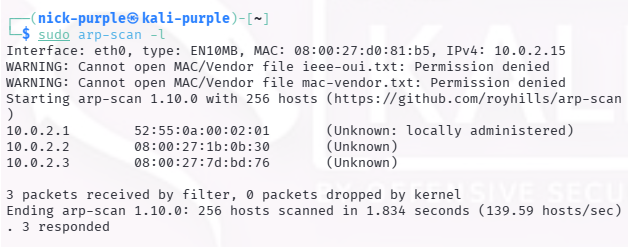
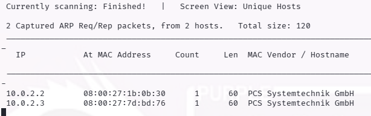

# Network Scanning Active: Live Host Discovery

Obiettivo: Mappatura dei nodi attivi (Live Hosts) all'interno della rete target per identificare la superficie di attacco interna.
Target: Rete Laboratorio (`10.0.2.0/24`)

Strumenti: `arp-scan`, `netdiscover`, `nmap`

---

## 1 Introduzione Teorica

Il Live Host Discovery è la fase preliminare del Network Scanning. Consiste nell'identificare quali indirizzi IP all'interno di un range di rete sono assegnati a dispositivi attivi.

Questa attività è fondamentale per:
- Ottimizzare i tempi: Evitare di scansionare porte su indirizzi IP inesistenti.
- Network Mapping: Creare una topologia della rete (Server, Client, Gateway).

### Differenza tra ARP e ICMP

- Scansione ARP (Layer 2): Utilizzata per reti locali (LAN). È estremamente affidabile poiché il protocollo ARP è essenziale per la comunicazione e raramente bloccato dai firewall locali.
- Scansione ICMP/Ping (Layer 3): Utilizzata per reti remote. Spesso soggetta a blocchi da parte di firewall (es. Windows Defender blocca le richieste Echo ICMP di default).

---

## 2 Esecuzione Tecnica

#### A. Scansione ARP (arp-scan)
È stato utilizzato `arp-scan` per una rilevazione rapida degli host nella sottorete locale. Questo metodo bypassa i firewall di livello OS.

Comando:

```bash
sudo apt install arp-scan
sudo arp-scan -l
```



Analisi: Sono stati rilevati [3] dispositivi, inclusa la macchina target Windows 10 (identificabile dal MAC Address o dall'IP noto).

#### B. Mappatura Attiva (Netdiscover)

È stato utilizzato netdiscover in modalità attiva per interrogare l'intero range di rete.

Comando:

```Bash
sudo apt install netdiscover
sudo netdiscover -r 10.0.2.0/24
```



Analisi: Il tool ha fornito una lista chiara di IP e relativi vendor MAC (es. Oracle VirtualBox).

#### C. Ping Sweep (Nmap)

È stata eseguita una scansione ICMP (Ping Sweep) per verificare la visibilità degli host tramite protocolli routabili.

Comando:

```Bash
nmap -sn 10.0.2.0/24
```


---

## 3 Conclusioni

L'attività di Live Host Discovery ha permesso di identificare con successo il target Windows 10 all'indirizzo IP 10.0.2.3. La comparazione tra ARP e ICMP ha confermato che, trovandosi nella stessa sottorete fisica, la scansione ARP risulta la più veloce e affidabile per l'enumerazione iniziale.