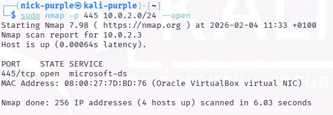
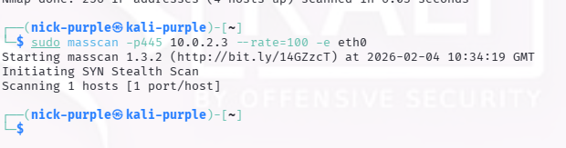

# Active Scanning: High-Speed Port Discovery (Masscan)

Obiettivo: Esecuzione di scansioni massive ad alta velocità per identificare rapidamente le porte aperte su ampi segmenti di rete, simulando uno scenario di "Large Scale Reconnaissance".
Target: Subnet Laboratorio (`10.0.2.0/24`)

Strumenti: `Masscan`

---

## 1. Introduzione Teorica

Masscan è uno scanner di porte TCP asincrono. A differenza degli scanner tradizionali, utilizza uno stack TCP/IP personalizzato che gli permette di inviare pacchetti (SYN packets) a una velocità limitata solo dalla larghezza di banda dell'hardware, senza attendere le risposte in modo sincrono.

Use Case: Questo strumento è ideale per la fase iniziale di Broad Scope Discovery (es. scansionare intere classi `/16` o `/8`), dove la velocità è prioritaria rispetto al dettaglio (Service Versioning).

---

## 2 Esecuzione Tecnica

#### Fase 1: Validazione del Target (Ground Truth)

È stata lanciata una scansione con Nmap per confermare la presenza di porte aperte sull'host target e stabilire una "verità di base".

```Bash
sudo nmap -p 445 10.0.2.0/24 --open
```



Analisi: L'host 10.0.2.3 è attivo e la porta 445 è confermata APERTA.

#### Fase 2: Test Alta Velocità (Masscan)

Successivamente, è stato testato Masscan sullo stesso target specifico per verificare la capacità di rilevamento asincrono.

```bash
sudo apt install masscan
sudo masscan -p445 10.0.2.3 --rate=100 -e eth0
```

- `--rate=100`: Limita l'invio a 100 pps (packets per second).
- `-p445`: Scansione mirata sulla porta nota aperta.



Analisi: Masscan ha completato la scansione senza rilevare la porta aperta (Falso Negativo).

---

## 3 Analisi Critica: Limitazioni in Ambiente Virtuale

Il test ha evidenziato una differenza sostanziale di comportamento dovuta all'architettura di rete del laboratorio (VirtualBox NAT Network).

| Feature | Nmap | Masscan |
|---------|------|---------|
| Tecnologia | Sincrono / Stateful | Asincrono / Stateless|
| | Usa le `syscall` del Kernel Linux standard | Usa Raw Sockets e bypassa il Kernel (stack custom) |
| Gestione NAT | Ottima. Il sistema operativo gestisce il tracciamento delle connessioni e il NAT traversal | Critica. I pacchetti di risposta (SYN-ACK) spesso non vengono instradati correttamente dall'interfaccia virtuale verso il processo Masscan |
| Risultato | Porta rilevata (open) | Falso negativo (closed/filtered) |

Lezione Appresa: In scenari reali, Masscan è imbattibile per velocità su reti fisiche dirette. Tuttavia, in ambienti virtualizzati o dietro NAT complessi, il suo stack personalizzato può perdere pacchetti di ritorno. È fondamentale eseguire sempre una Cross-Validation con Nmap quando i risultati di Masscan sono negativi su target sospetti.

---

## 4 Considerazioni OpSec

A prescindere dal risultato tecnico nel laboratorio, l'utilizzo di Masscan in un Red Team Engagement reale richiede cautela:

- Rumorosità: La natura aggressiva dei pacchetti generati (anche a bassi rate) crea un pattern di traffico anomalo facilmente rilevabile da IDS/IPS.
- Saturazione: Un rate errato (es. `--rate=100000`) su hardware domestico può causare un Denial of Service (DoS) involontario sui router intermedi.