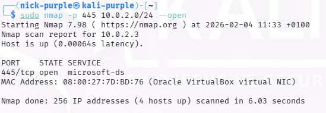
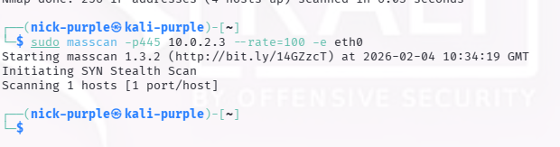

> [English](README.en.md) | **Italiano**

# Active Scanning: High-Speed Port Discovery (Masscan)

> - **Fase:** Reconnaissance - Active Network Scanning
> - **Visibilita:** Alta - SYN flood verso il target, pattern di traffico anomalo facilmente rilevabile da IDS/IPS
> - **Prerequisiti:** Masscan installato, accesso root, interfaccia di rete fisica (limitazioni in ambienti NAT virtualizzati)
> - **Output:** SCAN-002 - Porte TCP aperte sul target; in questo lab: falso negativo documentato in ambiente VirtualBox NAT

---

Obiettivo: Esecuzione di scansioni massive ad alta velocità per identificare rapidamente le porte aperte su ampi segmenti di rete, simulando uno scenario di "Large Scale Reconnaissance".
Target: Subnet Laboratorio (`10.0.2.0/24`)

Strumenti: `Masscan`

---

## 1. Introduzione Teorica

Masscan è uno scanner di porte TCP asincrono. A differenza degli scanner tradizionali, utilizza uno stack TCP/IP personalizzato che gli permette di inviare pacchetti (SYN packets) a una velocità limitata solo dalla larghezza di banda dell'hardware, senza attendere le risposte in modo sincrono.

Use Case: Questo strumento è ideale per la fase iniziale di Broad Scope Discovery (es. scansionare intere classi `/16` o `/8`), dove la velocità è prioritaria rispetto al dettaglio (Service Versioning).

---

## 2 Esecuzione Tecnica

**ID Finding:** `SCAN-002` | **Severity:** `Informativo`

#### Fase 1: Validazione del Target (Ground Truth)

È stata lanciata una scansione con Nmap per confermare la presenza di porte aperte sull'host target e stabilire una "verità di base".

```Bash
sudo nmap -p 445 10.0.2.0/24 --open
```



Analisi: L'host 10.0.2.3 è attivo e la porta 445 è confermata APERTA.

#### Fase 2: Test Alta Velocità (Masscan)

Successivamente, è stato testato Masscan sullo stesso target specifico per verificare la capacità di rilevamento asincrono.

```Bash
sudo apt install masscan
sudo masscan -p445 10.0.2.3 --rate=100 -e eth0
```

- `--rate=100`: Limita l'invio a 100 pps (packets per second).
- `-p445`: Scansione mirata sulla porta nota aperta.



Analisi: Masscan ha completato la scansione senza rilevare la porta aperta (Falso Negativo).

---

## 3 Analisi Critica: Limitazioni in Ambiente Virtuale

Il test ha evidenziato una differenza sostanziale di comportamento dovuta all'architettura di rete del laboratorio (VirtualBox NAT Network).

| Feature | Nmap | Masscan |
|---------|------|---------|
| Tecnologia | Sincrono / Stateful | Asincrono / Stateless|
| | Usa le `syscall` del Kernel Linux standard | Usa Raw Sockets e bypassa il Kernel (stack custom) |
| Gestione NAT | Ottima. Il sistema operativo gestisce il tracciamento delle connessioni e il NAT traversal | Critica. I pacchetti di risposta (SYN-ACK) spesso non vengono instradati correttamente dall'interfaccia virtuale verso il processo Masscan |
| Risultato | Porta rilevata (open) | Falso negativo (closed/filtered) |

Lezione Appresa: In scenari reali, Masscan è imbattibile per velocità su reti fisiche dirette. Tuttavia, in ambienti virtualizzati o dietro NAT complessi, il suo stack personalizzato può perdere pacchetti di ritorno. È fondamentale eseguire sempre una Cross-Validation con Nmap quando i risultati di Masscan sono negativi su target sospetti.

---

## 4 Considerazioni OpSec

A prescindere dal risultato tecnico nel laboratorio, l'utilizzo di Masscan in un Red Team Engagement reale richiede cautela:

- Rumorosità: La natura aggressiva dei pacchetti generati (anche a bassi rate) crea un pattern di traffico anomalo facilmente rilevabile da IDS/IPS.
- Saturazione: Un rate errato (es. `--rate=100000`) su hardware domestico può causare un Denial of Service (DoS) involontario sui router intermedi.

---

## Analisi a Basso Livello: Stack TCP Stateless di Masscan

### Architettura Asincrona

La differenza fondamentale tra Nmap e Masscan risiede nella gestione dello stato TCP. Nmap utilizza le syscall del kernel (`connect()`, `send()`, `recv()`) che mantengono lo stato di ogni connessione nella tabella conntrack del kernel. Masscan bypassa completamente il kernel TCP/IP: costruisce i pacchetti SYN a livello raw (libpcap) e li inietta direttamente sull'interfaccia di rete.

```
Nmap (Stateful):                    Masscan (Stateless):
Applicazione                        Applicazione
    |                                   |
    v                                   v
Kernel TCP stack                    Raw socket (libpcap)
    |                                   |
    v                                   v
conntrack table (stato per conn)    Nessuna tabella di stato
    |                                   |
    v                                   v
NIC driver -> wire                  NIC driver -> wire

Risposta SYN-ACK:                   Risposta SYN-ACK:
Kernel la associa alla conn         Masscan la intercetta via pcap
-> passata all'applicazione         -> decode manuale del pacchetto
                                    -> verifica cookie nel seq number
```

Masscan codifica l'IP di destinazione nel sequence number del SYN in uscita (SYN cookie techinque). Quando riceve un SYN-ACK, verifica che l'acknowledgment number corrisponda al cookie atteso - questo gli permette di correlare le risposte senza mantenere stato. Questo approccio scala linearmente: 1 milione di pacchetti al secondo richiedono la stessa quantita di RAM di 100 pacchetti al secondo.

### Perche il NAT di VirtualBox Rompe Masscan

Il NAT engine di VirtualBox opera a livello applicativo: intercetta i pacchetti in uscita dalla VM, li de-encapsula, e li re-encapsula con l'IP dell'host. Per i pacchetti gestiti dal kernel (Nmap), il NAT engine traccia correttamente la connessione tramite conntrack. Per i pacchetti raw di Masscan, il NAT engine non ha stato associato da correlare: quando il SYN-ACK arriva dall'esterno, VirtualBox non sa a quale processo nella VM inoltrarlo e lo droppa silenziosamente.

La soluzione in ambiente di laboratorio: utilizzare la modalita bridge (Bridged Adapter) invece di NAT, dove la VM ha un indirizzo IP reale sulla rete fisica e Masscan puo operare senza intermediari.

---

## Blue Team: Rilevamento delle Scansioni ad Alta Velocita

**Detection:**
- Masscan (e tool simili come ZMap) generano un volume anomalo di SYN verso porte diverse in finestra temporale ridotta. Regole IDS basate su threshold (es. Suricata: `alert tcp any any -> $HOME_NET any (msg:"Port scan - SYN flood"; flags:S; threshold: type both, track by_src, count 100, seconds 10; sid:1000001;)`) rilevano efficacemente questo pattern.
- L'assenza di handshake completo (solo SYN, mai ACK finale) genera un pattern di "half-open connections" anomalo nei log del firewall
- Il User-Agent di Masscan nella banner richieste HTTP e identificabile; tuttavia nella fase di SYN scan non c'e interazione applicativa

**Hardening:**
- Implementare SYN rate limiting a livello di firewall perimetrale (es. `iptables -A INPUT -p tcp --syn -m limit --limit 50/s -j ACCEPT`)
- Abilitare SYN cookies sul server target (`net.ipv4.tcp_syncookies = 1`) per mitigare l'impatto delle scansioni SYN massive
- Segmentare i servizi critici dietro firewall interni che limitano l'accesso alle sole porte necessarie

---

## Esperienza di Laboratorio

Il valore didattico principale di questo esercizio non e stato l'uso di Masscan in se, ma la comprensione del perche ha fallito. Il falso negativo in ambiente NAT ha forzato un'analisi del funzionamento interno dello stack di rete che non sarebbe emersa da un semplice "scan riuscito". La comparazione diretta con Nmap sullo stesso target (porta 445 confermata aperta) ha reso evidente che il problema non era nel target ma nel percorso di rete.

La lezione operativa e che Masscan richiede un percorso di rete "pulito" tra l'attaccante e il target - qualsiasi dispositivo intermedio che manipola i pacchetti (NAT, proxy trasparente, load balancer) puo causare falsi negativi. In un engagement reale, se Masscan restituisce zero risultati su un range che si sa essere popolato, il primo troubleshooting e verificare la topologia di rete, non il tool.

Un dettaglio tecnico emerso dalla documentazione di Masscan: il parametro `--rate=100` invia 100 pacchetti al secondo, che su una /24 (254 host) con una singola porta corrisponde a una scansione completa in circa 2.5 secondi. Su una /16 (65.534 host) con le top 1000 porte, il tempo sale a ~7 minuti a rate 100 pps. In un assessment reale con hardware dedicato e connessione gigabit, rate di 100.000-1.000.000 pps sono comuni, permettendo di scansionare l'intero Internet IPv4 in meno di 6 minuti (come dimostrato dal progetto ZMap).

---

## Mappatura MITRE ATT&CK

| Tattica | Tecnica | ID MITRE | Descrizione dell'Azione |
| :--- | :--- | :--- | :--- |
| Discovery | Network Service Discovery | `T1046` | Port discovery asincrono ad alta velocita con Masscan su subnet 10.0.2.0/24, documentando il comportamento in ambiente NAT virtualizzato (SCAN-002) |

---

> **Nota:** Le attivita di port scanning con Masscan sono state eseguite esclusivamente all'interno di un laboratorio VirtualBox isolato. Il rate utilizzato (100 pps) e stato scelto per minimizzare l'impatto sulla rete di test. In ambienti reali, Masscan richiede autorizzazione esplicita e calibrazione del rate in base alla larghezza di banda disponibile.