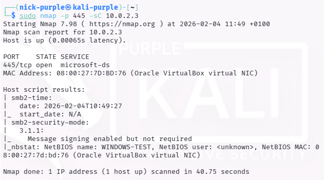

# Active Scanning: Nmap Scripting Engine (NSE)

Obiettivo: Utilizzo di script avanzati per l'enumerazione dei servizi e la rilevazione di vulnerabilità di configurazione.

---

## 1 Introduzione Teorica

L'Nmap Scripting Engine (NSE) permette di automatizzare l'interazione con i servizi per estrarre informazioni che il semplice port scanning non rivela.

In particolare, gli script di default (`-sC`) eseguono una batteria di test sicuri per identificare nomi NetBIOS, orari di sistema e configurazioni di sicurezza del protocollo SMB.

---

## 2 Esecuzione Tecnica

Default Scripts & Security Mode

È stata eseguita una scansione completa utilizzando gli script di default (`-sC`) combinati con la verifica della modalità di sicurezza SMB2.

```bash
sudo nmap -p 445 -sC 10.0.2.3
```



---

## 3 Analisi dei Risultati

Dall'output dello script sono emersi due dati fondamentali per la fase di Enumeration:

#### A. Information Disclosure (NetBIOS)

- Dato Rilevato: `NetBIOS name: WINDOWS-TEST`
- Significato: Nonostante il blocco di `smb-os-discovery`, il servizio NetBIOS ha rivelato il nome host della macchina. Questo permette di identificare la macchina all'interno di un dominio o workgroup.

#### B. Vulnerabilità di Configurazione (SMB Signing)

- Dato Rilevato: `Message signing enabled but not required`
- Significato: Il target supporta la firma digitale dei pacchetti SMB ma non la impone.
- Impatto di Sicurezza (Red Team): Questa configurazione espone la rete ad attacchi di tipo SMB Relay (Man-in-the-Middle). Un attaccante posizionato nella stessa rete locale potrebbe intercettare un tentativo di autenticazione verso questo server e "rilanciarlo" verso un altro host per ottenere accesso non autorizzato.

---

## 4 Remediation (Blue Team)

Per mitigare il rischio di SMB Relay:

- Impostare la policy di gruppo (GPO) "Microsoft network server: Digitally sign communications (always)" su Enabled.
- Disabilitare NetBIOS se non strettamente necessario per ridurre la visibilità del nome host.