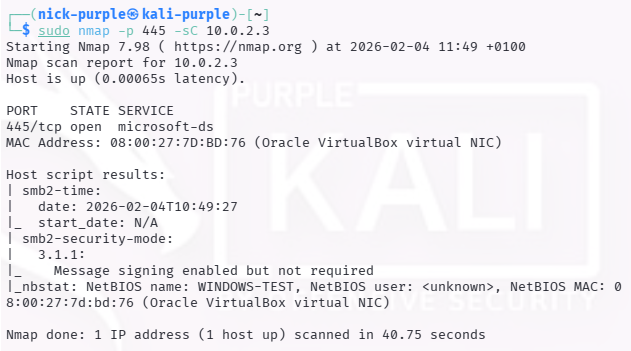

# Active Scanning: Nmap Scripting Engine (NSE)

> - **Fase:** Reconnaissance - Active Network Scanning
> - **Visibilita:** Media - gli script NSE generano traffico identificabile (richieste SMB, NetBIOS, banner grabbing) rilevabile da IDS
> - **Prerequisiti:** Nmap installato, porte target identificate da scansione precedente (SCAN-001/SCAN-002), accesso root
> - **Output:** SCAN-003 - SMB Signing non obbligatorio (vettore SMB Relay) e NetBIOS name disclosure su 10.0.2.3

---

Obiettivo: Utilizzo di script avanzati per l'enumerazione dei servizi e la rilevazione di vulnerabilità di configurazione.

---

## 1 Introduzione Teorica

L'Nmap Scripting Engine (NSE) permette di automatizzare l'interazione con i servizi per estrarre informazioni che il semplice port scanning non rivela.

In particolare, gli script di default (`-sC`) eseguono una batteria di test sicuri per identificare nomi NetBIOS, orari di sistema e configurazioni di sicurezza del protocollo SMB.

---

## 2 Esecuzione Tecnica

Default Scripts & Security Mode

È stata eseguita una scansione completa utilizzando gli script di default (`-sC`) combinati con la verifica della modalità di sicurezza SMB2.

```Bash
sudo nmap -p 445 -sC 10.0.2.3
```



---

## 3 Analisi dei Risultati

**ID Finding:** `SCAN-003` | **Severity:** `Alto`

Dall'output dello script sono emersi due dati fondamentali per la fase di Enumeration:

#### A. Information Disclosure (NetBIOS)

- Dato Rilevato: `NetBIOS name: WINDOWS-TEST`
- Significato: Nonostante il blocco di `smb-os-discovery`, il servizio NetBIOS ha rivelato il nome host della macchina. Questo permette di identificare la macchina all'interno di un dominio o workgroup.

#### B. Vulnerabilità di Configurazione (SMB Signing)

- Dato Rilevato: `Message signing enabled but not required`
- Significato: Il target supporta la firma digitale dei pacchetti SMB ma non la impone.
- Impatto di Sicurezza (Red Team): Questa configurazione espone la rete ad attacchi di tipo SMB Relay (Man-in-the-Middle). Un attaccante posizionato nella stessa rete locale potrebbe intercettare un tentativo di autenticazione verso questo server e "rilanciarlo" verso un altro host per ottenere accesso non autorizzato.

---

## 4 Remediation (Blue Team)

Per mitigare il rischio di SMB Relay:

- Impostare la policy di gruppo (GPO) "Microsoft network server: Digitally sign communications (always)" su Enabled.
- Disabilitare NetBIOS se non strettamente necessario per ridurre la visibilità del nome host.

---

## Mappatura MITRE ATT&CK

| Tattica | Tecnica | ID MITRE | Descrizione dell'Azione |
| :--- | :--- | :--- | :--- |
| Discovery | Network Service Discovery | `T1046` | Scansione NSE con script default (-sC) su porta 445 del target 10.0.2.3 per identificare configurazioni SMB e servizi esposti (SCAN-003) |
| Reconnaissance | Gather Victim Host Info: Software | `T1592.002` | Enumerazione versione protocollo SMB2 e configurazione Message Signing tramite script smb2-security-mode (SCAN-003) |

---

---

## Correlazioni con altri finding

Il finding SCAN-003 (SMB Signing not required) e il punto di partenza di una catena di attacco documentata nel laboratorio:

| Questo finding | Porta a | Modulo |
| :--- | :--- | :--- |
| SCAN-003 - SMB Signing disabled | [VULN-001](<../../../../02-vulnerability-assessment/01-general-scanners (Infrastructure)/nessus/README.md>) - Conferma via Nessus credentialed | 02-vuln-assessment |
| SCAN-003 - NetBIOS exposure | [VULN-003](<../../../../02-vulnerability-assessment/02-protocol-specific-audit/smb-net-bios/README.md>) - NetBIOS Name Disclosure | 02-vuln-assessment |
| SCAN-003 - Credenziali nick/1234 | [VULN-004](<../../../../02-vulnerability-assessment/02-protocol-specific-audit/smb-net-bios/README.md>) - Accesso C$ con credenziali standard | 02-vuln-assessment |
| VULN-001 + VULN-004 (catena) | [EXPLOIT-018](<../../../../04-system-exploitation/03-privilege-escalation (PrivEsc)/windows-priv-esc/winpeas/README.md>) - Pass-the-Hash lateral movement | 04-exploitation |

> **Nota:** Le attivita di enumeration con Nmap NSE sono state eseguite esclusivamente all'interno di un laboratorio VirtualBox isolato con target Windows 10 autorizzato (10.0.2.3). La misconfiguration SMB Signing documentata e stata rilevata a scopo di analisi e documentazione della superficie di attacco.