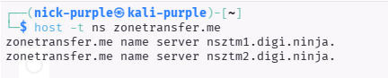
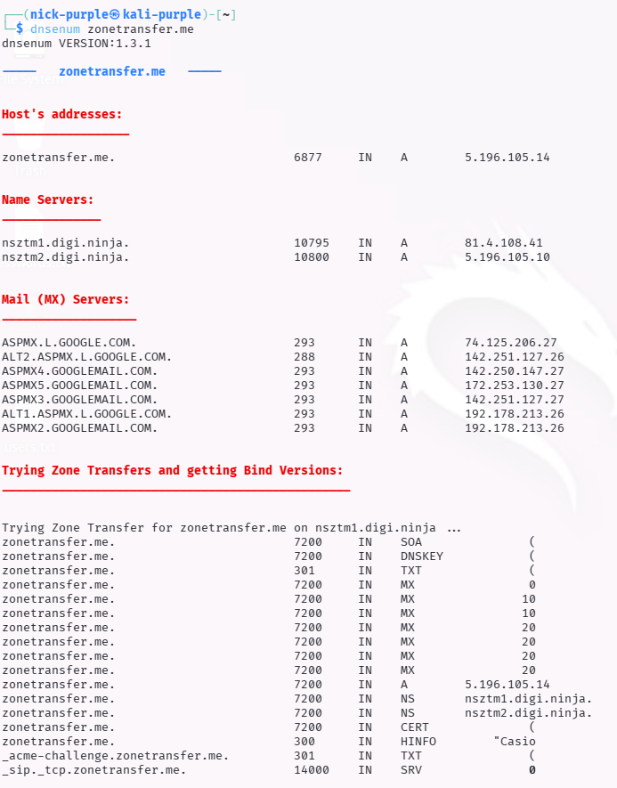
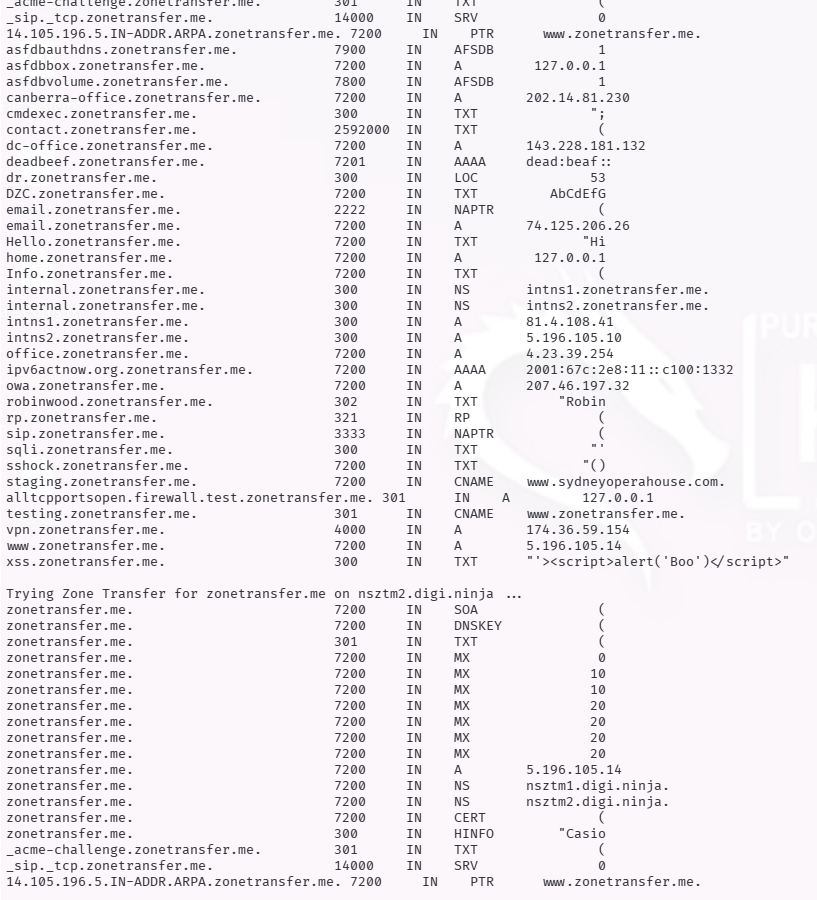
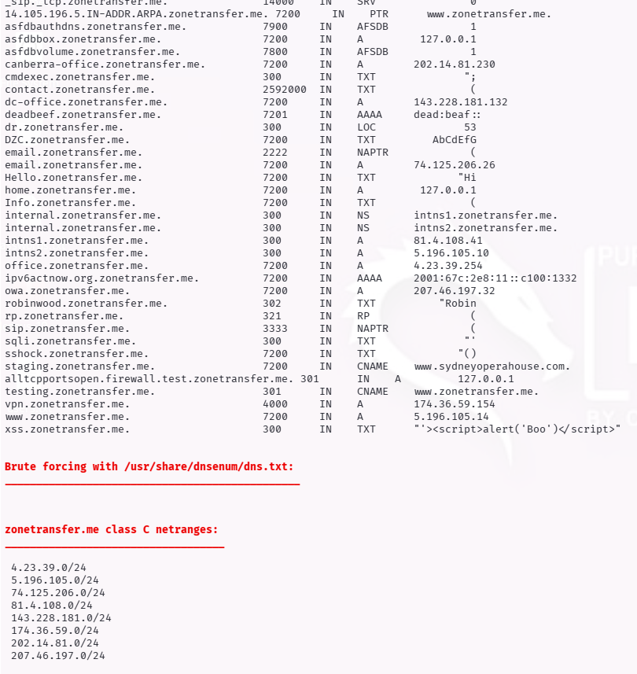

# Network Scanning: DNS Enumeration & Zone Transfers

Obiettivo: Mappare l'infrastruttura del dominio target identificando sottodomini, server di posta e tentare l'esfiltrazione dell'intera zona DNS (Zone Transfer).

Target Didattico: `zonetransfer.me` (Servizio di DigiNinja per test autorizzati)

Strumenti: `dig`, `host`, `dnsenum`

---

## 1 Introduzione Teorica

Il DNS (Domain Name System) opera tipicamente sulla porta 53 (UDP/TCP).

La DNS Enumeration è una tecnica che mira a individuare tutti i record associati a un dominio per espandere la superficie di attacco.

Cos'è un Zone Transfer (AXFR)?

È un meccanismo di replica del database DNS tra server primari e secondari. Se mal configurato (autorizzando richieste da qualsiasi IP), permette a un attaccante di scaricare l'intero elenco dei sottodomini e IP dell'organizzazione.

---

## 2 Esecuzione Tecnica

#### A. Identificazione dei Name Server (NS)

Prima di attaccare, bisogna sapere "chi" gestisce il DNS del target.

Comando:

```bash
host -t ns zonetransfer.me
```



Analisi: Identificati i server nsztm1.digi.ninja e nsztm2.digi.ninja.

#### B. Esecuzione del Zone Transfer (Attack)

Utilizzando il tool dig, interroghiamo il Name Server identificato chiedendo una copia completa della zona (axfr).

Comando:

```Bash
dig axfr @nsztm1.digi.ninja zonetransfer.me
```


- `@nsztm1.digi.ninja`: Il server DNS a cui stiamo chiedendo i dati.
- `axfr`: La richiesta di trasferimento zona.

Analisi dei Dati Estratti: Dal dump sono emersi sottodomini critici solitamente nascosti:

- `vpn.zonetransfer.me` (Accesso remoto)
- `dev.zonetransfer.me` (Ambiente di sviluppo)
- `office.zonetransfer.me` (Rete interna)
- Commenti nei record TXT che rivelano dettagli interni.

#### C. Automazione con DNSenum

Per velocizzare il processo, si utilizza dnsenum che combina query Google, Brute Force e Zone Transfer in un unico comando.

Comando:

```Bash
sudo apt install dnsenum -y
dnsenum zonetransfer.me
```





---

## 3 Conclusioni e Remediation

L'attacco ha avuto successo confermando una Critical Misconfiguration. L'esposizione completa della zona DNS annulla la "Security by Obscurity", fornendo all'attaccante la topologia completa della rete.

Remediation (Blue Team): Configurare il server DNS (es. BIND9 o Windows DNS) per consentire il Zone Transfer solamente agli indirizzi IP dei propri server DNS secondari (Allow-Transfer list), bloccando tutte le altre richieste.