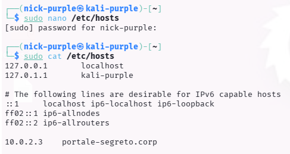
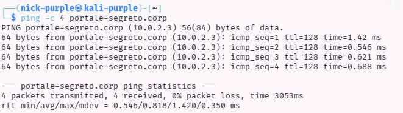

> **English** | [Italiano](README.md)

# DNS Enumeration: Local Hosts File Manipulation

> - **Phase:** Reconnaissance - DNS Enumeration
> - **Visibility:** Zero - the modification is local to the analyst's machine, no traffic generated towards external DNS
> - **Prerequisites:** Target server IP known, Virtual Host name to test (from subdomain-finding or other sources), root access to modify /etc/hosts
> - **Output:** DNS-002 - Virtual Host not published in public DNS but reachable through local manipulation

---

Objective: Force local DNS resolution to access non-indexed Virtual Hosts (VHosts) or hidden development environments.

---

## 1 Theoretical Introduction

The `/etc/hosts` file (or `hosts` on Windows) acts as a local name resolution mechanism, with priority over external DNS servers.

Virtual Hosting:

Many web servers (Apache/Nginx) host multiple websites on the same IP address. The server decides which site to show based on the `Host:` header of the HTTP request.
If a subdomain (e.g., `dev.target.com`) is not registered in public DNS but is configured on the server, the only way for an attacker to view it is to manually map the IP to the domain name in their `/etc/hosts` file.

---

## 2 Technical Execution

**Finding ID:** `DNS-002` | **Severity:** `Medium`

#### A. Resolution Verification (Before modification)

Connection attempt to the target domain before local manipulation.

Command:
```Bash
ping -c 4 portale-segreto.corp
```

Result: ping: portale-segreto.corp: Name or service not known

Analysis: The domain does not exist in public DNS.

#### B. Hosts File Injection

Modification of the local configuration file to forcefully associate the domain to the target IP.

Command:

```Bash
sudo nano /etc/hosts
# Added the line:
# 10.0.2.3    portale-segreto.corp
```



#### C. Verification and Access (After modification)

Verification of target reachability through the spoofed domain name.

Command:

```Bash
ping -c 3 portale-segreto.corp
```



Analysis: The system correctly resolves the domain to IP 10.0.2.3. It is now possible to launch attacks (Nmap, Nikto, Burp Suite) directly against portale-segreto.corp to test the Virtual Host's specific responses.

---

## 3 Conclusions

This technique is essential in Web Application Penetration Testing and CTF phases, where targets are often hidden behind unpublished Virtual Hosts. Hosts file manipulation allows interacting with the resource as if it were a legitimate domain.

---

## 4 Future Developments

To complete the SMB service analysis and simulate a more advanced attack scenario, the next planned steps are:

- Authenticated Enumeration (Grey Box Testing):

    Re-run `enum4linux` providing valid credentials (simulated or obtained through Brute Force) to fully map users, groups and Password Policy, comparing the output with the anonymous scan.

- Modern Tool Usage (NetExec / SMBMap):

    Test next-generation tools such as NetExec (formerly CrackMapExec) or SMBMap, which are industry standards for fast enumeration on large Active Directory networks.

- Password Spraying & Brute Force:

    Use tools like Hydra or Metasploit against port 445 to attempt credential guessing, based on the user list (if obtained) or common dictionaries.

- Targeted Vulnerability Scanning:

    Specifically verify the presence of critical historical vulnerabilities (e.g., MS17-010 EternalBlue or SMBGhost) using specific NSE scripts or vulnerability scanners.

The theory (and a brief practical guide) is available at this path: `cybersecurity-labs/02-vulnerability-assessment/02-protocol-specific-audit/smb-net-bios/README.md`

---

## MITRE ATT&CK Mapping

| Tactic | Technique | MITRE ID | Action Description |
| :--- | :--- | :--- | :--- |
| Defense Evasion | Modify Authentication Process | `T1556` | Manipulation of the /etc/hosts file to force resolution of names not registered in public DNS towards the target IP, bypassing external resolvers (DNS-002) |

---

> **Note:** The /etc/hosts file manipulation technique was applied exclusively within the VirtualBox lab on an authorized target (10.0.2.3). This technique does not alter public DNS and has no effects outside the analyst's local machine.
