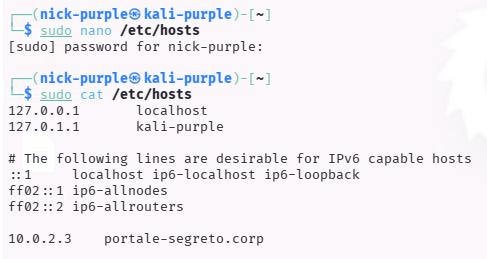
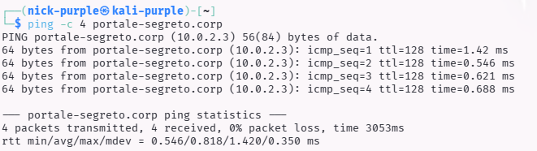

# DNS Enumeration: Local Hosts File Manipulation

Obiettivo: Forzare la risoluzione DNS locale per accedere a Virtual Hosts (VHosts) non indicizzati o ambienti di sviluppo nascosti.

---

## 1 Introduzione Teorica

Il file `/etc/hosts` (o `hosts` su Windows) funge da meccanismo di risoluzione dei nomi locale, con priorità rispetto ai server DNS esterni.

Virtual Hosting:

Molti server web (Apache/Nginx) ospitano più siti web sullo stesso indirizzo IP. Il server decide quale sito mostrare basandosi sull'header `Host:` della richiesta HTTP.
Se un sottodominio (es. `dev.target.com`) non è registrato nel DNS pubblico ma è configurato sul server, l'unico modo per un attaccante di visualizzarlo è mappare manualmente l'IP al nome di dominio nel proprio file `/etc/hosts`.

---

## 2 Esecuzione Tecnica

#### A. Verifica della Risoluzione (Prima della modifica)

Tentativo di connessione al dominio target prima della manipolazione locale.

Comando:
```bash
ping -c 4 portale-segreto.corp
```

Risultato: ping: portale-segreto.corp: Name or service not known

Analisi: Il dominio non esiste nei DNS pubblici.

#### B. Hosts File Injection

Modifica del file di configurazione locale per associare forzatamente il dominio all'IP del target.

Comando:

```Bash
sudo nano /etc/hosts
# Aggiunta la riga:
# 10.0.2.3    portale-segreto.corp
```



#### C. Verifica e Accesso (Dopo la modifica)

Verifica della raggiungibilità del target tramite il nome a dominio spoofato.

Comando:

```Bash
ping -c 3 portale-segreto.corp
```



Analisi: Il sistema risolve correttamente il dominio verso l'IP 10.0.2.3. Ora è possibile lanciare attacchi (Nmap, Nikto, Burp Suite) direttamente contro portale-segreto.corp per testare le risposte specifiche del Virtual Host.

---

## 3 Conclusioni

Questa tecnica è essenziale nelle fasi di Web Application Penetration Testing e CTF, dove spesso i target sono nascosti dietro Virtual Host non pubblicati. La manipolazione del file hosts permette di interagire con la risorsa come se fosse un dominio legittimo.

---

## 4 Sviluppi futuri

Per completare l'analisi del servizio SMB e simulare uno scenario di attacco più avanzato, i prossimi passi previsti sono:

- Authenticated Enumeration (Grey Box Testing):
    
    Eseguire nuovamente `enum4linux` fornendo credenziali valide (simulate o ottenute tramite Brute Force) per mappare completamente utenti, gruppi e Password Policy, confrontando l'output con la scansione anonima.

- Utilizzo di Tool Moderni (NetExec / SMBMap):
    
    Testare strumenti di nuova generazione come NetExec (ex CrackMapExec) o SMBMap, che sono standard industriali per l'enumerazione veloce su grandi reti Active Directory.

- Password Spraying & Brute Force:
    
    Utilizzare strumenti come Hydra o Metasploit contro la porta 445 per tentare di indovinare le credenziali di accesso, basandosi sulla lista utenti (se ottenuta) o su dizionari comuni.

- Vulnerability Scanning Mirato:
    
    Verificare specificamente la presenza di vulnerabilità critiche storiche (es. MS17-010 EternalBlue o SMBGhost) utilizzando script NSE specifici o scanner di vulnerabilità.

La teoria (e una breve guida pratica) è presente in questo path: `cybersecurity-labs/02-vulnerability-assessment/02-protocol-specific-audit/smb-net-bios/README.md`