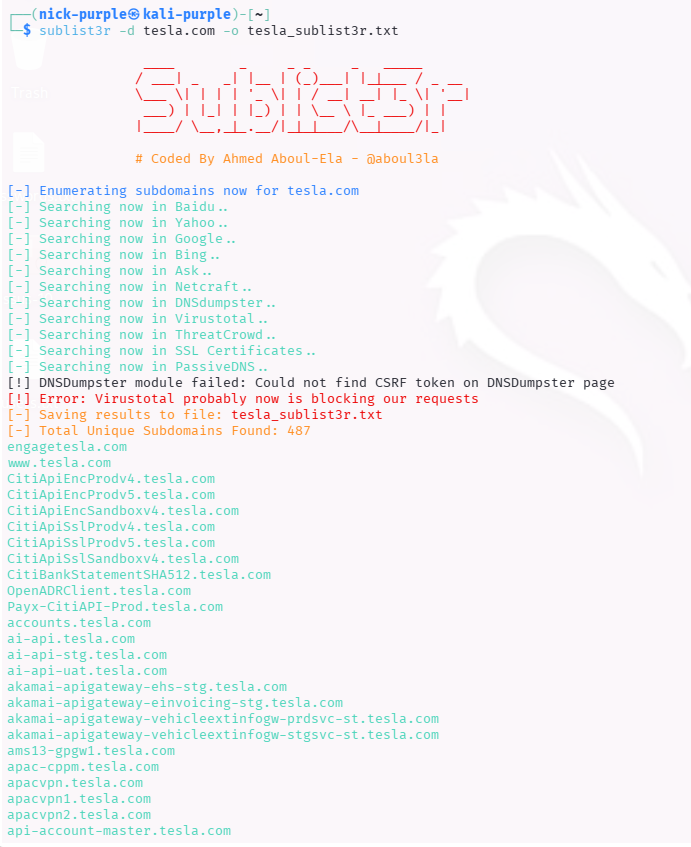
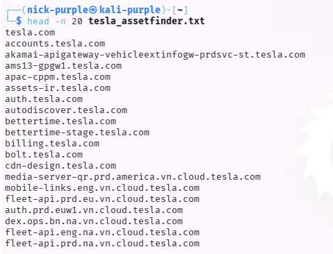
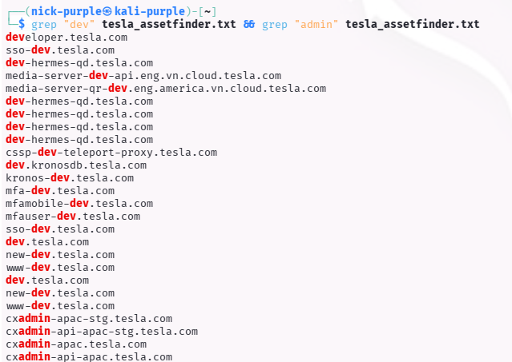

> **English** | [Italiano](README.md)

# Subdomain Discovery

> - **Phase:** Reconnaissance - DNS Enumeration
> - **Visibility:** Low (passive) - querying third-party sources (CT logs, search engines) without contacting the target's servers
> - **Prerequisites:** Known target domain, Sublist3r and Assetfinder installed, Internet access
> - **Output:** DNS-003 - 500+ tesla.com subdomains including high-value targets (vpn, sso, dev-app, toolbox)

---

Objective: Mapping the external attack surface of an Enterprise organization through OSINT (Open Source Intelligence) techniques, without directly interacting with the systems.

Target: `tesla.com` (Public Bug Bounty Program)

Tools: `Sublist3r`, `Assetfinder`

---

## 1 Theoretical Introduction

Passive Subdomain Enumeration consists of gathering information about a target's subdomains by querying third-party sources (Search engines, Certificate Transparency logs, VirusTotal, etc.) instead of directly querying the company's DNS servers.

Why is it important?

- Stealth: Being passive, it generates no direct traffic towards the target and does not trigger alarms (IDS/IPS).
- Shadow IT: It allows discovering old administration panels, development environments (`dev-app`, `staging`) or forgotten services that often present critical vulnerabilities.
- Certificate Transparency: It leverages public SSL certificate logs to identify domains created even just hours ago.

---

## 2 Technical Execution

**Finding ID:** `DNS-003` | **Severity:** `Medium`

#### A. OSINT Aggregation (Sublist3r)

`Sublist3r` was used to query multiple search engines (Google, Bing, Yahoo, Baidu) and aggregate historical results.

Command:

```Bash
sublist3r -d tesla.com -o tesla_sublist3r.txt
```



Analysis: The tool took several minutes to query the search engine APIs, returning a list of "historical" and well-indexed subdomains.

#### B. Certificate Transparency Analysis (Assetfinder)

assetfinder was used for rapid enumeration based on SSL certificates. This technique is extremely effective for finding exposed internal infrastructure (VPN, Mail Server) that has a valid certificate but is not indexed on Google.

Command:

```Bash
assetfinder --subs-only tesla.com > tesla_assetfinder.txt
```

(Note: Output was truncated with head for readability, given the high number of results)

Command:

```Bash
head -n 20 tesla_assetfinder.txt
```



Targeted search for development or administration subdomains.

Command:

```Bash
grep "dev" tesla_assetfinder.txt
grep "admin" tesla_assetfinder.txt
```



---

## 3 Results Analysis (Attack Surface)

From the combined results of both tools, a list of over 500+ unique subdomains was compiled. Below are some examples of "High Value Targets" identified that would require further investigation (Active Recon):

| Detected Subdomain | Category | Bug Bounty Interest |
|-----------------------|-----------|--------------------------|
| toolbox.tesla.com | Internal Tool | High (Internal tool panels) |
| sso.tesla.com | Authentication | Critical (Single Sign-On, phishing target) |
| vpn.tesla.com | Network Access | High (Infrastructure entry point) |
| energysupport.tesla.com | Customer Support | Medium (Ticket systems, possible XSS) |
| dev-app.tesla.com | Development | High (Test environments often vulnerable) |

Technical Note: Unlike a controlled lab, in a real target like Tesla the amount of data requires post-processing (filtering dead domains with tools like `httprobe`) before proceeding with attacks.

---

## 4 Conclusions

The combined use of `Sublist3r` and `Assetfinder` on an Enterprise target demonstrated how "Security through Obscurity" is ineffective. Thanks to Certificate Transparency logs, any new service exposed on the Internet with HTTPS is immediately made visible to attackers, allowing infrastructure mapping without sending a single packet towards Tesla's servers.

---

## MITRE ATT&CK Mapping

| Tactic | Technique | MITRE ID | Action Description |
| :--- | :--- | :--- | :--- |
| Reconnaissance | Search Open Technical Databases: DNS/Passive DNS | `T1596.001` | tesla.com subdomain enumeration through Certificate Transparency logs with Assetfinder, identifying 500+ hosts including vpn and sso (DNS-003) |
| Reconnaissance | Gather Victim Network Info: DNS | `T1590.002` | Subdomain aggregation from search engines (Sublist3r) to map the target's external attack surface (DNS-003) |

---

> **Note:** Subdomain enumeration activities were performed on tesla.com within the company's public bug bounty program, which explicitly authorizes passive infrastructure reconnaissance. Results were documented for exclusively educational purposes and were not used for unauthorized access attempts.
