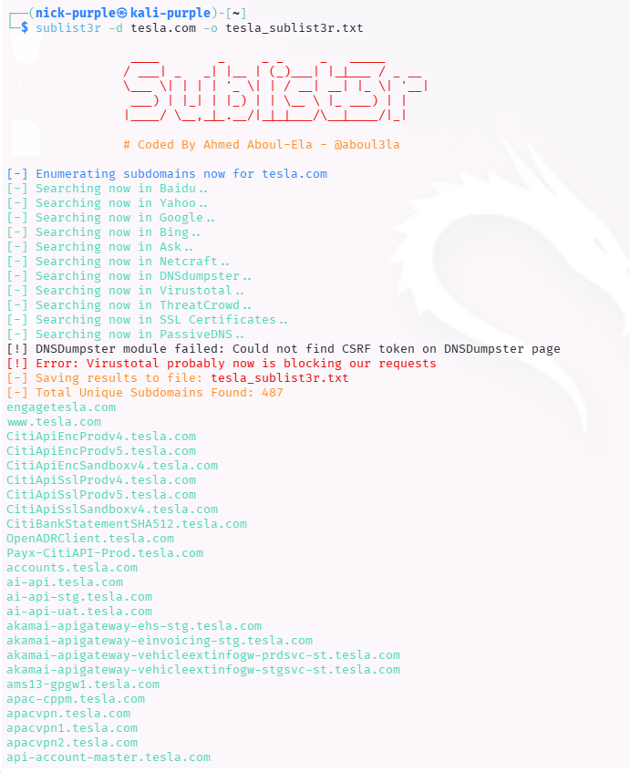
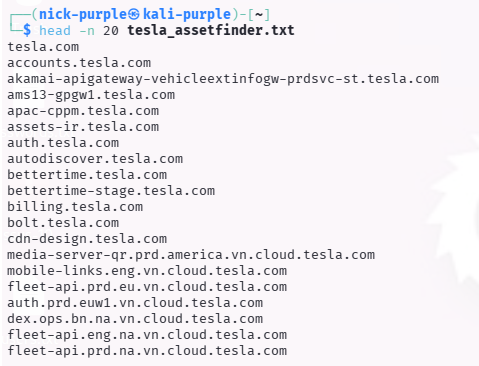
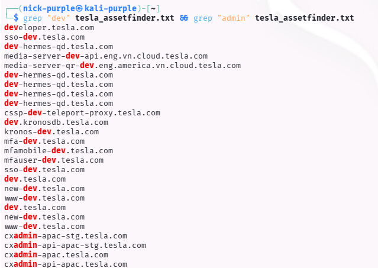

# Subdomain Discovery

Obiettivo: Mappatura della superficie di attacco esterna di un'organizzazione Enterprise tramite tecniche di OSINT (Open Source Intelligence), senza interagire direttamente con i sistemi.

Target: `tesla.com` (Public Bug Bounty Program)

Strumenti: `Sublist3r`, `Assetfinder`

---

## 1 Introduzione Teorica

La Passive Subdomain Enumeration consiste nel raccogliere informazioni sui sottodomini di un target interrogando fonti di terze parti (Motori di ricerca, Log di "Certificate Transparency", VirusTotal, ecc.) invece di interrogare direttamente i server DNS dell'azienda.

Perché è importante?

- Stealth: Essendo passiva, non genera traffico diretto verso il bersaglio e non fa scattare allarmi (IDS/IPS).
- Shadow IT: Permette di scoprire vecchi pannelli di amministrazione, ambienti di sviluppo (`dev-app`, `staging`) o servizi dimenticati che spesso presentano vulnerabilità critiche.
- Certificate Transparency: Sfrutta i log pubblici dei certificati SSL per individuare domini creati anche poche ore fa.

---

## 2 Esecuzione Tecnica

#### A. Aggregazione OSINT (Sublist3r)

È stato utilizzato `Sublist3r` per interrogare molteplici motori di ricerca (Google, Bing, Yahoo, Baidu) e aggregare i risultati storici.

Comando:

```bash
sublist3r -d tesla.com -o tesla_sublist3r.txt
```



Analisi: Il tool ha impiegato diversi minuti per interrogare le API dei motori di ricerca, restituendo una lista di sottodomini "storici" e ben indicizzati.

#### B. Certificate Transparency Analysis (Assetfinder)

È stato utilizzato assetfinder per un'enumerazione rapida basata sui certificati SSL. Questa tecnica è estremamente efficace per trovare infrastrutture interne esposte (VPN, Mail Server) che hanno un certificato valido ma non sono indicizzate su Google.

Comando:

```Bash
assetfinder --subs-only tesla.com > tesla_assetfinder.txt
```

(Nota: L'output è stato troncato con head per leggibilità, dato l'elevato numero di risultati)

Comando:

```Bash
head -n 20 tesla_assetfinder.txt
```



Ricerca mirata di sottodomini di sviluppo o amministrazione.

Comando:

```Bash
grep "dev" tesla_assetfinder.txt
grep "admin" tesla_assetfinder.txt
```



---

## 3 Analisi dei Risultati (Attack Surface)

Dall'unione dei risultati dei due tool, è stata compilata una lista di oltre 500+ sottodomini unici. Di seguito alcuni esempi di "High Value Targets" identificati che richiederebbero ulteriore investigazione (Active Recon):

| Sottodominio Rilevato | Categoria | Interesse per Bug Bounty |
|-----------------------|-----------|--------------------------|
| toolbox.tesla.com | Internal Tool | Alto (Pannelli strumenti interni) |
| sso.tesla.com | Authentication | Critico (Single Sign-On, target phishing) |
| vpn.tesla.com | Network Access | Alto (Punto di ingresso infrastrutturale) |
| energysupport.tesla.com | Customer Support | Medio (Ticket systems, possibili XSS) |
| dev-app.tesla.com | Development | Alto (Ambienti di test spesso vulnerabili) |

Nota Tecnica: A differenza di un laboratorio controllato, in un target reale come Tesla la quantità di dati richiede post-processing (filtraggio dei domini morti con tool come `httprobe`) prima di procedere con gli attacchi.

---

## 4 Conclusioni

L'utilizzo combinato di `Sublist3r` e `Assetfinder` su un target Enterprise ha dimostrato come la "Security through Obscurity" sia inefficace. Grazie ai log di Certificate Transparency, qualsiasi nuovo servizio esposto su Internet dotato di HTTPS viene immediatamente reso visibile agli attaccanti, permettendo di mappare l'infrastruttura senza inviare un singolo pacchetto verso i server di Tesla.