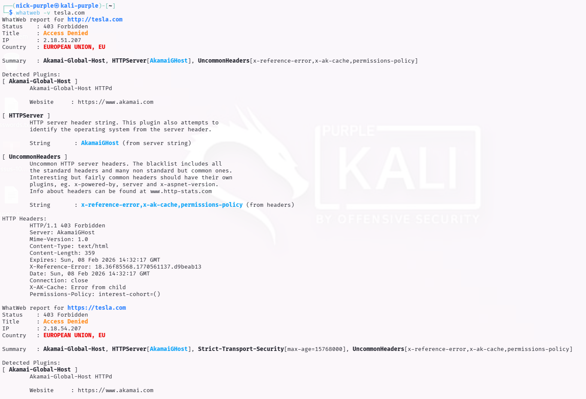
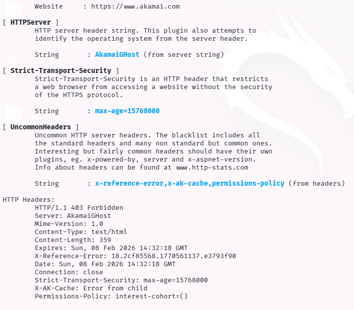

# Tech Stack Fingerprinting: WhatWeb & BuiltWith

Obiettivo: Identificare le tecnologie sottostanti (CMS, Web Server, Framework, Librerie JS) utilizzate dal target per individuare versioni obsolete o vulnerabilità note (CVE).

Target: `tesla.com`

Strumenti: `WhatWeb` (CLI), `Wappalyzer` (Browser Extension), `BuiltWith` (Web)

---

## 1 Introduzione Teorica

Il Tech Stack Fingerprinting è il processo di raccolta di "impronte digitali" dal server web. Analizzando le risposte HTTP, i cookie, e il codice sorgente HTML, è possibile determinare:

- Sistema Operativo: (es. Ubuntu, CentOS, Windows Server)
- Web Server: (es. Nginx, Apache, IIS)
- Framework/CMS: (es. Drupal, WordPress, React)
- Librerie Client-side: (es. jQuery, Bootstrap)

Per un attaccante, questa fase è cruciale per selezionare gli exploit corretti (es. non lanciare attacchi PHP contro un server Java).

---

## 2 Esecuzione Tecnica: WhatWeb

`WhatWeb` è uno scanner di nuova generazione che identifica le tecnologie web. È stato lanciato contro il dominio target per ottenere un profilo rapido.

Comando:
```bash
whatweb -v tesla.com
```

(Nota: L'opzione -v attiva la modalità verbosa per maggiori dettagli)





Analisi dell'Output:

L'output dimostra l'efficacia delle difese perimetrali di Tesla. Lo scanner non è riuscito a raggiungere l'applicazione web sottostante, venendo bloccato all'ingresso:

- Access Denied / 403 Forbidden:

    Osservazione: Lo scanner ha ricevuto uno stato HTTP `403 Forbidden` e il titolo pagina `Access Denied`, invece del classico `200 OK`.

    Analisi Tecnica: Il sistema di difesa ha identificato la firma (User-Agent o comportamento) di `WhatWeb` come traffico automatizzato/malevolo, terminando immediatamente la connessione.

- Il "Colpevole" (Akamai):

    Osservazione: sono stati rilevati i plugin: `Akamai-Global-Host` e la stringa server `AkamaiGHost`.

    Analisi Tecnica: Questo conferma che `tesla.com` utilizza Akamai come CDN e WAF (Web Application Firewall). L'IP risolto non è quello del server reale, ma quello di un nodo edge di Akamai, che agisce da scudo (Reverse Proxy) contro attacchi diretti.

- Sicurezza SSL (HSTS):

    Osservazione: È presente l'header: `Strict-Transport-Security`.

    Analisi Tecnica: Il dominio forza i browser a utilizzare esclusivamente connessioni HTTPS cifrate, prevenendo attacchi di tipo "SSL Stripping" o "Downgrade".

---

## 3 Conclusioni

Questa fase di fingerprinting ha confermato che tesla.com utilizza una strategia di "Defense in Depth". L'attacco diretto automatizzato viene mitigato efficacemente da Akamai. Per un attaccante, questo implica che l'uso di scanner attivi "rumorosi" (come Nikto o WhatWeb standard) è inefficace contro il dominio principale. Sarebbe necessario utilizzare tecniche di evasione (rotazione IP, spoofing User-Agent) o spostarsi su una ricognizione puramente passiva (Wappalyzer) per mappare le tecnologie backend (es. Drupal) senza allertare il WAF.