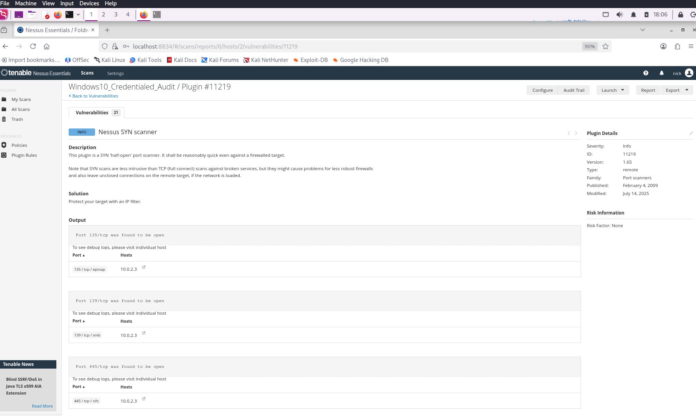
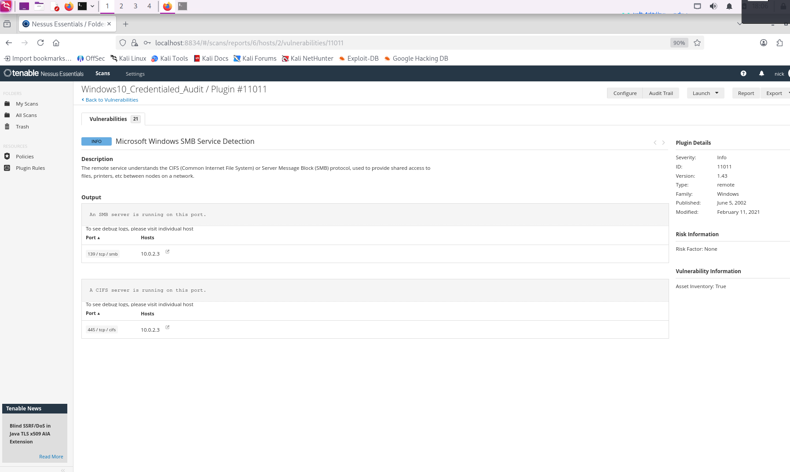
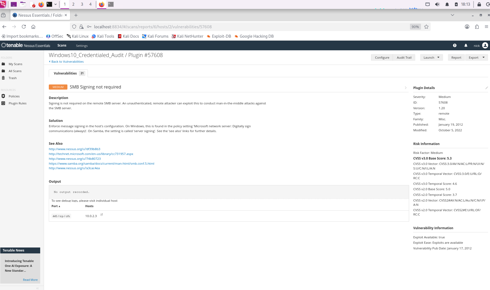

> **English** | [Italiano](README.md)

# Vulnerability Assessment & Remediation: Windows 10 Hardening with Tenable Nessus

> - **Phase:** Vulnerability Assessment - Credentialed Scan with Tenable Nessus
> - **Visibility:** High - credentialed scanning generates intense SMB and WMI traffic towards the target, easily identifiable by an IDS
> - **Prerequisites:** Nessus Essentials installed and configured; local administrator account on the Windows target; Remote Registry and File and Printer Sharing services enabled on the target
> - **Output:** Finding VULN-001 (SMB Signing not mandatory, severity High) and VULN-002 (Windows 10 22H2 End of Life, severity Medium); GPO remediation procedure verified

---

## 1 Introduction and Objective

This project documents a complete Vulnerability Assessment (VA) process performed on a Windows 10 workstation within a virtualized lab environment.

The main objective was to simulate a real corporate scenario:
1.  Execute a vulnerability scan.
2.  Analyze the results distinguishing between false positives/info and real risks.
3.  Execute Remediation (mitigation) of critical vulnerabilities.
4.  Verify the hardening through a confirmation scan.

---

## 2 Theory and Key Concepts

### Vulnerability Assessment vs Penetration Test

While a Penetration Test seeks to exploit a vulnerability to enter the system, the Vulnerability Assessment (subject of this report) aims to catalog and classify all security flaws present so they can be preventively corrected.

### Non-Credentialed vs Credentialed Scan

During the lab I experienced the crucial difference between the two modes:

- Non-Credentialed (Black Box): Nessus looks at the system from the outside. It only sees open ports and exposed services. It often reports few results or false negatives.
- Credentialed (White/Grey Box): Nessus logs into the target system with administrative credentials. This allows querying the system registry, verifying installed patches and local configurations. This is the mode used for this report.

### SMB (Server Message Block)

It is the network protocol used by Windows for file and printer sharing. If not configured correctly (e.g., without digital signing), it is vulnerable to Man-in-the-Middle (MitM) attacks.

---

## 3 Discovery and Analysis Phase

### 3.1 The Initial Scan

After configuring Nessus and the target (IP: `10.0.2.3`), the first scan reported predominantly informational results (INFO - Blue).

Relevant results (INFO):
- Plugin 11011 (SMB Service Detection): Confirms that the SMB service is active on port 445/139.



- Plugin `92415` (Application Compatibility Cache): Nessus extracted the ShimCache. Although not a vulnerability, it is useful data for forensic analysis (shows which .exe have been executed).



Analysis: these results indicated that the system was reachable, but did not present immediate risks. They were simply confirmation that "everything works".

### 3.2 Identification of Real Vulnerabilities

Deepening the analysis with an authenticated scan (Credentialed Audit), real security issues emerged:

### Vulnerability 1: SMB Signing not required (Risk: HIGH/MEDIUM)

**Finding ID:** `VULN-001` | **Severity:** `High`

- Description: The remote SMB server does not require digital signing of packets.
- Impact: An attacker on the same local network can intercept the communication between client and server, modify its content and forward it without the parties noticing (Man-in-the-Middle Attack).
- Status: Active (Orange color).



### Vulnerability 2: Windows 10 22H2 SEoL (Risk: MEDIUM)

**Finding ID:** `VULN-002` | **Severity:** `Medium`

- Description: The Windows 10 version in use (22H2) has reached End of Life (End of Life) in October 2025.
- Context: Since the current date is January 2026, the system has not received security patches for approximately 3 months.
- Impact: The system is exposed to new threats (0-day) for which Microsoft will not release fixes.

---

## 4 Remediation Phase (Resolution)

I decided to focus on mitigating the SMB Signing vulnerability, as it is resolvable through configuration (Hardening), while the SEoL issue would require a complete operating system upgrade.

### Hardening Procedure
To enforce SMB signing, I acted on the local Group Policy (GPO) of the Windows 10 machine.

Steps performed:
1.  Access to the Group Policy Editor: `Win + R` -> `gpedit.msc`.
2.  Path: Computer Configuration > Windows Settings > Security Settings > Local Policies > Security Options.
3.  Modified policy: `Microsoft network server: Digitally sign communications (always)`.
4.  Action: Set to Enabled.

Application command:

To apply the change without restarting, I forced the policy update through terminal (Administrator CMD):

```powershell
gpupdate /force
```

---

## 5 Final Verification

I relaunched the Nessus scan on the same host.

- Result: The "SMB Signing not required" entry disappeared from the vulnerability list or was downgraded to simple "Info" (confirming that signing is now active).
- Conclusion: The system is now protected against SMB traffic manipulation attacks on the local network.

---

## 6 Personal Experience and Troubleshooting

During this lab I faced several technical challenges that enriched my understanding of the process.

### Problem 1: Interpreting "Info" Plugins

- Situation: Initially, seeing screenshots with plugins like "Microsoft Windows SMB Service Detection" (Plugin 11011), I feared they were errors or missed vulnerabilities.
- Solution: I learned to read the Severity. "Info" plugins (Blue) are fundamental for reconnaissance (they tell me what's there), but don't require fixes. I learned not to be alarmed by blue, but to look for orange and red.

### Problem 2: Credentialed Scan Configuration

- Situation: The initial scan was not detecting deep system details.
- Cause: Nessus did not have permissions to read the Windows system registry.
- Solution:
    - I created a dedicated local administrator account on Windows.
    - I enabled the "Remote Registry" service on Windows.
    - I configured File and Printer Sharing to allow incoming SMB traffic through the firewall.
    - I entered the credentials in the "Credentials" > "Windows" section of Nessus.

### Problem 3: Windows EoL (End of Life)

- Reflection: I noticed that Nessus flags as "Medium" the fact that Windows 10 is out of support (We are in 2026, support ended in 2025).
- Lesson Learned: No configuration can fix this problem. In a real corporate environment, this report would be the necessary evidence to justify the upgrade budget to Windows 11 or later to management.

---

## Conclusion

This project demonstrated the importance of not stopping at superficial scanning. Enabling credentials allowed discovering insecure configurations (SMB Signing) that, if exploited, could have compromised corporate data integrity. Remediation through Group Policy was effective and verifiable.

---

## MITRE ATT&CK Mapping

| Tactic | Technique | MITRE ID | Action Description |
| :--- | :--- | :--- | :--- |
| Reconnaissance | Active Scanning: Vulnerability Scanning | `T1595.002` | Use of Nessus in credentialed mode to identify known vulnerabilities on the Windows 10 target host (VULN-001, VULN-002). |
| Discovery | Network Service Discovery | `T1046` | Enumeration of active services (SMB port 445) and their configurations through credentialed scan. |
| Reconnaissance | Gather Victim Host Information: Software | `T1592.002` | Collection of installed software information and patch level through Windows system registry interrogation (ShimCache, OS version). |

---

---

## Correlations with other findings

| Origin | This finding | Leads to | Module |
| :--- | :--- | :--- | :--- |
| [SCAN-003](<../../../01-recon (Red Team Basic)/02-network-scanning-active/port-scanning (Nmap)/nmap-scripts/README.en.md>) | VULN-001 - SMB Signing disabled | [EXPLOIT-018](<../../../04-system-exploitation/03-privilege-escalation (PrivEsc)/windows-priv-esc/winpeas/README.en.md>) - Pass-the-Hash lateral movement | 04-exploitation |
| VULN-002 - Windows EoL | [EXPLOIT-001](<../../../04-system-exploitation/01-frameworks/metasploit/README.en.md>) - EternalBlue on unpatched system | 04-exploitation |
| [VULN-004](<../../02-protocol-specific-audit/smb-net-bios/README.en.md>) | VULN-001 + VULN-004 | [EXPLOIT-013](<../../../04-system-exploitation/03-privilege-escalation (PrivEsc)/windows-priv-esc/juicypotato-printnightmare/README.en.md>) - SeImpersonatePrivilege | 04-exploitation |

> **Note:** All documented activities were conducted in a virtualized lab environment (VirtualBox NAT Network). The target is a Windows 10 virtual machine owned by the author. No scan was performed on third-party systems without explicit authorization.
