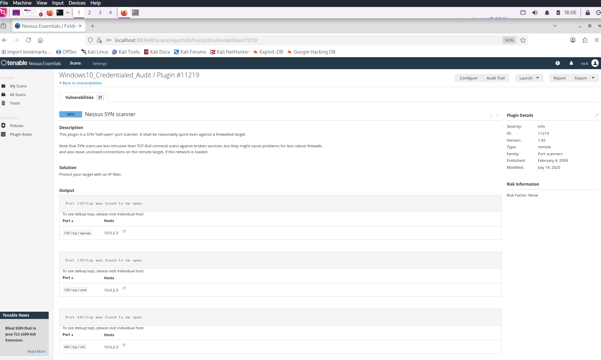
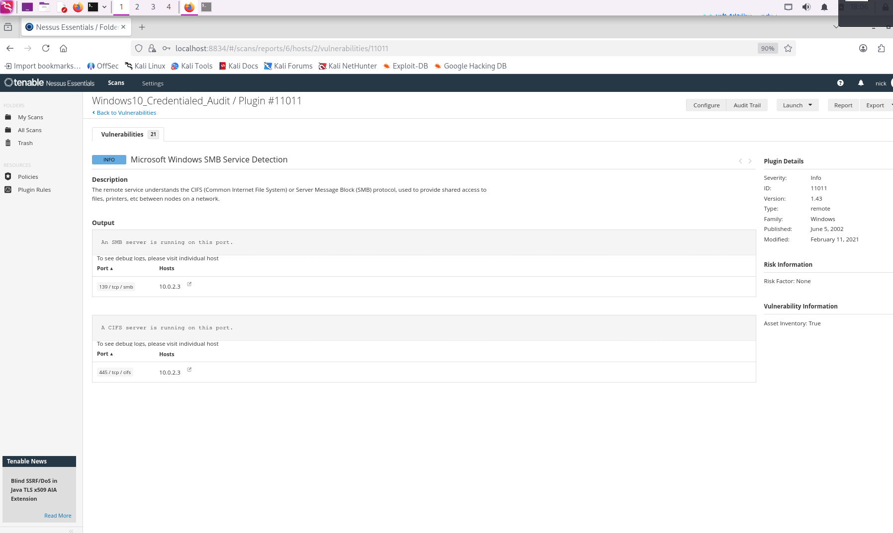
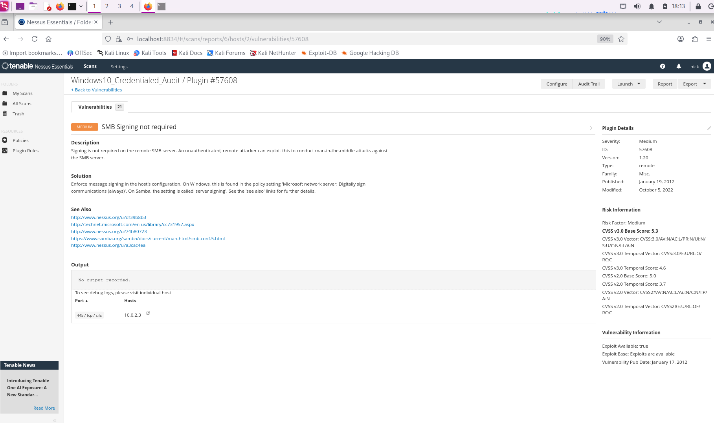

# Vulnerability Assessment & Remediation: Windows 10 Hardening con Tenable Nessus

---

## Introduzione e Obiettivo

Questo progetto documenta un processo completo di Vulnerability Assessment (VA) eseguito su una workstation Windows 10 all'interno di un ambiente di laboratorio virtualizzato. 

L'obiettivo principale è stato simulare uno scenario aziendale reale:
1.  Eseguire una scansione di vulnerabilità.
2.  Analizzare i risultati distinguendo tra falsi positivi/info e rischi reali.
3.  Eseguire la Remediation (mitigazione) delle vulnerabilità critiche.
4.  Verificare la messa in sicurezza tramite una scansione di conferma.

---

## Teoria e Concetti Chiave

### Vulnerability Assessment vs Penetration Test

Mentre il Penetration Test cerca di sfruttare una vulnerabilità per entrare nel sistema, il Vulnerability Assessment (oggetto di questo report) mira a catalogare e classificare tutte le falle di sicurezza presenti per poterle correggere preventivamente.

### Scansione Non-Credentialed vs Credentialed

Durante il laboratorio ho sperimentato la differenza cruciale tra le due modalità:

- Non-Credentialed (Black Box): Nessus guarda il sistema dall'esterno. Vede solo le porte aperte e i servizi esposti. Spesso riporta pochi risultati o falsi negativi.
- Credentialed (White/Grey Box): Nessus effettua il login nel sistema target con credenziali amministrative. Questo permette di interrogare il registro di sistema, verificare le patch installate e le configurazioni locali. È la modalità utilizzata per questo report.

### SMB (Server Message Block)

È il protocollo di rete utilizzato da Windows per la condivisione di file e stampanti. Se non configurato correttamente (es. senza firma digitale), è vulnerabile ad attacchiMan-in-the-Middle (MitM).

---

## 3. Fase di Discovery e Analisi

### 3.1 La Scansione Iniziale

Dopo aver configurato Nessus e il target (IP: `10.0.2.3`), la prima scansione ha riportato prevalentemente risultati informativi (INFO - Blu).

Risultati rilevanti (INFO):
- Plugin 11011 (SMB Service Detection): Conferma che il servizio SMB è attivo sulla porta 445/139.



- Plugin `92415` (Application Compatibility Cache): Nessus ha estratto laShimCache. Sebbene non sia una vulnerabilità, è un dato utile per l'analisi forense (mostra quali .exe sono stati eseguiti).



Analisi: questi risultati indicavano che il sistema era raggiungibile, ma non presentavano rischi immediati. Erano semplicemente la conferma che "tutto funziona".

### 3.2 Identificazione delle Vulnerabilità Reali

Approfondendo l'analisi con una scansione autenticata (Credentialed Audit), sono emerse problematiche di sicurezza reali:

### Vulnerabilità 1: SMB Signing not required (Risk: HIGH/MEDIUM)

- Descrizione: Il server SMB remoto non richiede la firma digitale dei pacchetti.
- Impatto: Un attaccante sulla stessa rete locale può intercettare la comunicazione tra il client e il server, modificarne il contenuto e inoltrarlo senza che le parti se ne accorgano (Attacco Man-in-the-Middle).
- Stato: Attivo (Colore Arancione).



### Vulnerabilità 2: Windows 10 22H2 SEoL (Risk: MEDIUM)
- Descrizione: La versione di Windows 10 in uso (22H2) ha raggiunto la fine del supporto (End of Life) nell'Ottobre 2025.
- Contesto: Essendo la data attuale Gennaio 2026, il sistema non riceve patch di sicurezza da circa 3 mesi.
- Impatto: Il sistema è esposto a nuove minacce (0-day) per le quali Microsoft non rilascerà correzioni.

---

## 4. Fase di Remediation (Risoluzione)

Ho deciso di concentrarmi sulla mitigazione della vulnerabilità SMB Signing, in quanto risolvibile tramite configurazione (Hardening), mentre il problema SEoL richiederebbe un aggiornamento completo del sistema operativo.

### Procedura di Hardening
Per forzare la firma SMB, ho agito sulle Group Policy (GPO) locali della macchina Windows 10.

Passaggi eseguiti:
1.  Accesso all'editor dei criteri di gruppo: `Win + R` -> `gpedit.msc`.
2.  Percorso: Configurazione computer > Impostazioni di Windows > Impostazioni sicurezza > Criteri locali > Opzioni di sicurezza.
3.  Policy modificata: `Server di rete Microsoft: aggiungi firma digitale alle comunicazioni (sempre)`.
4.  Azione: Impostato su Abilitato (Enabled).

Comando di applicazione:

Per rendere effettiva la modifica senza riavviare, ho forzato l'aggiornamento delle policy tramite terminale (CMD Amministratore):

```powershell
gpupdate /force
```

---

## 5 Verifica Finale

Ho rilanciato la scansione Nessus sullo stesso host.

- Risultato: La voce "SMB Signing not required" è scomparsa dalla lista delle vulnerabilità o è stata declassata a semplice "Info" (confermando che la firma è ora attiva).
- Conclusione: Il sistema è ora protetto contro attacchi di manipolazione del traffico SMB sulla rete locale.

---

## 6 Esperienza Personale e Troubleshooting

Durante questo laboratorio ho affrontato diverse sfide tecniche che hanno arricchito la mia comprensione del processo.

### Problema 1: Interpretazione dei Plugin "Info"

- Situazione: Inizialmente, vedendo screenshot con plugin come "Microsoft Windows SMB Service Detection" (Plugin 11011), temevo fossero errori o vulnerabilità mancate.
- Soluzione: Ho imparato a leggere la Severity. I plugin "Info" (Blu) sono fondamentali per la ricognizione (mi dicono cosa c'è), ma non richiedono fix. Ho imparato a non allarmarmi per il blu, ma a cercare l'arancione e il rosso.

### Problema 2: Configurazione della Scansione Credentialed

- Situazione: La scansione iniziale non rilevava dettagli profondi del sistema.
- Causa: Nessus non aveva i permessi per leggere il registro di sistema di Windows.
- Soluzione:
    - Ho creato un account amministratore locale dedicato su Windows.
    - Ho abilitato il servizio "Remote Registry" su Windows.
    - Ho configurato la condivisione file e stampanti per permettere l'ingresso del traffico SMB in entrata attraverso il firewall.
    - Ho inserito le credenziali nella sezione "Credentials" > "Windows" di Nessus.

### Problema 3: Windows EoL (End of Life)

- Riflessione: Ho notato che Nessus segnala come "Medium" il fatto che Windows 10 sia fuori supporto (Siamo nel 2026, supporto terminato nel 2025).
- Lesson Learned: Nessuna configurazione può risolvere questo problema. In un ambiente aziendale reale, questo report sarebbe la prova necessaria per giustificare al management il budget per l'upgrade a Windows 11 o successivi.

---

## Conclusione

Questo progetto ha dimostrato l'importanza di non fermarsi alla scansione superficiale. L'abilitazione delle credenziali ha permesso di scoprire configurazioni insicure (SMB Signing) che, se sfruttate, avrebbero potuto compromettere l'integrità dei dati aziendali. La remediation tramite Group Policy è stata efficace e verificabile.