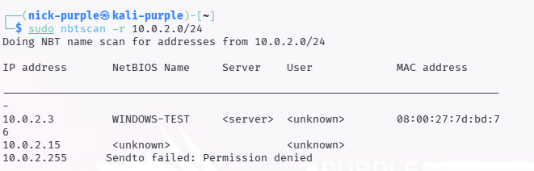
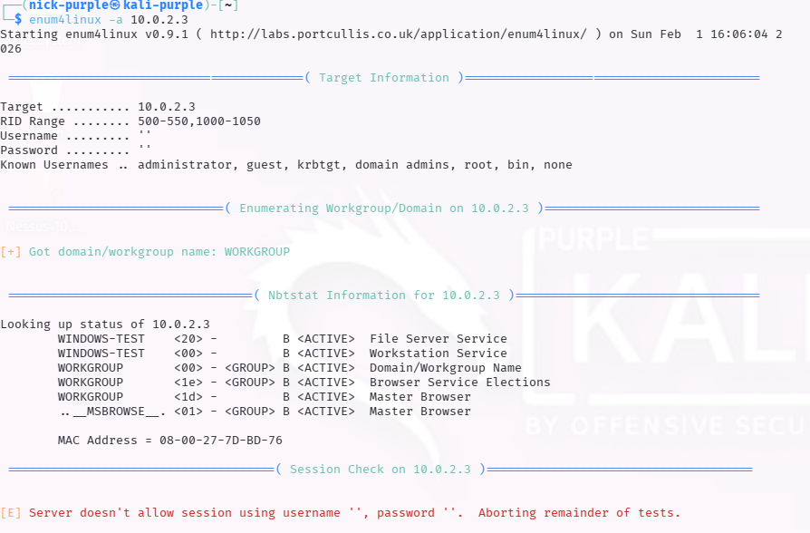
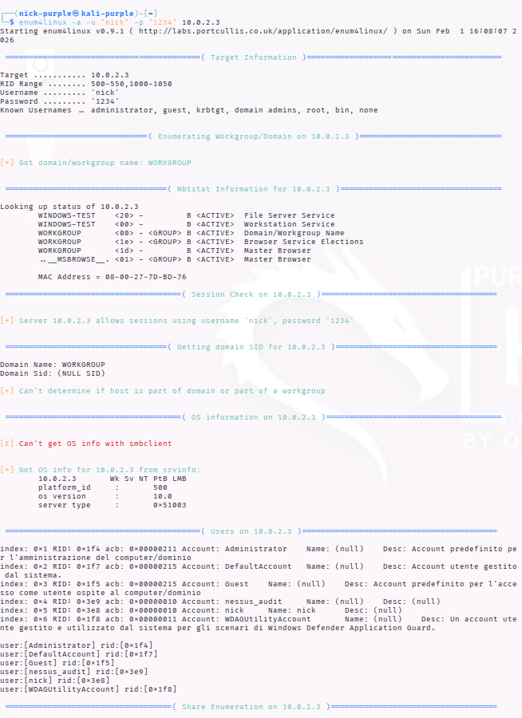
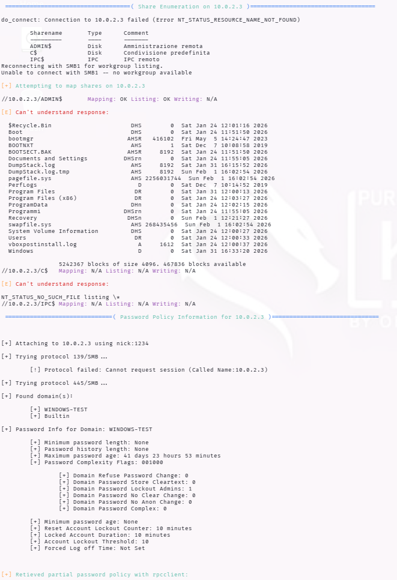
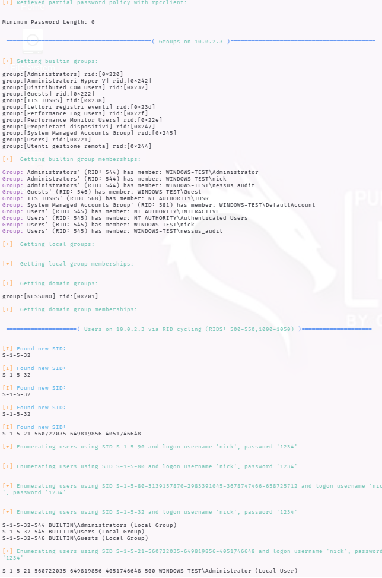
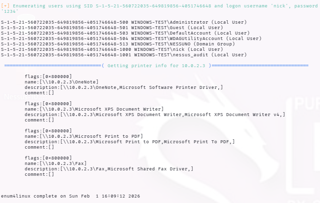
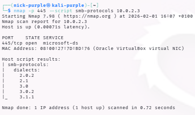
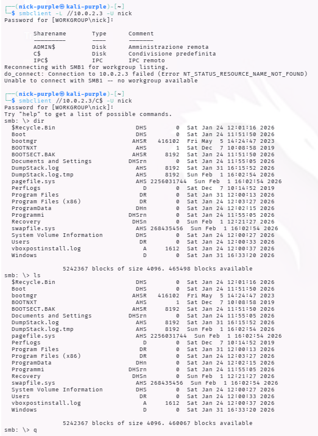

# Audit Protocolli di Rete: SMB & NetBIOS

Target: Windows 10 Enterprise (10.0.2.3)

Strumenti: Nbtscan, Enum4linux

---

## Introduzione Teorica

Il Server Message Block (SMB) è un protocollo di livello applicativo utilizzato principalmente per fornire accesso condiviso a file, stampanti e porte seriali tra i nodi di una rete. Nelle infrastrutture Windows, opera spesso in congiunzione con NetBIOS (Network Basic Input/Output System), che si occupa della risoluzione dei nomi e della gestione delle sessioni.

### Vettori di Attacco

Questi protocolli rappresentano una superficie di attacco critica per:

- Enumerazione: Esposizione di nomi utente, gruppi e policy di sistema.
- Accesso Non Autorizzato: Tramite condivisioni configurate male (es. Null Sessions).
- Brute Force: Tentativi di indovinare credenziali valide.
- Movimento Laterale: Utilizzo di credenziali compromesse per saltare da un host all'altro (es. PsExec).

Porte di Riferimento:

- UDP 137: NetBIOS Name Service (Risoluzione nomi).
- TCP 139: NetBIOS Session Service.
- TCP 445: SMB su TCP/IP (Direct Hosting).

---

## Fase 1: Network Discovery (NetBIOS)

La prima fase dell'audit ha previsto l'identificazione dei nodi attivi nella sottorete e la risoluzione dei loro hostname. Per questa operazione è stato utilizzato nbtscan, che interroga il servizio NetBIOS (porta 137 UDP).

#### Esecuzione del Test

È stata scansionata l'intera sottorete locale (`10.0.2.0/24`) per identificare il target.

```Bash
sudo nbtscan -r 10.0.2.0/24
```



Nota: Il MAC Address indica un ambiente virtualizzato (Oracle VirtualBox)

---

## Fase 2: Enumerazione SMB (Enum4linux)

Identificato il target, è stato utilizzato enum4linux (un wrapper per strumenti Samba) per estrarre informazioni dettagliate come lista utenti, policy password e share condivise.

#### Scenario A: Tentativo "Null Session" (Accesso Anonimo)

In prima istanza, è stato tentato un accesso senza credenziali (Utente vuoto, Password vuota) per verificare la sicurezza di base del sistema.

```Bash
enum4linux -a 10.0.2.3
```



Risultato: Il target ha rifiutato la connessione. L'output `[E] Server doesn't allow session using username '', password ''` conferma che le Null Session sono disabilitate.

Valutazione: Configurazione sicura (Default su Windows 10 moderni).

#### Scenario B: Enumerazione Autenticata (Simulazione Insider Threat)

Per simulare uno scenario di "Compromised Credentials" (attaccante interno o credenziali rubate), il test è stato ripetuto fornendo le credenziali di un utente standard (nick / 1234).

```Bash
enum4linux -a -u "nick" -p "1234" 10.0.2.3
```









#### Risultati Critici Rilevati:

L'accesso autenticato ha esposto l'intera configurazione del sistema:

#### Enumerazione Utenti (RID Cycling): 

Sono stati identificati tutti gli account locali, rivelando potenziali vettori di attacco:
- `Administrator` (RID 500)
- `Guest` (RID 501)
- `nick` (RID 1000)
- `nessus_audit` (RID 1001) - Account di servizio rilevato.

#### Analisi dei Privilegi (Gruppi):

L'analisi dell'output "Group Memberships" ha rivelato una criticità di alto livello.

`Group: Administrators (RID: 544) has member: WINDOWS-TEST\nick`

L'utente `nick`, di cui possediamo le credenziali, è membro del gruppo Administrators. Questo garantisce il controllo totale sul sistema.

#### Password Policy:

È stata estratta la politica di sicurezza delle password:
- `Account Lockout Threshold: 10` (L'account si blocca dopo 10 tentativi errati).
- `Minimum password length: None` (Criticità: permette password vuote o deboli).

---

## Fase 3: Analisi dei Protocolli SMB (Nmap NSE)

È stata effettuata un'analisi dei dialetti SMB supportati per verificare la presenza di protocolli obsoleti o vulnerabili.

```Bash
nmap -p 445 --script smb-protocols 10.0.2.3
```



Analisi dei risultati:

L'output elenca i dialetti SMB negoziati dal server:

- `2.0.2`
- `2.1`
- `3.0`
- `3.0.2`
- `3.1.1` (La versione più recente e sicura, introdotta con Windows 10).

Cosa MANCA in quella lista? Manca `NT LM 0.12 (SMBv1)`.

Perché è importante?
- Sicurezza (Niente WannaCry): Il fatto che SMBv1 non ci sia significa che questa macchina è immune all'exploit più famoso della storia recente: EternalBlue (MS17-010), quello usato dal ransomware WannaCry. Se avessimo visto NT LM 0.12 nella lista, avremmo trovato una vulnerabilità critica da "Codice Rosso".
- Encryption: La presenza di SMB 3.1.1 significa che la macchina supporta la crittografia dei dati in transito (molto più difficile da sniffare con Wireshark rispetto alle versioni vecchie).

---

## Fase 4: Exploitation, accesso al File System (SMB Client)

Dopo aver confermato i privilegi amministrativi dell'account `nick` nella fase di enumerazione, è stato eseguito l'accesso diretto alle risorse condivise.

Il test si è svolto in due passaggi:

Listato delle Share: Verifica della visibilità delle share amministrative nascoste.

```Bash
smbclient -L //10.0.2.3 -U nick
```

Accesso a C$: Connessione alla root del disco di sistema.

```Bash
smbclient //10.0.2.3/C$ -U nick
```



Analisi dell'Attacco:

1. Il comando `smbclient -L` ha rivelato la presenza delle share amministrative nascoste:

- ADMIN$: Accesso remoto per l'amministrazione del sistema.
- C$: Accesso alla radice del volume di avvio.

2. La connessione a C$ è avvenuta con successo, garantendo una shell interattiva (`smb: \>`).

- L'esecuzione del comando `dir` (o `ls`) ha mostrato le cartelle di sistema (`Windows`, `Program Files`, `Users`).

Esito: Compromissione totale. L'attaccante possiede privilegi di lettura e scrittura sull'intero disco rigido della vittima, permettendo l'esfiltrazione di dati sensibili o l'upload di malware.

---

## Conclusioni e Raccomandazioni

L'audit ha evidenziato una postura di sicurezza mista:

- Punti di Forza: Il sistema è correttamente configurato per rifiutare connessioni anonime (Null Session), prevenendo l'enumerazione da parte di attaccanti esterni non autenticati.
- Criticità: La presenza di un utente (`nick`) con password debole (`1234`) e privilegi di Amministratore Locale vanifica le difese perimetrali. Un attaccante che ottenesse queste credenziali avrebbe accesso completo al file system (tramite share `C$`) e potrebbe eseguire codice remoto.

Azioni Consigliate:
- Imporre una Password Policy complessa (minimo 12 caratteri).
- Rimuovere i diritti di amministratore agli utenti standard.
- Monitorare i log per accessi SMB sospetti (Event ID 4624).