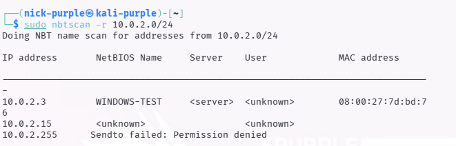
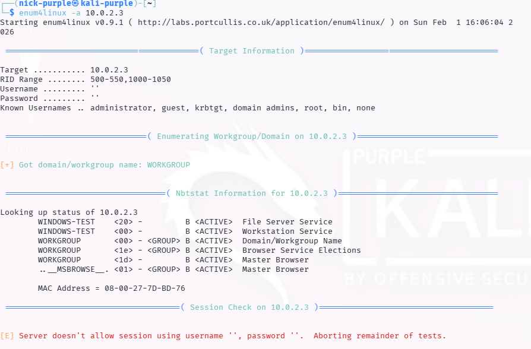
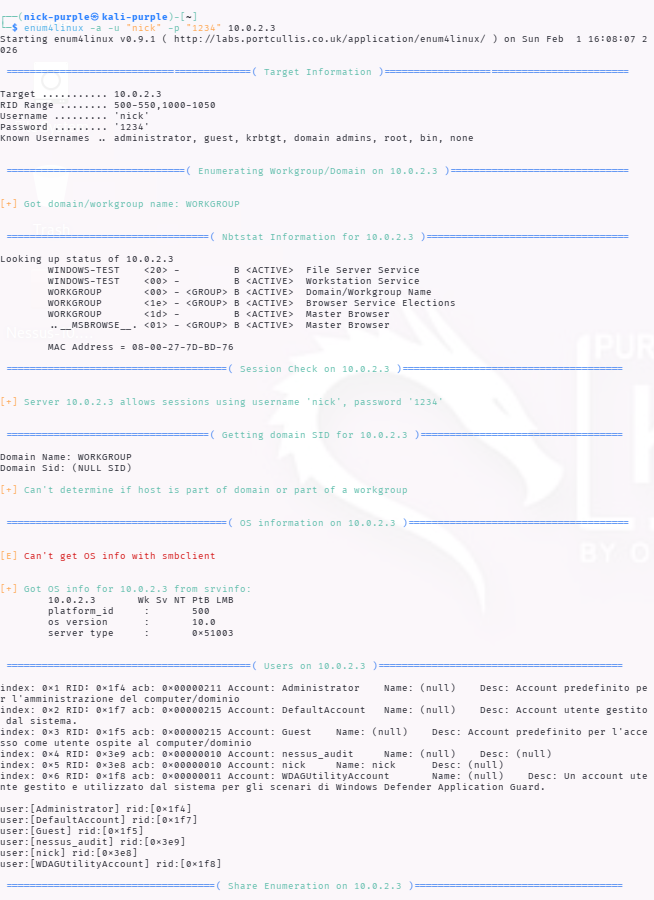
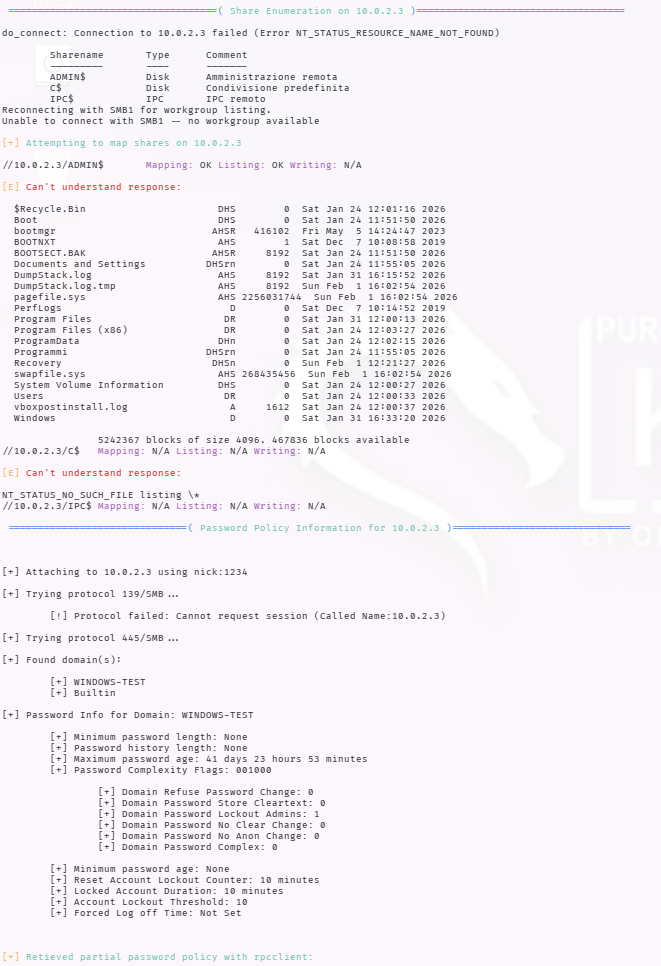
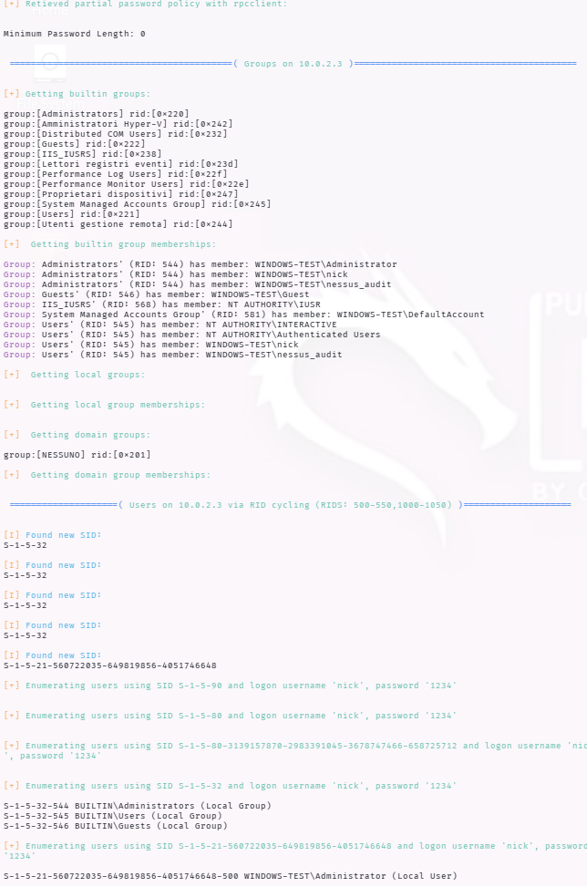
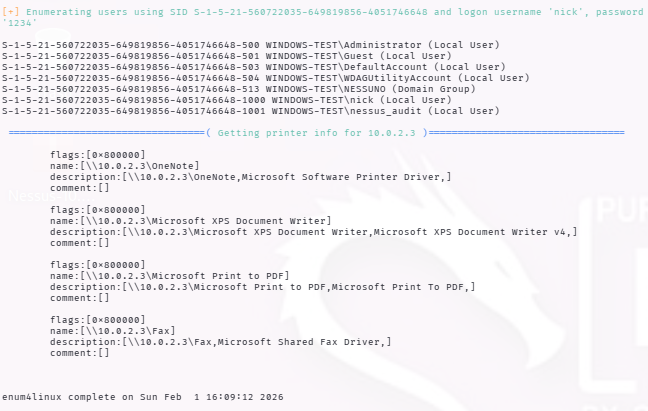
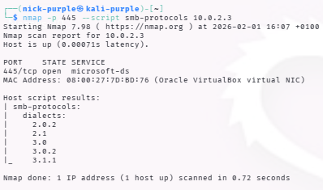
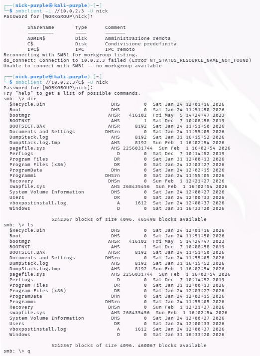

> [English](README.en.md) | **Italiano**

# Audit Protocolli di Rete: SMB & NetBIOS

> - **Fase:** Vulnerability Assessment - Protocol Audit (SMB/NetBIOS)
> - **Visibilita:** Media - nbtscan genera traffico UDP 137, enum4linux genera traffico SMB identificabile; smbclient genera una sessione SMB autenticata
> - **Prerequisiti:** Porte 137 UDP, 139 TCP e 445 TCP identificate come aperte dalla fase di recon; opzionalmente credenziali di un utente standard per i test autenticati
> - **Output:** Finding VULN-003 (NetBIOS Name Disclosure, severity Basso) e VULN-004 (accesso SMB C$ con credenziali standard, severity Alto); enumerazione completa utenti, gruppi e password policy

Target: Windows 10 Enterprise (10.0.2.3)

Strumenti: Nbtscan, Enum4linux

---

## Introduzione Teorica

Il Server Message Block (SMB) è un protocollo di livello applicativo utilizzato principalmente per fornire accesso condiviso a file, stampanti e porte seriali tra i nodi di una rete. Nelle infrastrutture Windows, opera spesso in congiunzione con NetBIOS (Network Basic Input/Output System), che si occupa della risoluzione dei nomi e della gestione delle sessioni.

### Vettori di Attacco

Questi protocolli rappresentano una superficie di attacco critica per:

- Enumerazione: Esposizione di nomi utente, gruppi e policy di sistema.
- Accesso Non Autorizzato: Tramite condivisioni configurate male (es. Null Sessions).
- Brute Force: Tentativi di indovinare credenziali valide.
- Movimento Laterale: Utilizzo di credenziali compromesse per saltare da un host all'altro (es. PsExec).

Porte di Riferimento:

- UDP 137: NetBIOS Name Service (Risoluzione nomi).
- TCP 139: NetBIOS Session Service.
- TCP 445: SMB su TCP/IP (Direct Hosting).

---

## Fase 1: Network Discovery (NetBIOS)

**ID Finding:** `VULN-003` | **Severity:** `Basso`

La prima fase dell'audit ha previsto l'identificazione dei nodi attivi nella sottorete e la risoluzione dei loro hostname. Per questa operazione è stato utilizzato nbtscan, che interroga il servizio NetBIOS (porta 137 UDP).

#### Esecuzione del Test

È stata scansionata l'intera sottorete locale (`10.0.2.0/24`) per identificare il target.

```Bash
sudo nbtscan -r 10.0.2.0/24
```



Nota: Il MAC Address indica un ambiente virtualizzato (Oracle VirtualBox)

---

## Fase 2: Enumerazione SMB (Enum4linux)

Identificato il target, è stato utilizzato enum4linux (un wrapper per strumenti Samba) per estrarre informazioni dettagliate come lista utenti, policy password e share condivise.

#### Scenario A: Tentativo "Null Session" (Accesso Anonimo)

In prima istanza, è stato tentato un accesso senza credenziali (Utente vuoto, Password vuota) per verificare la sicurezza di base del sistema.

```Bash
enum4linux -a 10.0.2.3
```



Risultato: Il target ha rifiutato la connessione. L'output `[E] Server doesn't allow session using username '', password ''` conferma che le Null Session sono disabilitate.

Valutazione: Configurazione sicura (Default su Windows 10 moderni).

#### Scenario B: Enumerazione Autenticata (Simulazione Insider Threat)

Per simulare uno scenario di "Compromised Credentials" (attaccante interno o credenziali rubate), il test è stato ripetuto fornendo le credenziali di un utente standard (nick / 1234).

```Bash
enum4linux -a -u "nick" -p "1234" 10.0.2.3
```









#### Risultati Critici Rilevati:

L'accesso autenticato ha esposto l'intera configurazione del sistema:

#### Enumerazione Utenti (RID Cycling): 

Sono stati identificati tutti gli account locali, rivelando potenziali vettori di attacco:
- `Administrator` (RID 500)
- `Guest` (RID 501)
- `nick` (RID 1000)
- `nessus_audit` (RID 1001) - Account di servizio rilevato.

#### Analisi dei Privilegi (Gruppi):

L'analisi dell'output "Group Memberships" ha rivelato una criticità di alto livello.

`Group: Administrators (RID: 544) has member: WINDOWS-TEST\nick`

L'utente `nick`, di cui possediamo le credenziali, è membro del gruppo Administrators. Questo garantisce il controllo totale sul sistema.

#### Password Policy:

È stata estratta la politica di sicurezza delle password:
- `Account Lockout Threshold: 10` (L'account si blocca dopo 10 tentativi errati).
- `Minimum password length: None` (Criticità: permette password vuote o deboli).

---

## Fase 3: Analisi dei Protocolli SMB (Nmap NSE)

È stata effettuata un'analisi dei dialetti SMB supportati per verificare la presenza di protocolli obsoleti o vulnerabili.

```Bash
nmap -p 445 --script smb-protocols 10.0.2.3
```



Analisi dei risultati:

L'output elenca i dialetti SMB negoziati dal server:

- `2.0.2`
- `2.1`
- `3.0`
- `3.0.2`
- `3.1.1` (La versione più recente e sicura, introdotta con Windows 10).

Cosa MANCA in quella lista? Manca `NT LM 0.12 (SMBv1)`.

Perché è importante?
- Sicurezza (Niente WannaCry): Il fatto che SMBv1 non ci sia significa che questa macchina è immune all'exploit più famoso della storia recente: EternalBlue (MS17-010), quello usato dal ransomware WannaCry. Se avessimo visto NT LM 0.12 nella lista, avremmo trovato una vulnerabilità critica da "Codice Rosso".
- Encryption: La presenza di SMB 3.1.1 significa che la macchina supporta la crittografia dei dati in transito (molto più difficile da sniffare con Wireshark rispetto alle versioni vecchie).

---

## Fase 4: Exploitation, accesso al File System (SMB Client)

**ID Finding:** `VULN-004` | **Severity:** `Alto`

Dopo aver confermato i privilegi amministrativi dell'account `nick` nella fase di enumerazione, è stato eseguito l'accesso diretto alle risorse condivise.

Il test si è svolto in due passaggi:

Listato delle Share: Verifica della visibilità delle share amministrative nascoste.

```Bash
smbclient -L //10.0.2.3 -U nick
```

Accesso a C$: Connessione alla root del disco di sistema.

```Bash
smbclient //10.0.2.3/C$ -U nick
```



Analisi dell'Attacco:

1. Il comando `smbclient -L` ha rivelato la presenza delle share amministrative nascoste:

- ADMIN$: Accesso remoto per l'amministrazione del sistema.
- C$: Accesso alla radice del volume di avvio.

2. La connessione a C$ è avvenuta con successo, garantendo una shell interattiva (`smb: \>`).

- L'esecuzione del comando `dir` (o `ls`) ha mostrato le cartelle di sistema (`Windows`, `Program Files`, `Users`).

Esito: Compromissione totale. L'attaccante possiede privilegi di lettura e scrittura sull'intero disco rigido della vittima, permettendo l'esfiltrazione di dati sensibili o l'upload di malware.

---

## Conclusioni e Raccomandazioni

L'audit ha evidenziato una postura di sicurezza mista:

- Punti di Forza: Il sistema è correttamente configurato per rifiutare connessioni anonime (Null Session), prevenendo l'enumerazione da parte di attaccanti esterni non autenticati.
- Criticità: La presenza di un utente (`nick`) con password debole (`1234`) e privilegi di Amministratore Locale vanifica le difese perimetrali. Un attaccante che ottenesse queste credenziali avrebbe accesso completo al file system (tramite share `C$`) e potrebbe eseguire codice remoto.

Azioni Consigliate:
- Imporre una Password Policy complessa (minimo 12 caratteri).
- Rimuovere i diritti di amministratore agli utenti standard.
- Monitorare i log per accessi SMB sospetti (Event ID 4624).

---

## Mappatura MITRE ATT&CK

| Tattica | Tecnica | ID MITRE | Descrizione dell'Azione |
| :--- | :--- | :--- | :--- |
| Discovery | Network Service Discovery | `T1046` | Scansione nbtscan su subnet 10.0.2.0/24 per identificare host attivi tramite NetBIOS (UDP 137); esposizione hostname e MAC address (VULN-003). |
| Discovery | Network Share Discovery | `T1135` | Enumerazione delle share SMB disponibili tramite `enum4linux -a` e `smbclient -L`; identificazione delle share amministrative C$ e ADMIN$ (VULN-004). |
| Discovery | Account Discovery: Local Account | `T1087.001` | Enumerazione degli account locali tramite enum4linux RID Cycling: Administrator (500), Guest (501), nick (1000), nessus_audit (1001). |
| Defense Evasion | Valid Accounts | `T1078` | Utilizzo di credenziali utente standard (nick/1234) per accesso autenticato alle risorse SMB, bypassando le restrizioni delle Null Session (VULN-004). |
| Collection | Data from Network Shared Drive | `T1039` | Accesso diretto alla share C$ con `smbclient`, ottenendo lettura e scrittura sull'intero file system della vittima (VULN-004). |

---

## Analisi a Basso Livello: Protocolli SMB e NetBIOS

### Architettura del Protocollo SMB

SMB (Server Message Block) e un protocollo di livello applicativo che opera su TCP. La negoziazione del dialetto avviene durante il primo scambio di pacchetti:

```
Client (Kali)                            Server (Windows 10)
    |                                          |
    |--- TCP 3-way handshake ----------------->| porta 445
    |                                          |
    |--- SMB Negotiate Protocol Request ------>|
    |   Dialects: [2.0.2, 2.1, 3.0, 3.0.2, 3.1.1]
    |                                          |
    |<-- SMB Negotiate Protocol Response ------|
    |   DialectRevision: 0x0311 (SMB 3.1.1)   |
    |   SecurityMode: 0x01                     | <-- Signing ENABLED but NOT REQUIRED
    |   Capabilities: Encryption, Leasing      |
    |                                          |
    |--- SessionSetup (NTLMSSP_NEGOTIATE) ---->|
    |<-- SessionSetup (NTLMSSP_CHALLENGE) -----|  <-- Server invia challenge
    |--- SessionSetup (NTLMSSP_AUTH) ---------->|  <-- Client invia response
    |<-- SessionSetup Response (STATUS_OK) ----|
    |                                          |
    |--- TreeConnect \\10.0.2.3\C$ ----------->|  <-- Richiesta accesso share
    |<-- TreeConnect Response (STATUS_OK) -----|
```

### SecurityMode e SMB Signing (VULN-001)

Il campo `SecurityMode` nella risposta `Negotiate Protocol` e critico:

| Valore | Significato | Rischio |
| :--- | :--- | :--- |
| `0x01` | Signing Enabled, NOT Required | Alto - il server accetta pacchetti non firmati (NTLM Relay possibile) |
| `0x03` | Signing Enabled AND Required | Sicuro - ogni pacchetto deve essere firmato con la Session Key |

Lo script Nmap `smb-security-mode` e il plugin Nessus `57608` leggono esattamente questo campo. Quando il valore e `0x01`, un attaccante che intercetta un'autenticazione NTLM puo relay-arla verso il server, perche il server non richiede la firma sui pacchetti della sessione relayata.

### NetBIOS Name Service (UDP 137)

NetBIOS Name Service opera su UDP 137 e utilizza un formato pacchetto specifico:

```
NetBIOS Name Query (nbtscan):
+--+--+--+--+--+--+--+--+--+--+
| Transaction ID (2 bytes)      |
| Flags: 0x0010 (Name Query)   |
| Questions: 1                  |
| Name: * (wildcard - CKAAAAAA)|  <-- encoded NetBIOS name (RFC 1001)
| Type: NBSTAT (0x0021)        |
+--+--+--+--+--+--+--+--+--+--+

NetBIOS Name Response:
+--+--+--+--+--+--+--+--+--+--+
| Names: WINDOWS-TEST<00>      |  <-- Workstation Service
|        WINDOWS-TEST<20>      |  <-- File Server Service
|        WORKGROUP<00>         |  <-- Domain/Workgroup
| MAC: 08:00:27:XX:XX:XX       |  <-- OUI: Oracle VirtualBox
+--+--+--+--+--+--+--+--+--+--+
```

I suffissi NetBIOS (`<00>`, `<20>`, `<1C>`) identificano i servizi attivi sulla macchina. Il suffisso `<20>` indica che il servizio Server (file sharing) e attivo - informazione che conferma l'utilita di procedere con l'enumerazione SMB.

### RID Cycling: Meccanica dell'Enumerazione Utenti

Enum4linux esegue l'enumerazione degli utenti tramite una tecnica chiamata RID Cycling, che sfrutta le Named Pipe `\PIPE\samr` (Security Account Manager Remote):

```
Enum4linux                              Target SMB
    |                                         |
    |--- SMB Session (autenticata) ---------->|
    |--- TreeConnect IPC$ ------------------->|  <-- share speciale per IPC
    |                                         |
    |--- DCE/RPC Bind: SAMR pipe ------------>|  <-- \PIPE\samr (DCERPC)
    |<-- Bind ACK ----------------------------|
    |                                         |
    |--- SamrConnect (server handle) -------->|
    |--- SamrEnumerateDomainsInSamServer ---->|
    |<-- Domains: ["Builtin", "WINDOWS-TEST"]-|
    |                                         |
    |--- SamrLookupDomainInSamServer -------->|  <-- ottiene Domain SID
    |<-- SID: S-1-5-21-XXXXX... --------------|
    |                                         |
    |--- SamrOpenDomain (SID) --------------->|
    |--- SamrLookupNamesInDomain (RID 500) -->|  <-- Administrator
    |--- SamrLookupNamesInDomain (RID 501) -->|  <-- Guest
    |--- SamrLookupNamesInDomain (RID 1000) ->|  <-- nick
    |--- SamrLookupNamesInDomain (RID 1001) ->|  <-- nessus_audit
    |    ... (cicla RID da 500 a 1100+) ...   |
```

I RID (Relative Identifier) sono prevedibili: 500 e sempre Administrator, 501 Guest, e gli utenti creati partono da 1000 incrementando di 1. Questo permette un'enumerazione brute-force efficiente anche senza conoscere i nomi utente.

### Administrative Shares: C$ e ADMIN$

Le share amministrative (`C$`, `ADMIN$`, `IPC$`) sono create automaticamente da Windows e accessibili solo ai membri del gruppo `Administrators`:

| Share | Path fisico | Scopo | Rischio se compromessa |
| :--- | :--- | :--- | :--- |
| `C$` | `C:\` | Accesso alla root del volume | Lettura/scrittura totale del file system |
| `ADMIN$` | `C:\Windows` | Amministrazione remota | Upload DLL/EXE nella directory di sistema |
| `IPC$` | N/A (Named Pipes) | Inter-Process Communication | Enumerazione utenti, gruppi, policy |

L'accesso a `C$` (VULN-004) non e solo data exfiltration: permette di caricare un payload (es. `C$\Windows\Temp\beacon.exe`) e schedularne l'esecuzione tramite `schtasks` remoto o WMI, ottenendo esecuzione di codice senza usare exploit di rete.

---

## Scenario Reale: Da Credenziali Compromesse a Movimento Laterale (VULN-004)

In un assessment aziendale, il finding VULN-004 (accesso C$ con credenziali utente standard che e admin locale) e uno dei vettori di movimento laterale piu sfruttati. La catena di attacco tipica:

### Kill Chain: Lateral Movement via Administrative Shares

```
Fase 1: Accesso Iniziale
    Attaccante ottiene credenziali di un utente (phishing, password spray, breach data)
    Credenziali: nick / 1234 (password debole - nessuna policy di complessita)
    |
    v
Fase 2: Verifica Privilegi (enum4linux)
    $ enum4linux -a -u nick -p 1234 10.0.2.3
    [+] nick is member of Administrators (RID 544)    <-- CRITICO
    [+] Password Policy: Minimum length = NONE         <-- nessun minimo
    |
    v
Fase 3: Accesso al File System (smbclient)
    $ smbclient //10.0.2.3/C$ -U nick
    smb: \> cd Users\nick\Desktop
    smb: \> get credenziali_vpn.txt                    <-- data exfiltration
    |
    v
Fase 4: Movimento Laterale (PsExec/Impacket)
    $ impacket-psexec nick:1234@10.0.2.3
    [*] Uploading service binary to ADMIN$\...
    [*] Creating service RemComSvc
    C:\Windows\system32> whoami
    nt authority\system                                <-- SYSTEM shell
    |
    v
Fase 5: Persistenza e Pivot
    Dump SAM database -> estrazione hash NTLM di tutti gli utenti locali
    $ secretsdump.py nick:1234@10.0.2.3
    Administrator:500:aad3b435...:31d6cfe0d16ae931b73c59d7e0c089c0:::
    -> Pass-the-Hash verso altri host della rete dove lo stesso hash e valido
```

**Impatto:** in reti dove l'admin locale ha la stessa password su piu workstation (prassi comune), la compromissione di una singola macchina permette il pivoting su tutte le altre. Questo pattern e documentato nel framework MITRE come `T1021.002` (Remote Services: SMB/Windows Admin Shares).

**Statistica (SANS 2024):** nel 72% degli incident response analizzati, il movimento laterale e avvenuto tramite administrative shares (C$/ADMIN$) con credenziali valide, non tramite exploit tecnici.

---

## Blue Team: Detection e Hardening SMB

### Detection

| Evento | Event ID Windows | Cosa indica | Soglia alert |
| :--- | :--- | :--- | :--- |
| Logon remoto via SMB | `4624` (Type 3) | Accesso di rete autenticato | Orari anomali, IP sorgente inatteso |
| Accesso a share C$ | `5140` | Tentativo di accesso a share | Qualsiasi accesso a C$, ADMIN$ da non-admin workstation |
| Logon fallito | `4625` | Brute force in corso | >5 tentativi in 60 secondi dallo stesso IP |
| Creazione servizio remoto | `7045` | PsExec o simile | Nome servizio non standard (PSEXESVC, RemComSvc) |
| Named Pipe access | `5145` | Enumerazione SAMR | Accesso a `\PIPE\samr` da IP non domain controller |

**Regola SIEM per VULN-004:**
```
rule: SMB_Administrative_Share_Access
condition: EventID=5140 AND (ShareName="C$" OR ShareName="ADMIN$")
           AND SourceIP NOT IN [admin_workstations]
severity: High
action: alert + isolate_endpoint
```

### Hardening

- **Password Policy:** imporre minimo 12 caratteri, complessita, lockout dopo 5 tentativi (`VULN-004` esisteva solo perche la password era `1234` senza policy di complessita)
- **LAPS (Local Administrator Password Solution):** randomizza la password dell'admin locale su ogni workstation, impedendo il password reuse cross-host
- **Disabilitare administrative shares** (se non necessarie): `HKLM\SYSTEM\CurrentControlSet\Services\LanmanServer\Parameters\AutoShareWks = 0`
- **Tiered Administration:** gli account admin di dominio non devono mai fare logon su workstation; gli admin locali delle workstation non devono avere accesso ai server (modello Microsoft "Red Forest")
- **SMB Signing obbligatorio:** via GPO di dominio (come remediation di VULN-001) su tutte le macchine

---

## Esperienza di Laboratorio

L'aspetto piu significativo dell'audit SMB e stato il confronto tra i due scenari: Null Session vs accesso autenticato. Il rifiuto della Null Session (comportamento corretto di Windows 10 moderno) ha inizialmente suggerito una postura sicura, ma l'accesso autenticato con credenziali deboli ha ribaltato completamente la valutazione.

La sequenza di discovery e stata istruttiva dal punto di vista metodologico: nbtscan ha rivelato l'hostname e confermato l'ambiente virtualizzato (OUI `08:00:27` = VirtualBox), informazione che un attaccante reale userebbe per calibrare i propri tool (es. evitare exploit che crashano le VM). La conferma dell'assenza di SMBv1 nella lista dei protocolli negoziati (Fase 3) ha escluso EternalBlue come vettore, spostando l'attenzione sulle credenziali.

Il RID Cycling di enum4linux ha rivelato un dettaglio non ovvio: l'account `nessus_audit` (RID 1001). In un assessment reale, la scoperta di un account di servizio per uno scanner di vulnerabilita sarebbe un finding aggiuntivo: se l'attaccante compromette quell'account, ottiene le stesse credenziali privilegiate che Nessus usa per la scansione credentialed - accesso totale al registro e ai servizi di sistema.

La distinzione tra `smbclient -L` (listing delle share) e `smbclient //target/C$` (accesso diretto) e cruciale operativamente: il listing rivela la superficie di attacco, l'accesso diretto dimostra l'impatto. In un report professionale, entrambi i passaggi sono necessari: il primo documenta la misconfiguration, il secondo la Proof of Concept dell'exploitation.

---

## Correlazioni con altri finding

| Provenienza | Questo finding | Porta a | Modulo |
| :--- | :--- | :--- | :--- |
| [SCAN-003](<../../../01-recon (Red Team Basic)/02-network-scanning-active/port-scanning (Nmap)/nmap-scripts/README.md>) | VULN-003 - NetBIOS disclosure | [EXPLOIT-018](<../../../04-system-exploitation/03-privilege-escalation (PrivEsc)/windows-priv-esc/winpeas/README.md>) - PtH con NTLM hash | 04-exploitation |
| [SCAN-003](<../../../01-recon (Red Team Basic)/02-network-scanning-active/port-scanning (Nmap)/nmap-scripts/README.md>) | VULN-004 - Accesso C$ | [EXPLOIT-016](<../../../04-system-exploitation/03-privilege-escalation (PrivEsc)/windows-priv-esc/winpeas/README.md>) - Unattend.xml (file system access) | 04-exploitation |
| [VULN-001](<../../01-general-scanners (Infrastructure)/nessus/README.md>) | VULN-004 - Credenziali nick/1234 | [EXPLOIT-003](<../../../04-system-exploitation/01-frameworks/metasploit/README.md>) - msfvenom initial access | 04-exploitation |

> **Nota:** Tutte le attivita documentate sono state condotte in un ambiente di laboratorio virtualizzato (VirtualBox NAT Network). Le credenziali utilizzate (nick/1234) appartengono a una macchina virtuale di test di proprieta dell'autore. Nessuna tecnica e stata applicata a sistemi reali o di terze parti senza autorizzazione esplicita.