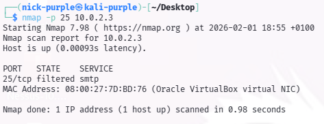
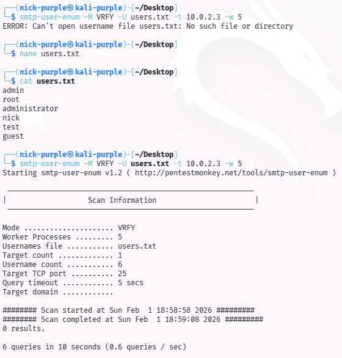

> **English** | [Italiano](README.md)

# SMTP Protocol Audit (Port 25)

> - **Phase:** Vulnerability Assessment - Protocol Audit (SMTP)
> - **Visibility:** Medium - nmap generates TCP traffic towards port 25; smtp-user-enum sends identifiable VRFY/EXPN application commands
> - **Prerequisites:** TCP port 25 identified as potentially open from the recon phase; user wordlist for the enumeration test
> - **Output:** Finding VULN-005 (severity Informational) - port 25 filtered by firewall, SMTP user enumeration not possible; confirmation of security posture on the mail vector

---

## 1 Theoretical Introduction

The SMTP (Simple Mail Transfer Protocol) protocol manages email sending. During an audit, the presence of insecure commands like `VRFY` (Verify) or `EXPN` (Expand) is searched for, which allow an external attacker to enumerate valid system users without authentication.

SMTP enumeration is often the prelude to targeted Password Spraying or Brute Force attacks.

---

## 2 Service Availability Check (Port Scan)

**Finding ID:** `VULN-005` | **Severity:** `Informational`

A targeted scan was performed on TCP port 25 to verify the presence of a Mail Transfer Agent (MTA).

Command:

```Bash
nmap -p 25 10.0.2.3
```



Result Analysis:

- Port Status: filtered.
- Interpretation: The target does not respond to requests on port 25. The "filtered" status indicates that a firewall (probably Windows Defender Firewall) is actively blocking incoming packets.
- Assessment: Secure configuration. The service is not reachable from outside.

---

## 3 Enumeration Attempt (Proof of Concept)

To validate the effectiveness of the firewall detected with Nmap, an active user enumeration test was performed using `smtp-user-enum`. A custom wordlist (`users.txt`) was created containing common usernames (admin, root, nick, guest).

Command:

```Bash
smtp-user-enum -M VRFY -U users.txt -t 10.0.2.3 -w 5
```



Outcome Analysis:

The tool completed the scan with "0 results". Due to port 25 filtering, the service did not respond to VRFY commands, preventing any form of user enumeration. This confirms that the email-related attack surface is completely mitigated.

---

## 4 Conclusions

The SMTP protocol audit gave a Positive (Secure) result.

The target system correctly protects port 25 via firewall, rendering SMTP-based User Enumeration techniques ineffective. No vulnerabilities or risky configurations were detected on this vector.

---

## MITRE ATT&CK Mapping

| Tactic | Technique | MITRE ID | Action Description |
| :--- | :--- | :--- | :--- |
| Discovery | Network Service Discovery | `T1046` | Nmap scan on TCP port 25 to verify SMTP service presence and status; result: port in "filtered" state (VULN-005). |
| Reconnaissance | Active Scanning: Vulnerability Scanning | `T1595.002` | User enumeration attempt through `smtp-user-enum` with VRFY commands and custom wordlist; result: 0 responses due to firewall filtering (VULN-005). |

---

> **Note:** All documented activities were conducted in a virtualized lab environment (VirtualBox NAT Network). The target is a Windows 10 virtual machine owned by the author. No scan was performed on third-party systems without explicit authorization.
