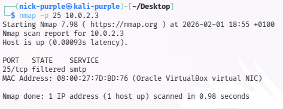
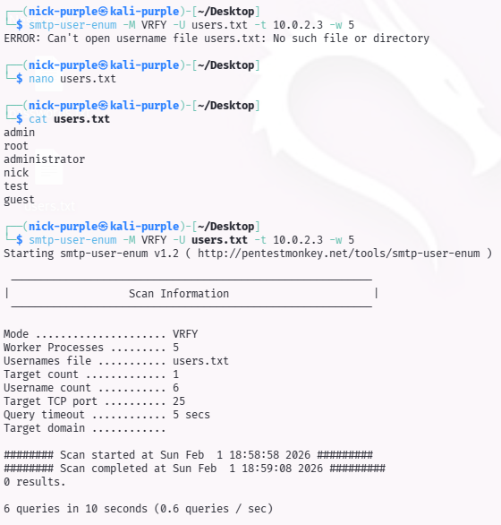

# da finire Audit Protocollo SMTP (Porta 25)

--- 

## 1 Introduzione Teorica

Il protocollo SMTP (Simple Mail Transfer Protocol) gestisce l'invio della posta elettronica. In fase di audit, si ricerca la presenza di comandi insicuri come `VRFY` (Verify) o `EXPN` (Expand) che permettono a un attaccante esterno di enumerare gli utenti validi del sistema senza autenticazione.

L'enumerazione SMTP è spesso il preludio ad attacchi di Password Spraying o Brute Force mirati.

---

## 2 Verifica Disponibilità Servizio (Port Scan)

È stata eseguita una scansione mirata sulla porta TCP 25 per verificare la presenza di un Mail Transfer Agent (MTA).

Comando:

```Bash
nmap -p 25 10.0.2.3
```



Analisi del Risultato:

- Stato Porta: filtered.
- Interpretazione: Il target non risponde alle richieste sulla porta 25. Lo stato "filtered" indica che un firewall (probabilmente Windows Defender Firewall) sta attivamente bloccando i pacchetti in ingresso.
- Valutazione: Configurazione sicura. Il servizio non è raggiungibile dall'esterno.

---

## 3 Tentativo di Enumerazione (Proof of Concept)

Per validare l'efficacia del firewall rilevato con Nmap, è stato eseguito un test attivo di enumerazione utenti utilizzando `smtp-user-enum`. È stata creata una wordlist personalizzata (`users.txt`) contenente nomi utente comuni (admin, root, nick, guest).

Comando:

```Bash
smtp-user-enum -M VRFY -U users.txt -t 10.0.2.3 -w 5
```



Analisi dell'Esito:

Il tool ha concluso la scansione con "0 results". A causa del filtraggio sulla porta 25, il servizio non ha risposto ai comandi VRFY, impedendo qualsiasi forma di user enumeration. Questo conferma che la superficie di attacco relativa alla posta elettronica è completamente mitigata.

---

## 4 Conclusioni

L'audit del protocollo SMTP ha dato esito Positivo (Sicuro).

Il sistema target protegge correttamente la porta 25 tramite firewall, rendendo inefficaci le tecniche di User Enumeration basate su SMTP. Non sono state rilevate vulnerabilità o configurazioni rischiose su questo vettore.