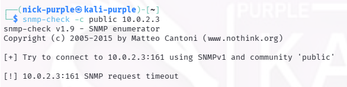

# Audit Protocollo SNMP (Porta 161 UDP)

Strumenti: Onesixtyone, Snmp-check

---

## 1 Introduzione Teorica

Il protocollo SNMP (Simple Network Management Protocol) viene utilizzato per il monitoraggio dei dispositivi di rete. Le versioni v1 e v2c sono considerate insicure perché trasmettono la "Community String" (password) in chiaro. Se attivo e mal configurato (community `public`), permette a un attaccante di mappare l'intero sistema (sistema operativo esatto e patch level,utenti presenti sul sistema, software installati, tutta la struttura della rete interna).

---

## 2 Verifica Presenza Servizio (Discovery)

È stato eseguito un tentativo di discovery utilizzando `onesixtyone` con un dizionario di community string comuni, per verificare se il servizio fosse attivo e raggiungibile.

```bash
onesixtyone -c /usr/share/doc/onesixtyone/dict.txt 10.0.2.3
```

Risultato: Il tool non ha ricevuto alcuna risposta dal target. Nessuna community string valida è stata identificata.

---

## 3 Tentativo di Enumerazione (Deep Scan)

Per ulteriore conferma, è stato lanciato `snmp-check` ipotizzando la community di default "public".

```Bash
snmp-check -c public 10.0.2.3
```



Esito: Timeout della richiesta. Il target non ha la porta UDP 161 aperta.

---

## 4 Conclusioni

L'audit ha dato esito Positivo (Sicuro).

Il servizio SNMP non è installato o è disabilitato sulla macchina target. La superficie di attacco relativa al monitoraggio di rete è inesistente. Questa configurazione è raccomandata per workstation che non necessitano di monitoraggio centralizzato.