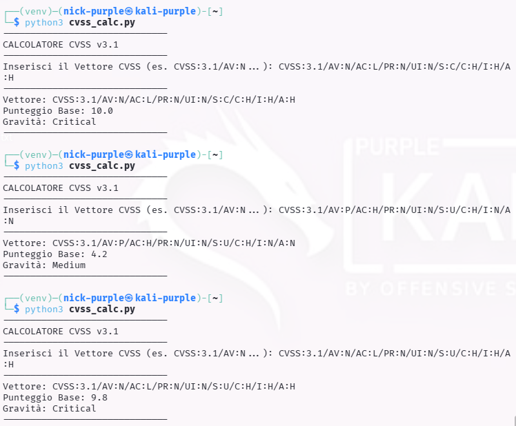

# Analisi del Rischio: CVSS Calculator

Strumenti: Python, CVSS Library
Metodologia: CVSS v3.1 (Common Vulnerability Scoring System)

---

## 1 Introduzione Teorica

Il Risk Scoring è il processo di quantificazione del rischio associato a una vulnerabilità di sicurezza. Lo standard industriale utilizzato è il CVSS. Questo sistema permette di trasformare le caratteristiche tecniche di un bug (es. complessità dell'attacco, impatto sui dati) in un valore numerico da 0.0 a 10.0.

La classificazione standard è:
- 0.1 - 3.9: Low (Basso)
- 4.0 - 6.9: Medium (Medio)
- 7.0 - 8.9: High (Alto)
- 9.0 - 10.0: Critical (Critico)

---

## 2 Calcolo Manuale del Punteggio (Python Scripting)

Per comprendere le metriche alla base del punteggio, è stato realizzato uno script in Python utilizzando la libreria `cvss`. È stato simulato il calcolo per una vulnerabilità critica nota (simile a EternalBlue), caratterizzata da:
- Attack Vector (AV): Network (Attaccabile da remoto).
- Access Complexity (AC): Low (Facile da eseguire).
- Privileges Required (PR): None (Nessuna autenticazione richiesta).
- Impact (C/I/A): High (Compromissione totale di riservatezza, integrità e disponibilità).

Esecuzione dello Script:

```Bash
python3 -m venv venv
source venv/bin/activate
pip install cvss
nano cvss_calc.py           # copiare il contenuto del file cvss_calc.py
```

```Bash
python3 cvss_calc.py
```



```bash
deactivate                  # eseguire quando si è finito
```
