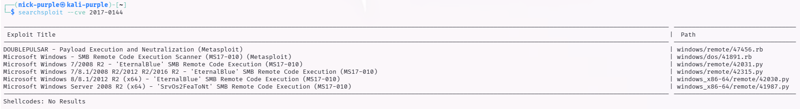
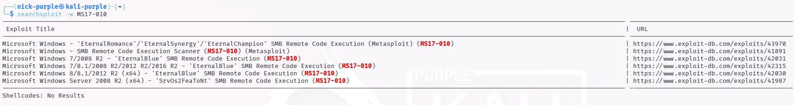

# Analisi dei Database di Vulnerabilità

---

## 1 Introduzione Teorica

I Vulnerability Databases sono archivi centralizzati che catalogano le vulnerabilità software note.
- CVE (Common Vulnerabilities and Exposures): È lo standard industriale per identificare univocamente una vulnerabilità (es. `CVE-2017-0144`). Gestito dal MITRE.
- NVD (National Vulnerability Database): Arricchisce i CVE con punteggi di rischio (CVSS) e dettagli sulle patch. Gestito dal NIST.
- Exploit-DB: Un archivio orientato all'offensiva che contiene i Proof of Concept (PoC) e gli exploit funzionanti mappati ai relativi CVE.

Utilità nel Mondo Reale:

La gestione della sicurezza aziendale (Vulnerability Management) si basa sul monitoraggio di questi database. L'uscita di un nuovo CVE critico su NVD fa scattare l'allarme per il patching; la comparsa del relativo codice su Exploit-DB indica che la minaccia è diventata attiva e sfruttabile da chiunque (Weaponization).

---

## 2 Ricerca di Precisione (Cross-Referencing)

Durante un audit, spesso si parte da un codice CVE fornito da uno scanner automatico (come OpenVAS o Nessus). È necessario interrogare il database locale per verificare la disponibilità di exploit pubblici.

Scenario: Lo scanner segnala `CVE-2017-0144`.

```bash
searchsploit --cve 2017-0144
```



Risultato: Il database locale conferma che per il CVE indicato esistono molteplici exploit. Il tool effettua automaticamente il mapping tra l'identificativo governativo (CVE) e l'identificativo interno di Exploit-DB (EDB-ID).

---

## 3 Consultazione delle Risorse Web

Per un'analisi completa, è spesso necessario consultare la documentazione originale o i commenti della community di sicurezza. L'opzione -w (Web) fornisce gli URL diretti alle schede tecniche.

```Bash
searchsploit -w MS17-010
```



Analisi: L'output mostra il collegamento diretto a `https://www.exploit-db.com/exploits/42315`. Visitando questa pagina, un analista può verificare:

- Se l'exploit è "Verified".
- La data di pubblicazione.
- Eventuali note aggiuntive non presenti nel file grezzo.

---

## 4 Conclusioni

L'uso combinato di identificativi standard (CVE) e database di exploit (Searchsploit) permette di trasformare un dato astratto (es. "Il sistema non è aggiornato") in una valutazione di rischio concreta ("Esiste un codice pubblico per attaccare questo sistema ora"). Questa competenza è fondamentale per definire le priorità di patching.