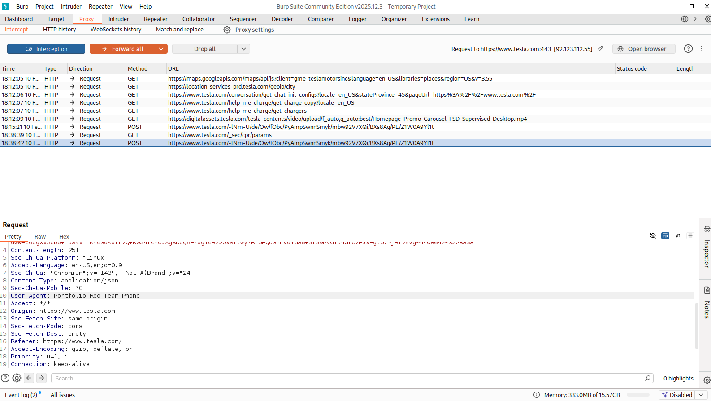
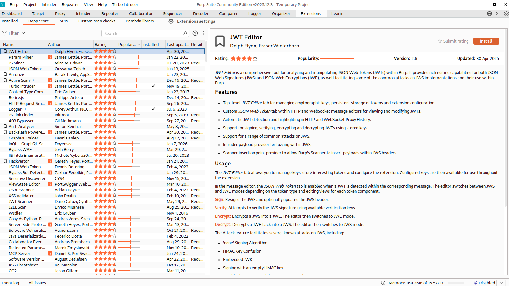

> **English** | [Italiano](README.md)

# Proxy Tools: Burp Suite Interception & Extensions

> - **Phase:** Web Attack - Proxy Setup & Traffic Manipulation
> - **Visibility:** Local - traffic stays between browser and proxy, no additional packets towards the target
> - **Prerequisites:** Browser configured to use proxy `127.0.0.1:8080`, Burp CA certificate installed in the trust store
> - **Output:** HTTP/HTTPS traffic interception and manipulation, User-Agent spoofing, request logging for subsequent analysis

---

Objective: Configure a local HTTP proxy to intercept, analyze and manipulate traffic between the client (Browser) and the target server, extending base functionality through BApps.

Target: `tesla.com` (Client-Side Analysis)

Tools: `Burp Suite Community Edition`

---

## 1 Theoretical Introduction

A Web Proxy (like Burp Suite) is the fundamental tool for Web Application Penetration Testing. It positions itself as a "Man-in-the-Middle" (MitM) between the attacker's browser and the web server. Unlike passive sniffers (Wireshark), the Proxy allows:

- Intercepting: Blocking an HTTP request before it leaves the computer.
- Modifying: Changing parameters, cookies or headers "on the fly".
- Forwarding: Sending the manipulated request to the server and analyzing how it responds.

---

## 2 Technical Execution: Traffic Manipulation

The proxy listener was configured on `127.0.0.1:8080` and traffic towards the target was intercepted.

Scenario: User-Agent Spoofing The objective is to modify the client identity declared in the HTTP header to simulate a different device or an authorized bot.

Procedure:

- Activation of `Intercept On` in the Proxy tab.
- Navigation to `tesla.com`.
- The GET request was blocked.
- The `User-Agent` header was manually modified from Mozilla/5.0... to `Portfolio-Red-Team-Phone`.
- The request was forwarded to the server (`Forward`).

Why is this technique critical in Red Teaming?

User-Agent manipulation allows Evasion and Access attacks:

- WAF Evasion: Changing the User-Agent to GoogleBot often bypasses firewalls that block known automated vulnerability scanners.
- Mobile Attack Surface: Impersonating a mobile device (iPhone, Android) can force the server to return a simplified version of the site, which often contains fewer security controls or different vulnerable APIs.
- Legacy Access: Simulating obsolete browsers (e.g., IE6) can unlock legacy administration panels not visible to modern browsers.

---

## 3 Advanced Configuration: BApp Store

To prepare the environment for more complex tests, the BApp Store was explored - Burp's official extension repository. Extensions allow automating repetitive tasks or supporting specific protocols.

Key extensions identified:

- Logger++: For advanced request logging (useful when the basic History is insufficient).
- Turbo Intruder: For high-speed brute-force attacks (Race Conditions).
- Autorize: For automatically testing access control vulnerabilities (IDOR) by navigating as different users.

---

## 4 Conclusions

The ability to intercept and modify traffic "in transit" is the prerequisite for any advanced Web Hacking activity. Through this lab, competence in HTTP flow management was demonstrated, going beyond simple passive browsing and directly interacting with the underlying protocol to manipulate server responses.

---

## 5 Extra, Note on Persistence and Reporting (.burp files)

During this lab the Community Edition was used, which operates exclusively in "Temporary Project" mode (in memory).
In an enterprise context (Enterprise/Red Team) using Burp Suite Professional, the standard workflow involves continuous project saving in `.burp` format.

Importance of .burp files:

- Evidence Retention: Ensures forensic preservation of all generated traffic, useful for responding to future disputes or for drafting the final report.
- Pause & Resume: Allows interrupting a test and resuming it days later while maintaining the Scanner, Repeater and Sitemap state.
- Collaboration: Files can be shared between team members to analyze complex vulnerabilities as a group.

---

## MITRE ATT&CK Mapping

| Tactic | Technique | MITRE ID | Action Description |
| :--- | :--- | :--- | :--- |
| Collection | Man-in-the-Middle | `T1557` | Positioning Burp Suite as MitM proxy between browser and `tesla.com` server to intercept HTTP/HTTPS traffic |
| Defense Evasion | Masquerading: Masquerade File Type | `T1036.008` | Modification of the `User-Agent` header from standard browser to `Portfolio-Red-Team-Phone` to simulate a different device and potentially bypass security controls |

---

> **Note:** The activities documented in this lab were conducted on `tesla.com` as part of a client-side analysis of HTTP traffic from the local browser to the target. The traffic did not generate invasive or automated requests towards the server. In a real engagement, any interception activity on unauthorized systems constitutes a privacy violation and a cybercrime offense.
