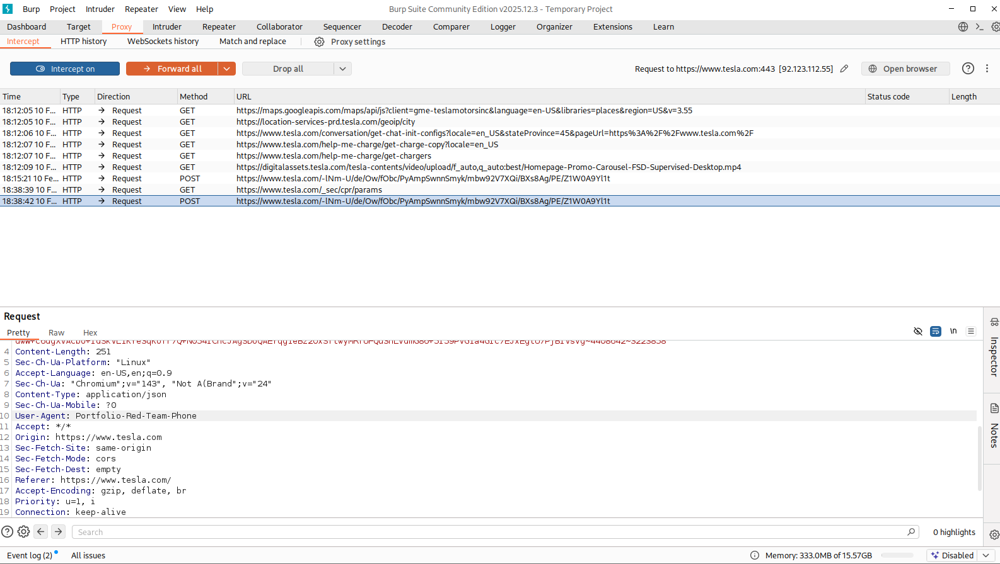
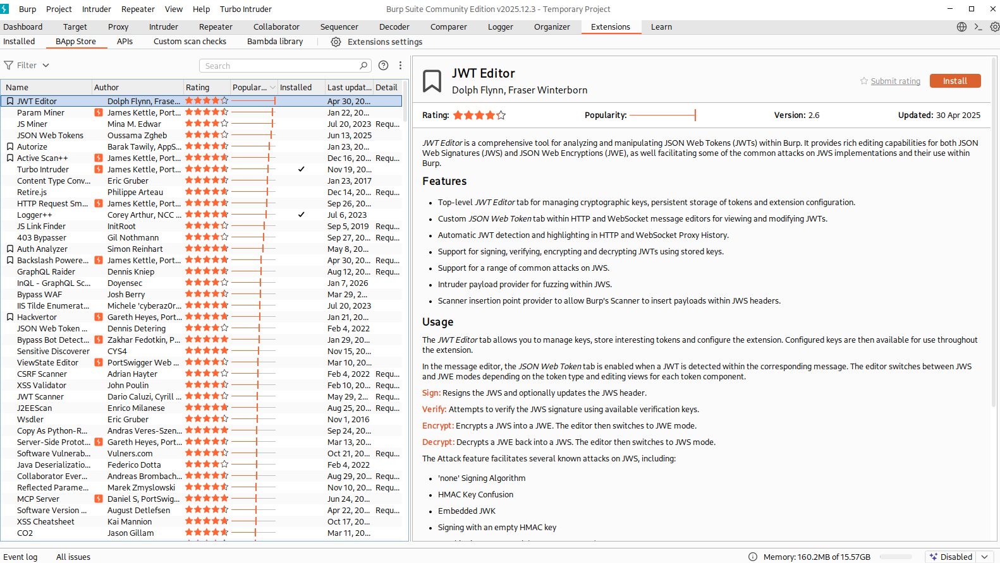

# Proxy Tools: Burp Suite Interception & Extensions

Obiettivo: Configurazione di un proxy HTTP locale per intercettare, analizzare e manipolare il traffico tra il client (Browser) e il server target, estendendo le funzionalità base tramite BApps.

Target: `tesla.com` (Analisi Client-Side)

Strumenti: `Burp Suite Community Edition`

---

## 1 Introduzione Teorica

Un Web Proxy (come Burp Suite) è lo strumento fondamentale per il Web Application Penetration Testing. Si posiziona come "Man-in-the-Middle" (MitM) tra il browser dell'attaccante e il server web. A differenza degli sniffer passivi (Wireshark), il Proxy permette di:

- Intercettare: Bloccare una richiesta HTTP prima che lasci il computer.
- Modificare: Cambiare parametri, cookie o header "al volo".
- Inoltrare: Inviare la richiesta manipolata al server e analizzare come risponde.

---

## 2 Esecuzione Tecnica: Traffic Manipulation

È stato configurato il proxy listener su `127.0.0.1:8080` ed è stato intercettato il traffico verso il target.

Scenario: User-Agent Spoofing L'obiettivo è modificare l'identità del client dichiarata nell'header HTTP per simulare un dispositivo diverso o un bot autorizzato.

Procedura:

- Attivazione di `Intercept On` nel tab Proxy.
- Navigazione verso `tesla.com`.
- La richiesta GET è stata bloccata.
- L'header `User-Agent` è stato modificato manualmente da Mozilla/5.0... a `Portfolio-Red-Team-Phone`.
- La richiesta è stata inoltrata al server (`Forward`).

Perché questa tecnica è critica nel Red Teaming?

La manipolazione dello User-Agent permette di eseguire attacchi di Evasione e Accesso:

- WAF Evasion: Modificare lo User-Agent in GoogleBot permette spesso di bypassare i firewall che bloccano gli scanner di vulnerabilità automatici.
- Mobile Attack Surface: Fingersi un dispositivo mobile (iPhone, Android) può costringere il server a restituire una versione semplificata del sito, che spesso contiene meno controlli di sicurezza o API diverse vulnerabili.
- Legacy Access: Simulare browser obsoleti (es. IE6) può sbloccare pannelli di amministrazione legacy non visibili ai browser moderni.

---

## 3 Advanced Configuration: BApp Store

Per preparare l'ambiente a test più complessi, è stato esplorato il BApp Store, il repository ufficiale delle estensioni di Burp. Le estensioni permettono di automatizzare task ripetitivi o supportare protocolli specifici.

Estensioni chiave identificate:

- Logger++: Per un logging avanzato delle richieste (utile quando la History di base non basta).
- Turbo Intruder: Per attacchi di brute-force ad alta velocità (Race Conditions).
- Autorize: Per testare automaticamente le vulnerabilità di controllo accessi (IDOR) navigando come utenti diversi.

---

## 4 Conclusioni

La capacità di intercettare e modificare il traffico "in transito" è il prerequisito per qualsiasi attività di Web Hacking avanzato. Attraverso questo lab, è stata dimostrata la competenza nella gestione del flusso HTTP, superando la semplice navigazione passiva e interagendo direttamente con il protocollo sottostante per manipolare la risposta del server.