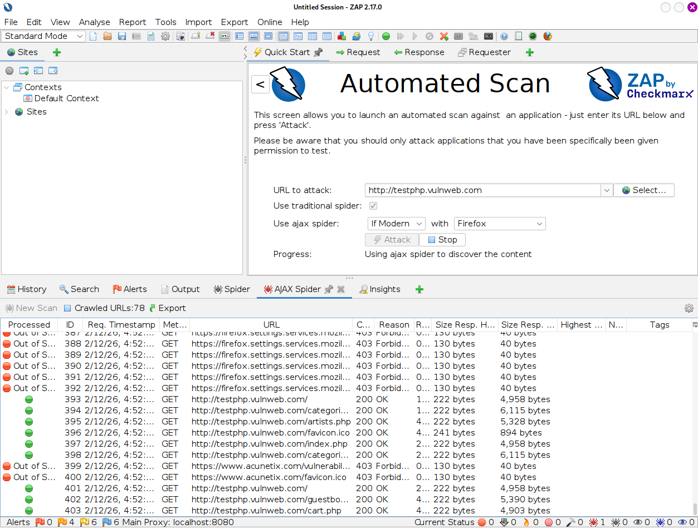
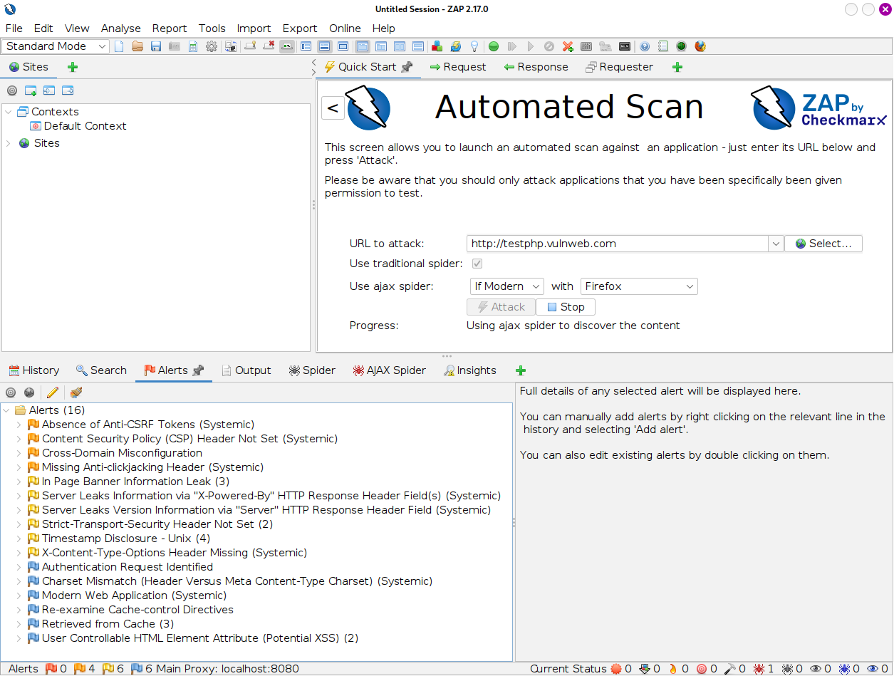
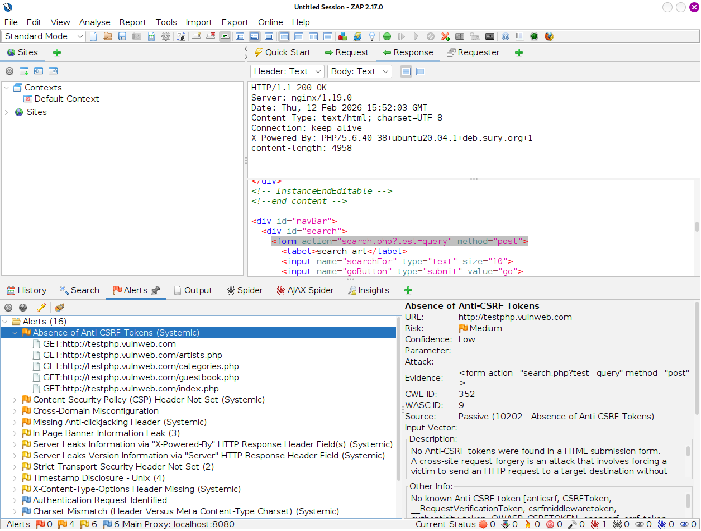

> **English** | [Italiano](README.md)

# Proxy Tools: OWASP ZAP & Automated Scanning

> - **Phase:** Web Attack - DAST Scanning
> - **Visibility:** Medium - OWASP ZAP generates structured HTTP traffic towards the target during spider and active scan
> - **Prerequisites:** Reachable web target, OWASP ZAP installed (preinstalled on Kali)
> - **Output:** Alert report classified by severity, finding WEB-001 (missing CSRF token)

---

**Finding ID:** `WEB-001` | **Severity:** `Medium` | **CVSS v3.1:** 5.4

---

Objective: Use an automated scanner (DAST - Dynamic Application Security Testing) to quickly identify known vulnerabilities and map the attack surface.

Target: `http://testphp.vulnweb.com` (Vulnerable educational target)

Tools: `OWASP ZAP` (Zed Attack Proxy)

---

## 1 Theoretical Introduction: DAST & Automation

While tools like Burp Suite are ideal for deep manual analysis, OWASP ZAP is the open-source standard for automation.
ZAP operates as a DAST scanner: it does not look at the source code, but attacks the application "from outside" while it is running, simulating a hacker who sends malicious payloads (SQL Injection, XSS) into every input field found.

ZAP's primary real-world use is in DevSecOps pipelines: it is integrated into CI/CD systems (e.g., Jenkins, GitHub Actions) to automatically block software release if new vulnerabilities are detected.

---

## 2 Technical Execution: Automated Scan

The test was conducted in three distinct phases.

Execute from terminal:

```Bash
zaproxy
```

#### Phase A: Configuration and Spidering

An "Automated Scan" was launched against the target application. ZAP activated the Spider (crawler) to automatically browse the site and discover all hidden pages, forms and parameters.



#### Phase B: Identification (Alerts)

At the end of the scan, ZAP populated the "Alerts" tab with potential vulnerabilities, classified by risk (High, Medium, Low).



Findings Analysis:

The screenshot highlights several security issues:

1.  Absence of Anti-CSRF Tokens (Medium): Forms lack Cross-Site Request Forgery protection.

2.  User Controllable HTML Element Attribute (Potential XSS): ZAP detected that user input is reflected in the page without sanitization, a potential vector for XSS attacks.

3.  Missing Security Headers: Headers such as CSP (Content Security Policy) and Anti-Clickjacking are missing.

#### Phase C: Manual Verification (Triage)

A critical aspect of automated scanner usage is verification. Scanners often generate False Positives.
The alert related to CSRF tokens was analyzed in detail to verify the server's request and response.



*(The image shows how ZAP highlights the HTML form lacking random protection tokens)*

---

## 3 Conclusions and Assessment

Using OWASP ZAP allowed quickly mapping the security posture of `testphp.vulnweb.com`.

However, automation does not replace the human analyst. The scanner correctly found structural deficiencies (CSRF, Headers), but to confirm complex logical vulnerabilities (like IDOR or Business Logic Errors) it is necessary to switch to manual analysis with tools like Burp Suite.

Outcome: The target presents confirmed Medium-level vulnerabilities (CSRF, XSS Reflected) requiring immediate source code patching.

---

## MITRE ATT&CK Mapping

| Tactic | Technique | MITRE ID | Action Description |
| :--- | :--- | :--- | :--- |
| Reconnaissance | Active Scanning: Vulnerability Scanning | `T1595.002` | DAST scanning with OWASP ZAP on `testphp.vulnweb.com` to identify structural vulnerabilities: missing CSRF tokens (WEB-001), missing headers, potential XSS |
| Initial Access | Exploit Public-Facing Application | `T1190` | Identification and documentation of missing Anti-CSRF protection on application forms (WEB-001), constituting a vector for Cross-Site Request Forgery |

---

> **Note:** The DAST scan was conducted on `testphp.vulnweb.com`, Acunetix's intentionally vulnerable public training environment. Results were manually validated to eliminate false positives. In a production context, DAST scanning generates significant traffic and must be explicitly authorized - many WAFs block and alert on ZAP scans.
