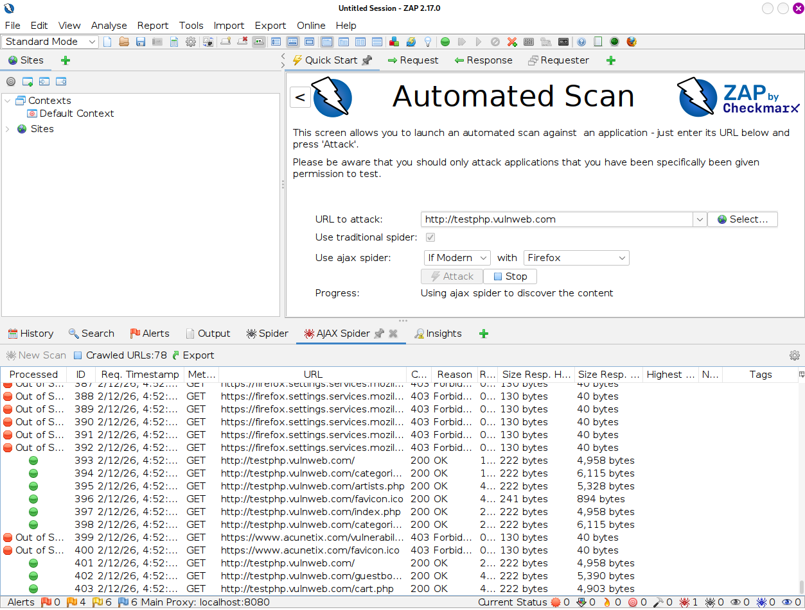
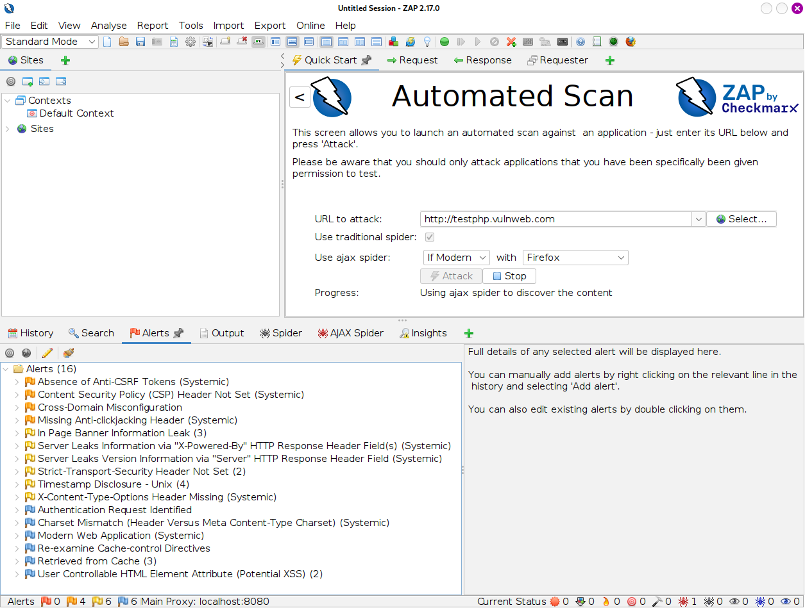

# Proxy Tools: OWASP ZAP & Automated Scanning

Obiettivo: Utilizzare uno scanner automatizzato (DAST - Dynamic Application Security Testing) per identificare rapidamente vulnerabilità note e mappare la superficie di attacco.

Target: `http://testphp.vulnweb.com` (Target didattico vulnerabile)

Strumenti: `OWASP ZAP` (Zed Attack Proxy)

---

## 1 Introduzione Teorica: DAST & Automazione

Mentre strumenti come Burp Suite sono ideali per l'analisi manuale approfondita, OWASP ZAP è lo standard open-source per l'automazione.
ZAP opera come uno scanner DAST: non guarda il codice sorgente, ma attacca l'applicazione "da fuori" mentre è in esecuzione, simulando un hacker che invia payload malevoli (SQL Injection, XSS) in ogni campo di input trovato.

L'uso principale di ZAP nel mondo reale è nelle pipeline DevSecOps: viene integrato nei sistemi di CI/CD (es. Jenkins, GitHub Actions) per bloccare automaticamente il rilascio di software se vengono rilevate nuove vulnerabilità.

---

## 2 Esecuzione Tecnica: Automated Scan

Il test è stato condotto in tre fasi distinte.

Eseguire da terminale:

```Bash
zaproxy
```

#### Fase A: Configurazione e Spidering

È stato lanciato un "Automated Scan" contro l'applicazione target. ZAP ha attivato il Spider (crawler) per navigare automaticamente il sito e scoprire tutte le pagine, i form e i parametri nascosti.



#### Fase B: Identification (Alerts)

Al termine dello scan, ZAP ha popolato la scheda "Alerts" con le vulnerabilità potenziali, classificate per rischio (High, Medium, Low).



Analisi dei Findings:

Dallo screenshot si evidenziano diverse problematiche di sicurezza:

1.  Absence of Anti-CSRF Tokens (Medium): I form non hanno protezione contro il Cross-Site Request Forgery.

2.  User Controllable HTML Element Attribute (Potential XSS): ZAP ha rilevato che l'input utente viene riflesso nella pagina senza sanitizzazione, potenziale vettore per attacchi XSS.

3.  Missing Security Headers: Mancano header come CSP (Content Security Policy) e Anti-Clickjacking.

#### Fase C: Verifica Manuale (Triage)

Un aspetto critico dell'uso degli scanner automatici è la verifica. Gli scanner generano spesso Falsi Positivi.
È stato analizzato nel dettaglio l'alert relativo ai token CSRF per verificare la richiesta e la risposta del server.


*(Nell'immagine si nota come ZAP evidenzi il form HTML privo di token di protezione randomici)*

---

## 3 Conclusioni e Valutazione

L'utilizzo di OWASP ZAP ha permesso di mappare rapidamente la postura di sicurezza di `testphp.vulnweb.com`.

Tuttavia, l'automazione non sostituisce l'analista umano. Lo scanner ha trovato correttamente mancanze strutturali (CSRF, Headers), ma per confermare vulnerabilità logiche complesse (come IDOR o Business Logic Errors) è necessario passare all'analisi manuale con strumenti come Burp Suite.

Outcome: Il target presenta vulnerabilità confermate di livello Medio (CSRF, XSS Reflected) che richiedono patching immediato del codice sorgente.