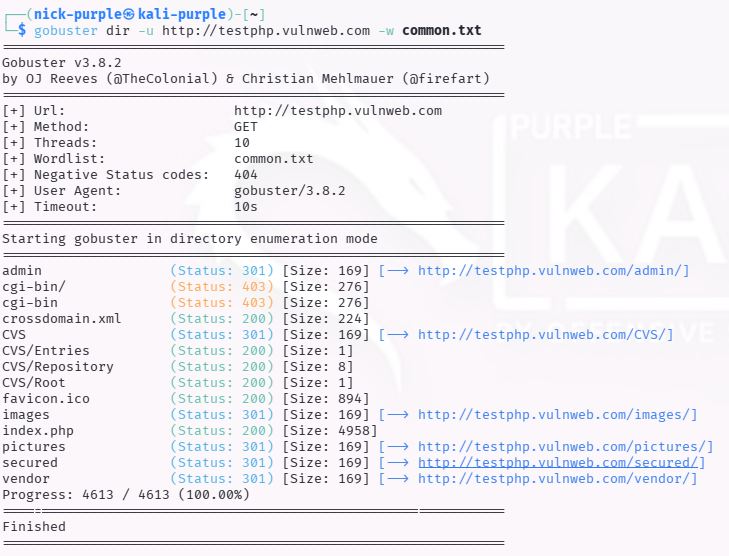

# Web Recon: Directory Busting con Gobuster

Obiettivo: Identificare risorse nascoste (directory, file di backup, pannelli di amministrazione) non linkate direttamente nell'applicazione web, utilizzando tecniche di Brute-force.

Target: `http://testphp.vulnweb.com`

Strumenti: `Gobuster` (v3.x), `wget`, `Feroxbuster`

---

## 1 Introduzione Teorica

Il Directory Busting è una tecnica di Enumerazione Attiva.

A differenza dei crawler tradizionali che seguono i link visibili, il Directory Busting cerca di "indovinare" l'esistenza di percorsi nascosti inviando migliaia di richieste basate su una Wordlist.

I codici di stato HTTP rivelano la presenza delle risorse:

- 200 OK: La risorsa esiste.
- 301 Redirect: Spesso indica una directory esistente (es. `/admin`).
- 403 Forbidden: La risorsa esiste ma l'accesso è negato.

---

## 2 Esecuzione Tecnica: Setup & Scan

Poiché l'ambiente di test (Kali Purple) non disponeva delle wordlist standard preinstallate, è stato necessario eseguire una fase preliminare di setup per recuperare il dizionario d'attacco `common.txt`.

Fase A: Recupero Wordlist

```bash
wget https://raw.githubusercontent.com/v0re/dirb/master/wordlists/common.txt
```

Fase B: Gobuster Scan È stato lanciato Gobuster in modalità dir (directory enumeration) contro il target.

```Bash
gobuster dir -u http://testphp.vulnweb.com -w common.txt
```



Risultato (Output):

Analisi dei Findings: La scansione ha rivelato diverse directory critiche non visibili dalla homepage:

- `/admin` (Status 301): Un pannello di amministrazione. Questo è il punto di ingresso prioritario per tentare attacchi di SQL Injection o Brute Force sulle credenziali.
- `/secured` (Status 301): Una directory che suggerisce la presenza di dati sensibili o aree riservate.
- `/CVS` (Status 301): Esposizione di directory di versionamento (Legacy). Questo è un finding critico di "Information Disclosure" che potrebbe permettere il download del codice sorgente.
- `/cgi-bin` (Status 403): Una cartella di script server-side, protetta ma esistente.

---

## 3 Advanced Scanning: Feroxbuster (Recursive)

Per approfondire l'analisi, è stato utilizzato Feroxbuster, un tool scritto in Rust che supporta la ricorsione automatica.

A differenza di Gobuster, quando Feroxbuster individua una directory (es. `/admin`), avvia automaticamente una nuova scansione al suo interno senza intervento umano.

```bash
feroxbuster -u http://testphp.vulnweb.com -w common.txt
```

Evidenza (Recursion in Action):

Differenze Rilevate: Grazie alla ricorsione, Feroxbuster ha mappato non solo la presenza di /admin, ma ha immediatamente identificato le risorse al suo interno (es. /admin/index.php, /admin/login.php) in un unico passaggio, riducendo drasticamente il tempo di enumerazione profonda.

---

## 4 Conclusioni

L'attività di Directory Busting ha avuto successo, rivelando una superficie di attacco molto più ampia rispetto alla semplice navigazione manuale. In uno scenario di Red Teaming reale, il passo successivo consisterebbe nel puntare strumenti di attacco specifici (come Burp Suite o SQLMap) verso la directory `/admin` appena scoperta.

---

## 5 Scenario Moderno: Docker & REST APIs (Localhost)

Le tecniche di Directory Busting non si limitano ai server web tradizionali, ma sono fondamentali anche per testare microservizi containerizzati (Docker) e RESTful APIs in fase di sviluppo (es. su `localhost:5173`).

Adattamenti necessari per l'ambiente Docker/API:

1.  Wordlist API-Specifiche:

    Le wordlist standard (`common.txt`) sono inefficaci contro le API, che usano percorsi strutturati (es. `/api/v1/user`).

    È necessario utilizzare liste dedicate come `api-endpoints.txt` (dalla raccolta SecLists) per individuare endpoint critici come `/health`, `/metrics`, `/swagger.json` o `/graphql`.

2.  Networking (VM vs Host):

    Se Kali Linux gira su una Virtual Machine e il container Docker gira sull'Host (Windows/Mac), puntare a `localhost` dalla VM non funzionerà. È necessario utilizzare l'indirizzo IP della macchina host nella rete locale (es. `gobuster dir -u http://192.168.X.X:<PORTA> ...`).

3.  Autenticazione (JWT Headers):

    Molte API restituiscono `401 Unauthorized` se non si presenta un token valido. Strumenti come Gobuster e Feroxbuster permettono di iniettare header di autenticazione per testare le aree riservate:

```bash
# Esempio di scansione autenticata su API locale
gobuster dir -u http://localhost:<PORTA> -w api-endpoints.txt -H "Authorization: Bearer <IL_TUO_JWT_TOKEN>"
```

Valore nel Red Teaming:

Scansionare container locali permette di individuare Debug Endpoints (es. Spring Boot Actuators) dimenticati attivi, che spesso espongono variabili d'ambiente e credenziali del cloud prima ancora che l'app vada in produzione.