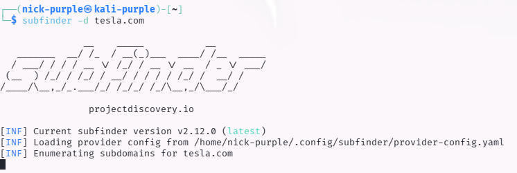
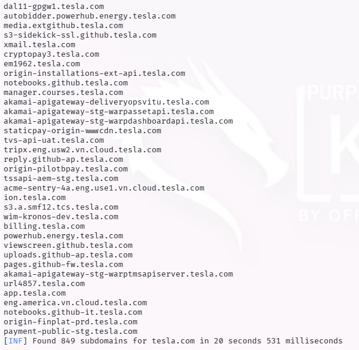

> **English** | [Italiano](README.md)

# Web Recon: Subdomain Enumeration

> - **Phase:** Web Attack - Subdomain Enumeration
> - **Visibility:** Low (passive enumeration from CT logs and OSINT) / Medium (active DNS brute force)
> - **Prerequisites:** Target domain identified, `subfinder` and `amass` installed
> - **Output:** List of active subdomains, correlated IPs, ASN mapping, potential less-protected secondary targets

---

Objective: Map an organization's external infrastructure by identifying valid subdomains, in order to expand the attack surface and find less-protected secondary services.

Target: `tesla.com` (Passive Scan)

Tools: `Subfinder`, `OWASP Amass`

---

## 1 Theoretical Introduction

Subdomain Enumeration is the critical reconnaissance phase where you go from knowing only the main domain (`tesla.com`) to knowing the entire network of exposed services (`dev.tesla.com`, `vpn.tesla.com`, `api.tesla.com`).

Techniques are divided into:

- Passive Enum: Querying public sources (OSINT), Certificate Transparency Logs (CT), and search engines (VirusTotal, Shodan). There is no direct interaction with the target.
- Active Enum: DNS name brute-forcing (attempts with wordlists) and Zone Transfers. Generates traffic towards the target.

---

## 2 Tools Used

#### Subfinder (Go)

Subfinder was chosen for its speed and passive nature. It uses multiple sources (Chaos, Censys, SecurityTrails) to aggregate data without alerting the target's defense systems (IDS/IPS).

#### OWASP Amass

In more complex scenarios, Amass is used for deep mapping, including ASN analysis and reverse WHOIS, offering a topological view of the network.

---

## 3 Technical Execution

A passive scan was performed on the `tesla.com` domain.

```Bash
sudo apt install subfinder -y
subfinder -d tesla.com
```





Result (Partial Output):

Results Analysis: The scan revealed hundreds of active subdomains. The most interesting targets for a Red Team would be:

- `origin-*.tesla.com`: Often servers that bypass the WAF (CDN).
- `dev` or `staging`: Test environments often configured with active debug mode or weak credentials.
- `vpn` or `sso`: Employee access portals.

---

## 4 Deep Reconnaissance: OWASP Amass

To obtain a more in-depth mapping, OWASP Amass was used.

Unlike Subfinder which is focused on speed, Amass performs Active and Correlated Enumeration:

1.  DNS Brute-forcing: Attempts to guess subdomains not publicly listed using internal wordlists.

2.  ASN Mapping: Identifies which "Autonomous Systems" (physical networks) the found IPs belong to, allowing discovery of network blocks forgotten by the company.

3.  Certificate Scraping: Analyzes active SSL certificates to extract alternative names (Subject Alternative Name).

```Bash
sudo apt install amass -y
amass enum -d tesla.com
```

Evidence (Network Mapping):

Added Value: Amass allowed identifying not only subdomain names, but also their relationship with the underlying network infrastructure (IP addresses and hosting providers), offering a topological view of the target essential for planning lateral attacks.

---

## 5 Related Risk: Subdomain Takeover

Enumeration is the prerequisite for identifying Subdomain Takeovers. If a subdomain (e.g., shop.tesla.com) points via CNAME to an external service (e.g., AWS S3, GitHub Pages) that has been decommissioned, an attacker can register that account on the third-party service and take complete control of the subdomain, inheriting its Trust and cookies.

---

## 6 Local Scenario: Virtual Host Fuzzing (Docker/Localhost)

While tools like Amass and Subfinder query public DNS, in local environments (LAN or Docker) these techniques cannot be used.
However, it is possible to perform Virtual Host (VHost) enumeration.

Many web servers (Nginx, Apache) on `localhost` are configured to serve different applications based on the HTTP request's `Host` header, while sharing the same IP address.

Gobuster is used in `vhost` mode to attempt guessing local subdomains (e.g., `admin.localhost`, `api.localhost`) by forcing the Host header.

```Bash
gobuster vhost -u http://localhost -w common.txt --append-domain
```

---

## 7 Case Study: Static Hosting (GitHub Pages)

The offensive approach changes radically when the target is a static site hosted on platforms like GitHub Pages (e.g., `https://nicholas-arcari.github.io/portfolio-nicholas/`).

Limitations of classical techniques:

- Subdomain Enum: Ineffective, since subdomains (`username.github.io`) belong to the provider's shared infrastructure.
- Server-Side Attacks: Impossible to execute SQL Injection or Remote Code Execution (RCE) since there is no dynamic backend or database.

Effective Attack Vectors (White Box):

The attack surface shifts from infrastructure to Source Code Disclosure.

Since the code is hosted in a public repository:

1.  Repository Mining: The attacker directly analyzes the GitHub repository looking for sensitive files (`.env`, `config.js`).

2.  Commit History Analysis: Using tools like TruffleHog or GitLeaks, it is possible to recover credentials (API Keys, AWS Tokens) that have been deleted from current files but remain permanent in Git's commit history.

3.  Client-Side Logic: Since all logic is in the browser (JavaScript), any API keys used by the frontend are visible in plaintext to anyone who inspects the code (e.g., "Inspect Element").

---

## 8 Conclusions

The activity demonstrated how an organization's real attack surface is often much broader than the simple corporate website.

Identifying these peripheral assets is often the key to finding critical vulnerabilities, as they tend to be less monitored and updated than the main domain.

---

## MITRE ATT&CK Mapping

| Tactic | Technique | MITRE ID | Action Description |
| :--- | :--- | :--- | :--- |
| Reconnaissance | Active Scanning: Wordlist Scanning | `T1595.003` | DNS brute force with OWASP Amass to discover subdomains not publicly listed through internal wordlists |
| Reconnaissance | Gather Victim Network Info: Domain Properties | `T1590.001` | Passive subdomain enumeration of `tesla.com` through Subfinder (CT logs, VirusTotal, Censys) without direct interaction with the target |
| Reconnaissance | Active Scanning: Vulnerability Scanning | `T1595.002` | VHost fuzzing with Gobuster in `vhost` mode to identify hidden virtual hosts on local Docker environments |

---

> **Note:** Passive subdomain enumeration on `tesla.com` was conducted using exclusively public OSINT sources (Certificate Transparency Logs, VirusTotal, Censys). No requests were sent directly to Tesla servers. Section 6 (VHost Fuzzing) refers to local environments. Active reconnaissance (DNS brute force) on third-party domains without authorization may violate DNS provider terms of service and constitute a criminal offense.
