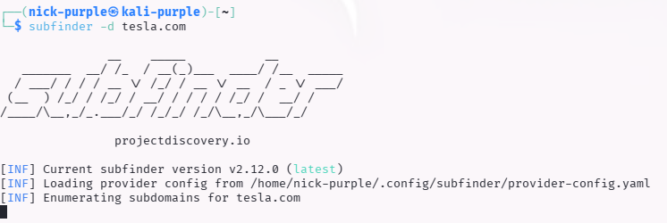
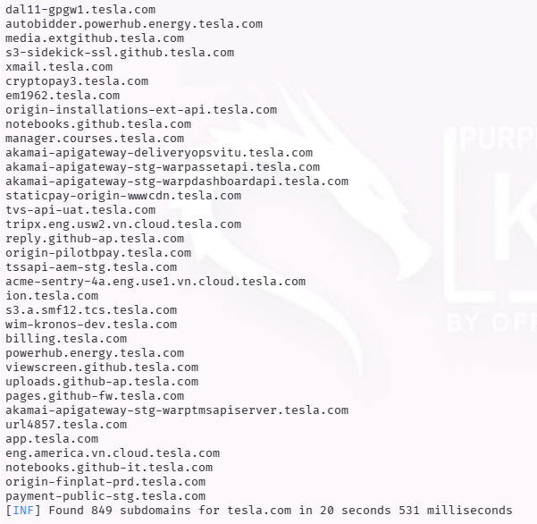

# Web Recon: Subdomain Enumeration

Obiettivo: Mappare l'infrastruttura esterna di un'organizzazione identificando i sottodomini validi, al fine di espandere la superficie di attacco e trovare servizi secondari meno protetti.

Target: `tesla.com` (Scansione Passiva)

Strumenti: `Subfinder`, `OWASP Amass`

---

## 1 Introduzione Teorica

La Subdomain Enumeration è la fase critica della ricognizione in cui si passa dal conoscere solo il dominio principale (`tesla.com`) al conoscere l'intera rete di servizi esposti (`dev.tesla.com`, `vpn.tesla.com`, `api.tesla.com`).

Le tecniche si dividono in:

- Passive Enum: Interrogazione di fonti pubbliche (OSINT), Certificate Transparency Logs (CT), e motori di ricerca (VirusTotal, Shodan). Non c'è interazione diretta con il target.
- Active Enum: Brute-forcing dei nomi DNS (tentativi con wordlist) e Zone Transfers. Genera traffico verso il target.

---

## 2 Strumenti Utilizzati

#### Subfinder (Go)

È stato scelto Subfinder per la sua velocità e natura passiva. Utilizza sorgenti multiple (Chaos, Censys, SecurityTrails) per aggregare dati senza allertare i sistemi di difesa (IDS/IPS) del target.

#### OWASP Amass

In scenari più complessi, Amass viene utilizzato per la mappatura profonda, includendo l'analisi degli ASN e il reverse WHOIS, offrendo una visione topologica della rete.

---

## 3 Esecuzione Tecnica

È stata eseguita una scansione passiva sul dominio `tesla.com`.

```bash
sudo apt install subfinder -y
subfinder -d tesla.com
```





Risultato (Output Parziale):

Analisi dei Risultati: La scansione ha rivelato centinaia di sottodomini attivi. I target più interessanti per un Red Team sarebbero:

- `origin-*.tesla.com`: Spesso server che bypassano il WAF (CDN).
- `dev` o `staging`: Ambienti di test spesso configurati con debug mode attivo o credenziali deboli.
- `vpn` o `sso`: Portali di accesso per i dipendenti.

---

## 4 Deep Reconnaissance: OWASP Amass

Per ottenere una mappatura più approfondita, è stato utilizzato OWASP Amass.

A differenza di Subfinder che è focalizzato sulla velocità, Amass esegue una Enumerazione Attiva e correlata:

1.  DNS Brute-forcing: Tenta di indovinare sottodomini non listati pubblicamente usando wordlist interne.

2.  ASN Mapping: Identifica a quali "Autonomous System" (reti fisiche) appartengono gli IP trovati, permettendo di scoprire blocchi di rete dimenticati dall'azienda.

3.  Certificate Scraping: Analizza i certificati SSL attivi per estrarre nomi alternativi (Subject Alternative Name).

```bash
sudo apt install amass -y
amass enum -d tesla.com
```


Evidenza (Network Mapping):

Valore Aggiunto: Amass ha permesso di identificare non solo i nomi dei sottodomini, ma anche la loro relazione con l'infrastruttura di rete sottostante (indirizzi IP e fornitori di hosting), offrendo una visione topologica del target essenziale per pianificare attacchi laterali.

---

## 5 Rischio Correlato: Subdomain Takeover

L'enumerazione è il prerequisito per identificare i Subdomain Takeover. Se un sottodominio (es. shop.tesla.com) punta tramite CNAME a un servizio esterno (es. AWS S3, GitHub Pages) che è stato dismesso, un attaccante può registrare quell'account sul servizio terzo e prendere il controllo completo del sottodominio, ereditandone la fiducia (Trust) e i cookie.

---

## 6 Conclusioni

L'attività ha dimostrato come la superficie di attacco reale di un'organizzazione sia spesso molto più vasta del semplice sito web istituzionale. L'identificazione di questi asset periferici è spesso la chiave per trovare vulnerabilità critiche, poiché tendono ad essere meno monitorati e aggiornati rispetto al dominio principale.