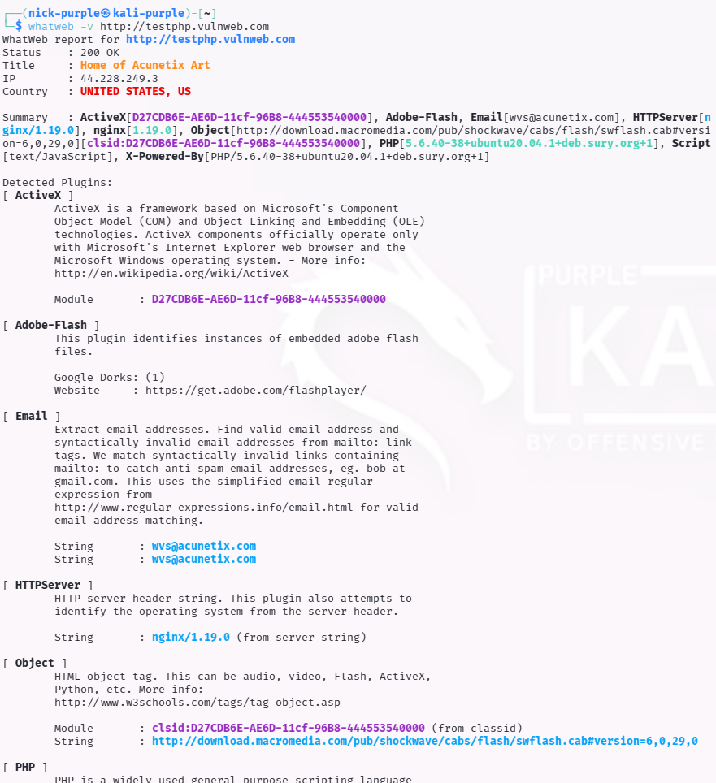
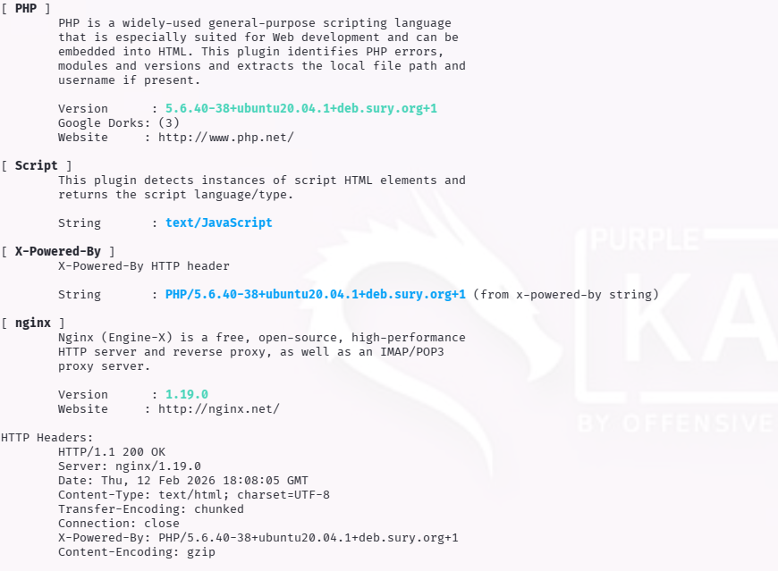

# Web Recon: Tech Profiling & Fingerprinting

Obiettivo: Identificare lo "Stack Tecnologico" (Sistema Operativo, Web Server, Framework, Linguaggi) del target per mirare la ricerca di vulnerabilità note (CVE).

Target: `http://testphp.vulnweb.com`

Strumenti: `WhatWeb` (CLI), `Wappalyzer` (Browser Extension)

---

## 1 Introduzione Teorica

Il Fingerprinting è l'arte di capire "di cosa è fatto" un sito web analizzando le risposte del server.

Le tecnologie web lasciano impronte digitali uniche:

- Header HTTP: `Server: Apache/2.4.41` o `X-Powered-By: PHP/7.4`.
- Codice Sorgente: Struttura delle cartelle (es. `/wp-content/` indica WordPress).
- Cookie: Nomi specifici come `JSESSIONID` (Java) o `PHPSESSID` (PHP).

Questa fase è cruciale per un attaccante: conoscere la versione esatta di un software permette di cercare Public Exploits specifici su database come Exploit-DB.

Perché un Red Teamer vuole sapere queste cose?

- CVE Mapping (Il motivo principale):

    - Se WhatWeb mi dice che il sito usa PHP 5.6.40, io vado su Google e cerco: "PHP 5.6.40 vulnerabilities". Scoprirò che è vecchio e pieno di buchi.
    - Se mi dice WordPress 4.8, cerco exploit per quella versione specifica. Non perdo tempo a lanciare attacchi per Joomla se il sito è WordPress.

- Default Credentials:

    - Se scopro che il server è Tomcat, proverò a loggarmi con tomcat:s3cret.
    - Se è Jenkins, proverò admin:password.
    - Sapere la tecnologia ti dà la chiave per indovinare la password di default.

- WAF Detection:

    - Questi tool ti dicono spesso se c'è un WAF (Web Application Firewall) come Cloudflare o Imperva. Se lo sai, sai che devi usare tecniche di evasione (o lasciar perdere per non farti bannare).
        
---

## 2 Strumenti Utilizzati

### WhatWeb (Active Scanner)

Strumento a riga di comando preinstallato su Kali Linux. Esegue una scansione rapida identificando CMS, piattaforme di blogging, librerie JavaScript e server web. Supporta diversi livelli di aggressività.

### Wappalyzer (Passive)

Utilizzato solitamente come estensione del browser, identifica le tecnologie analizzando passivamente la pagina caricata. Utile per una verifica visiva immediata senza inviare pacchetti di scansione sospetti.

---

## 3 Esecuzione Tecnica: WhatWeb Scan

È stata eseguita una scansione dettagliata (`-v`) contro il target per estrarre le versioni software.

```bash
whatweb -v http://testphp.vulnweb.com
```





Analisi dei Findings: L'output rivela informazioni critiche per la fase successiva di attacco:

- Web Server: Nginx 1.19.0. Sapere che è Nginx e non Apache cambia le tecniche di configurazione e i file da cercare (es. .htaccess non funziona su Nginx).
- Linguaggio: PHP 5.6.40. Finding Critico. Questa versione di PHP è obsoleta (End of Life) e soffre di numerose vulnerabilità note che potrebbero permettere Remote Code Execution (RCE).
- Framework: Nessun CMS complesso (come WordPress) rilevato, suggerendo un'applicazione custom ("Home of Acunetix Art").

---

## 4 Conclusioni

Il Tech Profiling ha confermato che il target gira su un'infrastruttura legacy (PHP 5.6). Questa informazione restringe il campo d'azione: invece di lanciare attacchi generici, un Red Team cercherebbe ora exploit specifici per PHP 5.6 o vulnerabilità di configurazione tipiche di Nginx 1.19.

---

## 5 Scenari Speciali: Localhost & Static Sites

Il Tech Profiling assume significati diversi a seconda dell'ambiente target.

#### A. Localhost / Docker (Hardening)

Lanciando WhatWeb contro ambienti di sviluppo locali (`localhost:5173`), l'obiettivo non è l'attacco ma l'Hardening.

I framework moderni (es. Express.js, Flask, Spring Boot) espongono di default header come `X-Powered-By` o `Server` che rivelano versioni precise del runtime.

Best Practice: Identificare questi leak in locale permette allo sviluppatore di disabilitarli (es. `app.disable('x-powered-by')` in Express) prima del deploy in produzione.

#### B. Static Hosting (GitHub Pages)

Analizzando siti statici come `https://nicholas-arcari.github.io`, il server web è gestito dal provider (GitHub) e quindi fuori dallo scope di attacco.
L'attenzione si sposta sulle Librerie Client-Side.

WhatWeb e Wappalyzer sono fondamentali per rilevare versioni obsolete di librerie JavaScript (es. jQuery < 3.0, Bootstrap vecchi) che spesso contengono vulnerabilità note di tipo DOM-based XSS, sfruttabili direttamente nel browser della vittima senza toccare il server.