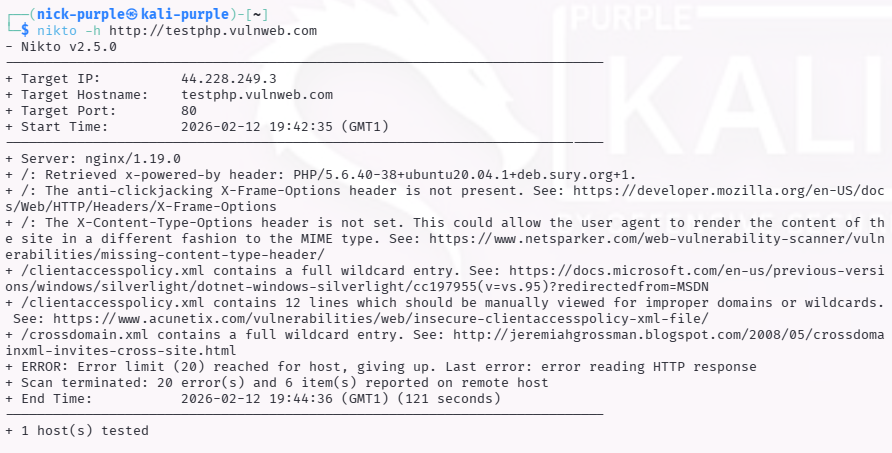
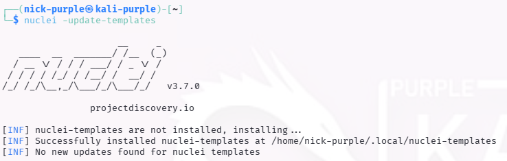
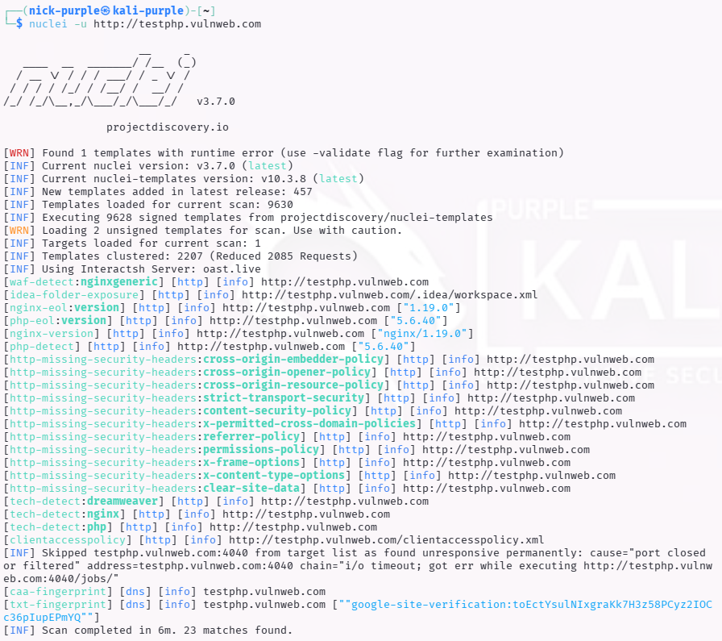

> **English** | [Italiano](README.md)

# Web Recon: Vulnerability Scanning (Nikto & Nuclei)

> - **Phase:** Web Attack - Automated Vulnerability Scanning
> - **Visibility:** High (Nikto - very noisy, easily detectable) / Medium (Nuclei - template-based, less detectable)
> - **Prerequisites:** Web target identified, `nikto` preinstalled on Kali, `nuclei` with updated templates
> - **Output:** List of vulnerabilities, misconfigurations and CVEs detected on the target; confirmation of WEB-002 and WEB-003

---

Objective: Automate the search for misconfigurations, default files and known server vulnerabilities on a web target.

Target: `http://testphp.vulnweb.com`

Tools: `Nikto` (Legacy Scanner), `Nuclei` (Modern Template Scanner)

---

## 1 Theoretical Introduction

Vulnerability Scanners are tools that query the target by comparing responses against a database of known signatures.
Unlike Tech Profiling (which identifies the technology), the Scanner actively searches for CVEs (Common Vulnerabilities and Exposures) and structural weaknesses.

### Tool Comparison:
- Nikto (Perl): A historical "general purpose" scanner. Excellent for detecting forgotten dangerous files and server misconfigurations. Known for being "noisy" (generates a lot of traffic).
- Nuclei (Go): The modern standard. Uses community-created YAML templates to detect specific vulnerabilities with very high precision and speed. Widely used in DevSecOps pipelines.

---

## 2 Technical Execution: Nikto Scan

A scan was performed with Nikto against the target server.

Command:
```Bash
nikto -h http://testphp.vulnweb.com
```




Detailed Findings Analysis: The scan, although prematurely interrupted by the server due to excessive errors, highlighted several structural criticalities:

- Information Disclosure (Critical): The server exposes the `X-Powered-By: PHP/5.6.40` header. Using an obsolete PHP version (End-Of-Life) exposes the application to known unpatachable vulnerabilities.
- Security Misconfiguration (Headers): Fundamental security headers are missing:

    - `X-Frame-Options`: Exposes to Clickjacking risk.
    - `X-Content-Type-Options`: Exposes to MIME Sniffing risk.

- Insecure Cross-Domain Policy: The `crossdomain.xml` and `clientaccesspolicy.xml` files are configured with wildcards (`*`), potentially allowing untrusted external domains to interact with the application (Legacy Risk).

Note on Error: The error Error limit (20) reached indicates that the target server stopped responding to requests. This highlights Nikto's "aggressive" nature, which in a real context would be easily detected and blocked by perimeter defense systems (WAF/IPS).

---

## 3 Advanced Scanning: Nuclei (Template Based)

For targeted and modern detection, Nuclei was used. Unlike Nikto, Nuclei uses daily-updated YAML Templates to identify specific CVEs.

Command:

```Bash
# Template update and execution
nuclei -update-templates
```



```Bash
nuclei -u http://testphp.vulnweb.com
```



Findings Analysis (Nuclei Scan):

Nuclei's output provides granular details on the infrastructure:

1.  DevOps Misconfiguration (`idea-folder-exposure`):

    The file `.idea/workspace.xml` was detected. This indicates that developers mistakenly uploaded IDE configuration files (IntelliJ/PHPStorm) to the production server. This file can reveal the internal project structure and source file names.

2.  Obsolete Software (`php-eol`, `nginx-eol`):

    Nuclei explicitly tagged the detected versions as EOL (End of Life).

    - PHP 5.6.40
    - Nginx 1.19.0

    This confirms that the software no longer receives security updates, making it a critical target.

3.  WAF Detection (`waf-detect`):

    The tool identified the server behavior as `nginxgeneric`, useful for planning Firewall evasion techniques in subsequent phases.

---

## 4 Special Scenarios: Localhost & Static Sites

The Vulnerability Scanning approach changes radically depending on the target environment.

#### A. Localhost / Docker (Hardening)

When scanning a local environment (`localhost:5173`) or a Docker container, the objective is not attack but Hardening. Running Nikto against your own container allows discovering if the server is "talking too much" (Verbose Headers).

- Example: Detecting that Express.js exposes `X-Powered-By: Express` allows the developer to disable that header before going to production, reducing information available to attackers.

#### B. Static Hosting (GitHub Pages)

Against static sites like `https://nicholas-arcari.github.io`, server-side scanners like Nikto are ineffective since the server is managed by the provider (GitHub) and is not modifiable. Attention shifts to Client-Side Libraries. In this scenario, the vulnerability is not in the server, but in the user's browser: one searches for obsolete JavaScript library versions (e.g., jQuery < 3.0, old Bootstrap) that contain DOM-based XSS vulnerabilities.

---

## Ethical Note: Report Management

The results reported above refer to `testphp.vulnweb.com`, an intentionally vulnerable public training environment.

Important: In a real scenario (client Pentest), scan reports containing software versions and specific vulnerabilities are classified as Strictly Confidential and must never be published on public repositories.

---

## MITRE ATT&CK Mapping

| Tactic | Technique | MITRE ID | Action Description |
| :--- | :--- | :--- | :--- |
| Reconnaissance | Active Scanning: Vulnerability Scanning | `T1595.002` | Scanning with Nikto and Nuclei to identify PHP EOL, missing security headers (`X-Frame-Options`, `X-Content-Type-Options`) and exposed crossdomain.xml |
| Reconnaissance | Gather Victim Host Info: Software | `T1592.002` | Nuclei templates `php-eol` and `nginx-eol` confirming PHP 5.6.40 and Nginx 1.19 as End of Life (WEB-002) |
| Discovery | File and Directory Discovery | `T1083` | Nuclei template `idea-folder-exposure` confirming the exposure of `.idea/workspace.xml` folder (WEB-003) |
| Discovery | Network Service Scanning | `T1046` | WAF behavior detection through Nuclei `waf-detect` template (identified as `nginxgeneric`) |

---

> **Note:** The Nikto scan generated over 20 errors on the target server, which stopped responding due to request saturation. This demonstrates Nikto's "aggressive" nature in production environments: the tool would have been blocked by any real WAF. Results refer to `testphp.vulnweb.com`, an authorized Acunetix test environment.
