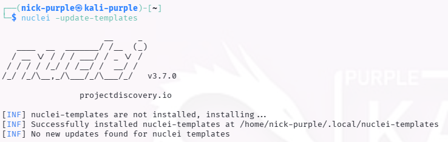
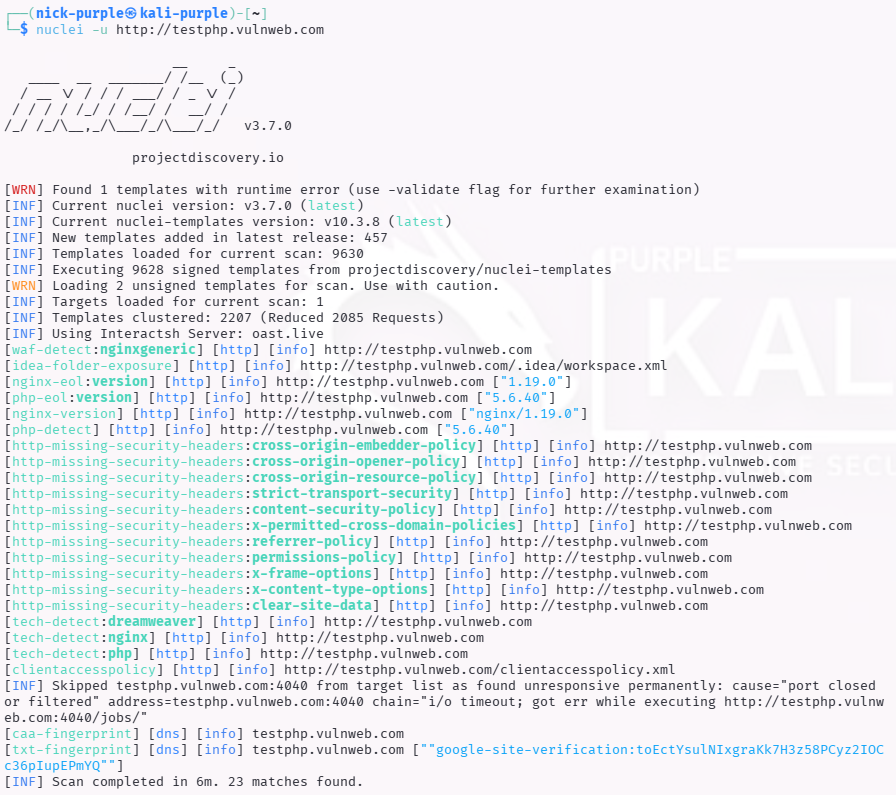

# Web Recon: Vulnerability Scanning (Nikto & Nuclei)

Obiettivo: Automatizzare la ricerca di configurazioni errate (Misconfigurations), file di default e vulnerabilità server note su un target web.

Target: `http://testphp.vulnweb.com`

Strumenti: `Nikto` (Legacy Scanner), `Nuclei` (Modern Template Scanner)

---

## 1 Introduzione Teorica

I Vulnerability Scanners sono strumenti che interrogano il target confrontando le risposte con un database di firme (signatures) note.
A differenza del Tech Profiling (che identifica la tecnologia), lo Scanner cerca attivamente CVE (Common Vulnerabilities and Exposures) e debolezze strutturali.

### Confronto Strumenti:
- Nikto (Perl): Uno scanner "general purpose" storico. Eccellente per rilevare file pericolosi dimenticati e configurazioni server errate. È noto per essere "rumoroso" (genera molto traffico).
- Nuclei (Go): Lo standard moderno. Utilizza template YAML creati dalla community per rilevare vulnerabilità specifiche con altissima precisione e velocità. È ampiamente usato nelle pipeline DevSecOps.

---

## 2 Esecuzione Tecnica: Nikto Scan

È stata eseguita una scansione con Nikto contro il server target.

Comando:
```bash
nikto -h http://testphp.vulnweb.com
```


Analisi Dettagliata dei Findings: La scansione, sebbene interrotta prematuramente dal server per eccesso di errori, ha evidenziato diverse criticità strutturali:

- Information Disclosure (Critico): Il server espone l'header `X-Powered-By: PHP/5.6.40`. L'uso di una versione PHP obsoleta (End-Of-Life) espone l'applicazione a vulnerabilità note non patchabili.
- Security Misconfiguration (Headers): Mancano header di sicurezza fondamentali:

    - `X-Frame-Options`: Espone al rischio di Clickjacking.
    - `X-Content-Type-Options`: Espone al rischio di MIME Sniffing.

- Insecure Cross-Domain Policy: I file `crossdomain.xml` e `clientaccesspolicy.xml` sono configurati con wildcard (`*`), permettendo potenzialmente a domini esterni non fidati di interagire con l'applicazione (Legacy Risk).

Nota sull'Errore: L'errore Error limit (20) reached indica che il server target ha smesso di rispondere alle richieste. Questo evidenzia la natura "aggressiva" di Nikto, che in un contesto reale verrebbe facilmente rilevato e bloccato dai sistemi di difesa perimetrale (WAF/IPS).

---

## 3 Advanced Scanning: Nuclei (Template Based)

Per una rilevazione mirata e moderna, è stato utilizzato Nuclei. A differenza di Nikto, Nuclei utilizza Template YAML aggiornati quotidianamente per identificare CVE specifiche.

Comando:

```Bash
# Aggiornamento template ed esecuzione
nuclei -update-templates
```



```Bash
nuclei -u http://testphp.vulnweb.com
```



Analisi dei Findings (Nuclei Scan):

L'output di Nuclei fornisce dettagli granulari sull'infrastruttura:

1.  DevOps Misconfiguration (`idea-folder-exposure`):

    È stato rilevato il file `.idea/workspace.xml`. Questo indica che gli sviluppatori hanno caricato per errore i file di configurazione dell'IDE (IntelliJ/PHPStorm) sul server di produzione. Questo file può rivelare la struttura interna del progetto e i nomi dei file sorgente.

2.  Software Obsoleto (`php-eol`, `nginx-eol`):

    Nuclei ha taggato esplicitamente le versioni rilevate come EOL (End of Life).

    - PHP 5.6.40
    - Nginx 1.19.0

    Questo conferma che il software non riceve più aggiornamenti di sicurezza, rendendolo un bersaglio critico.

3.  WAF Detection (`waf-detect`):

    Il tool ha identificato il comportamento del server come `nginxgeneric`, utile per pianificare tecniche di evasione del Firewall in fasi successive.

---

## 4 Scenari Speciali: Localhost & Static Sites

L'approccio al Vulnerability Scanning cambia radicalmente a seconda dell'ambiente target.

#### A. Localhost / Docker (Hardening)

Quando si scansiona un ambiente locale (`localhost:5173`) o un container Docker, l'obiettivo non è l'attacco ma l'Hardening. Lanciare Nikto contro il proprio container permette di scoprire se il server sta "parlando troppo" (Verbose Headers).

- Esempio: Rilevare che Express.js espone `X-Powered-By: Express` permette allo sviluppatore di disabilitare quell'header prima di andare in produzione, riducendo le informazioni disponibili agli attaccanti.

#### B. Static Hosting (GitHub Pages)

Contro siti statici come `https://nicholas-arcari.github.io`, scanner server-side come Nikto sono inefficaci poiché il server è gestito dal provider (GitHub) e non è modificabile. L'attenzione si sposta sulle Librerie Client-Side. In questo scenario, la vulnerabilità non è nel server, ma nel browser dell'utente: si cercano versioni obsolete di librerie JavaScript (es. jQuery < 3.0, Bootstrap vecchi) che contengono vulnerabilità DOM-based XSS.

---

## Nota Etica: Gestione dei Report

I risultati sopra riportati si riferiscono a `testphp.vulnweb.com`, un ambiente di addestramento pubblico intenzionalmente vulnerabile.

Importante: In uno scenario reale (Pentest su cliente), i report di scansione contenenti versioni software e vulnerabilità specifiche sono classificati come Strictly Confidential e non devono mai essere pubblicati su repository pubblici.