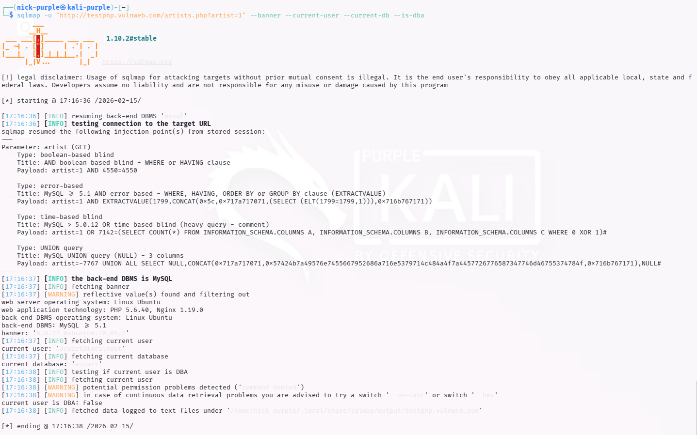
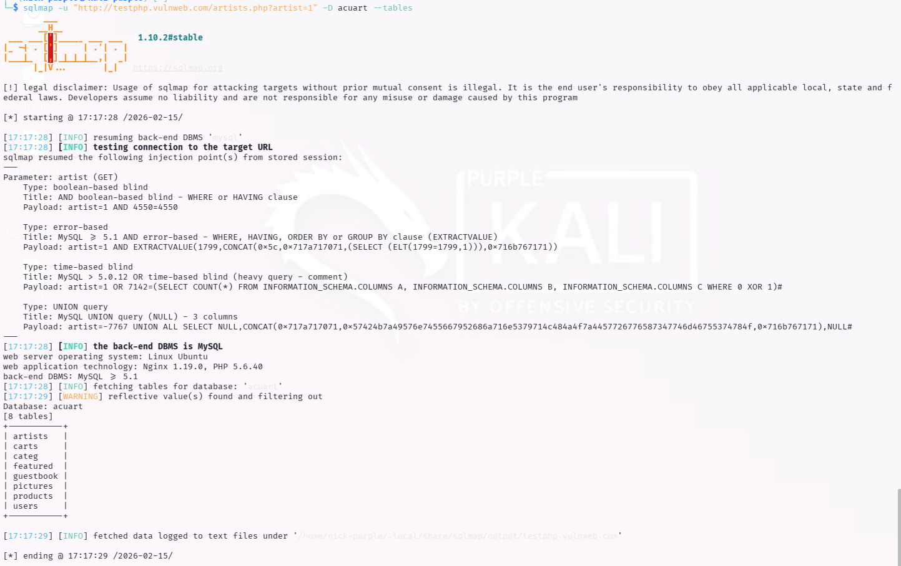
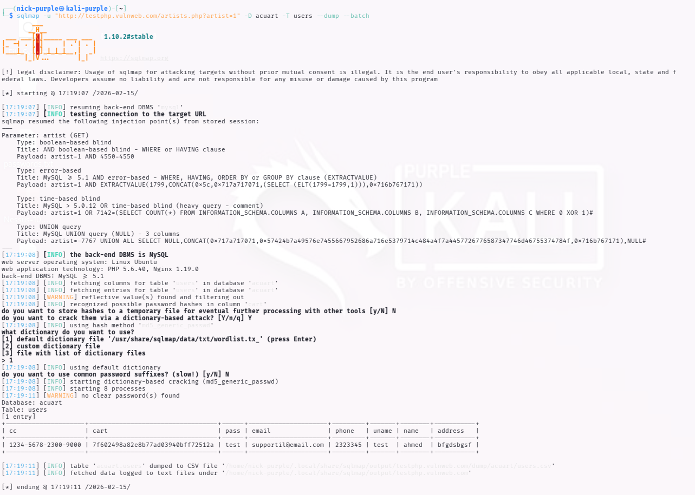

> **English** | [Italiano](README.md)

# Automated Vulnerability Assessment: SQL Injection & Data Exfiltration

> - **Phase:** Web Attack - SQL Injection (Automated)
> - **Visibility:** High - sqlmap generates heavy HTTP traffic in short time, easily detectable by WAF and IDS
> - **Prerequisites:** Vulnerable endpoint identified (also through manual test WEB-004), `sqlmap` installed (preinstalled on Kali)
> - **Output:** DBMS fingerprint, table dump, complete data exfiltration (credentials, credit card PANs), finding WEB-011

---

**Finding ID:** `WEB-011` | **Severity:** `Critical` | **CVSS v3.1:** 9.8

---

## 1 Executive Summary

During the automated Security Assessment activity, a critical SQL Injection vulnerability was detected on the `artists.php` endpoint.

Using the SQLMap tool allowed automating the entire attack process, confirming the possibility of injecting arbitrary commands into the backend database (MySQL).

The impact is assessed as Catastrophic for the following reasons:

- Total Exfiltration: It was possible to download the entire user database.
- PCI-DSS Violation: Credit Card numbers (PAN) stored in plaintext were found.
- Insecure Credential Management: User passwords are saved in plaintext, without any Hashing function.

---

## 2 Technical Execution

#### Phase 1: Vulnerability Scanning & Fingerprinting

In this initial phase, the tool queried the server to identify the database type and current user. 4 attack vectors were detected (Boolean-based, Error-based, Time-based, UNION query).

Command:

```Bash
sqlmap -u "http://testphp.vulnweb.com/artists.php?artist=1" --banner --current-user --current-db --is-dba
```



Result (Recon):

- DBMS: MySQL >= 5.1
- Current Database: `acuart`
- Current User: `acuart@localhost` (Not DBA)

#### Phase 2: Database Enumeration

Once the target database (`acuart`) was identified, table enumeration was performed to map the data structure and locate sensitive information.

Command:

```Bash
sqlmap -u "http://testphp.vulnweb.com/artists.php?artist=1" -D acuart --tables
```



Result:

8 tables were identified. The `users` table was selected as the primary target for exfiltration.

#### Phase 3: Data Exfiltration (The Breach)

Having confirmed the presence of the `users` table, a complete dump of columns containing credentials and personal data was performed.

Command:

```Bash
sqlmap -u "http://testphp.vulnweb.com/artists.php?artist=1" -D acuart -T users --dump --batch
```



Output Analysis (Evidence):

The screenshot below shows the successful data extraction. SQLMap generated a CSV report containing sensitive records, including passwords and credit cards.

Local File Path:

The complete dump was saved locally at: `~/.local/share/sqlmap/output/testphp.vulnweb.com/dump/acuart/users.csv`

---

## 3 Risk Analysis & Compliance

The extracted data analysis highlights severe violations of security best practices and international regulations.

| Extracted Data | Example Value | Violation / Risk |
|---------------|----------------|----------------------|
| Password | test | CRITICAL. Passwords are saved in plaintext (Cleartext). Total lack of Hashing (e.g., bcrypt, Argon2) and Salting. An attacker can immediately impersonate any user. |
| Credit Card (CC) | 1234-5678... | CRITICAL (PCI-DSS). Storing the PAN (Primary Account Number) in plaintext is a direct violation of PCI-DSS Requirement 3.4. |
| PII Data | Email, Phone, Address | HIGH (GDPR). Personal data exposure that can lead to identity theft and significant administrative penalties. |

---

## 4 Remediation Plan

To secure the infrastructure, the following immediate corrective actions are recommended:

- Secure Code (Preventive):
    
    - Implement Prepared Statements (Parameterized Queries) throughout all PHP code to neutralize SQL injection at its root.

- Data Protection (Corrective):

    - Passwords: Immediately migrate all user passwords to strong hashing algorithms (e.g., `bcrypt` or `Argon2id`). Never store passwords in plaintext.

    - Credit Cards: Never store complete credit card data unless strictly necessary. If required, use tokenization through Payment Gateway or strong encryption (AES-256) with secure key management.

- Infrastructure:

    - Implement a Web Application Firewall (WAF) (e.g., ModSecurity or Cloudflare services) to block known SQLMap attack patterns and malicious requests.

---

## MITRE ATT&CK Mapping

| Tactic | Technique | MITRE ID | Action Description |
| :--- | :--- | :--- | :--- |
| Initial Access | Exploit Public-Facing Application | `T1190` | Automated exploitation with sqlmap of the `artist` parameter vulnerable to SQL Injection on `testphp.vulnweb.com` (WEB-011) |
| Collection | Data from Information Repositories | `T1213` | Complete dump of the `acuart` database through sqlmap, including the `users` table with plaintext passwords and credit card PAN numbers (WEB-011) |
| Exfiltration | Exfiltration Over Web Service | `T1567` | Database dump saved in local CSV format at `~/.local/share/sqlmap/output/` (WEB-011) |

---

> **Note:** The sqlmap scan was conducted on `testphp.vulnweb.com`, Acunetix's public training environment. The CSV dump with credentials and credit card PANs was treated as sensitive data and not published in this repository. Finding WEB-011 includes a PCI-DSS Requirement 3.4 violation (plaintext PAN storage) that in a real engagement would require immediate client notification and incident response procedure.
