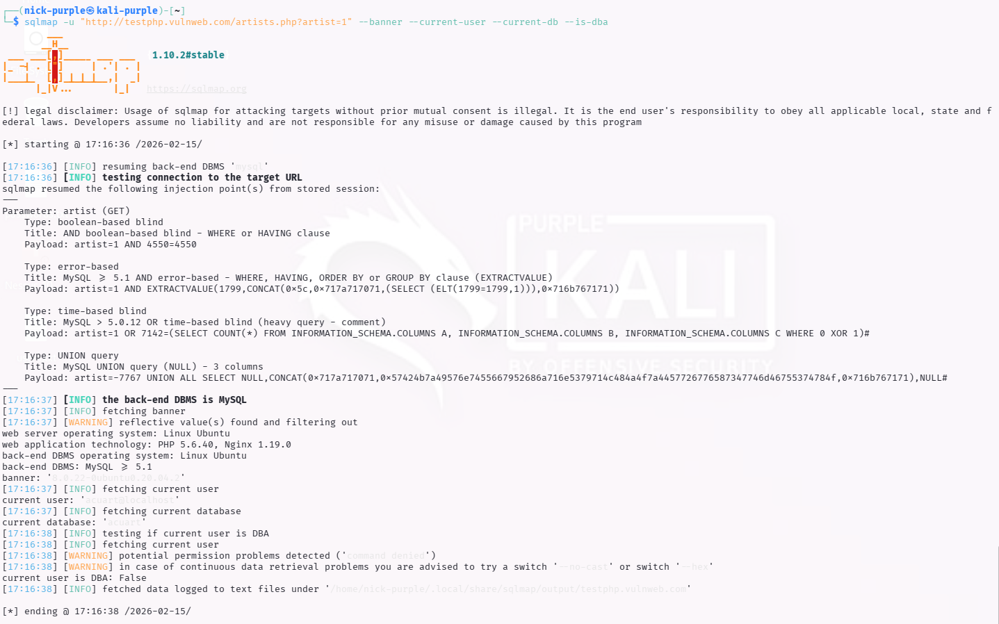
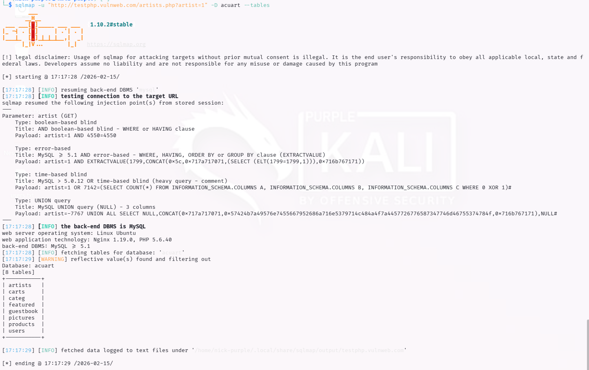
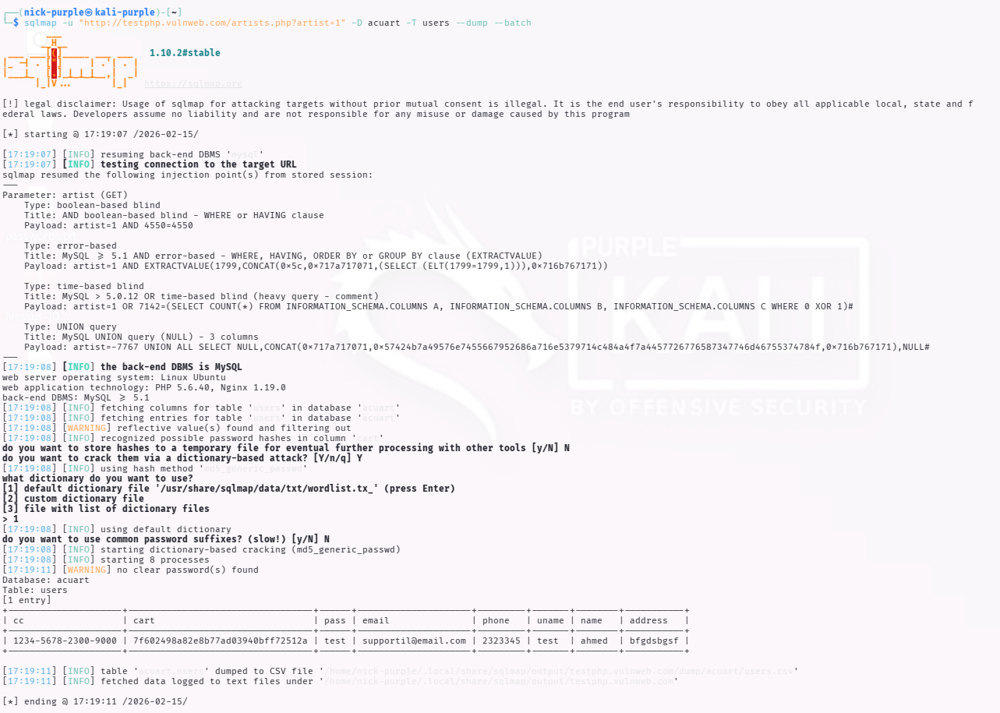

# Automated Vulnerability Assessment: SQL Injection & Data Exfiltration

---

## 1 Executive Summary

Durante l'attività di Security Assessment automatizzato, è stata rilevata una vulnerabilità critica di tipo SQL Injection sull'endpoint `artists.php`.

L'utilizzo dello strumento SQLMap ha permesso di automatizzare l'intero processo di attacco, confermando la possibilità di iniettare comandi arbitrari nel database backend (MySQL).

L'impatto è valutato come Catastrofico per i seguenti motivi:

- Esfiltrazione Totale: È stato possibile scaricare l'intero database utenti.
- Violazione PCI-DSS: Sono stati rinvenuti numeri di Carte di Credito (PAN) memorizzati in chiaro.
- Gestione Credenziali Insicura: Le password degli utenti sono salvate in chiaro (Plaintext), senza alcuna funzione di Hashing.

---

## 2 Technical Execution

#### Phase 1: Vulnerability Scanning & Fingerprinting

In questa fase iniziale, il tool ha interrogato il server per identificare il tipo di database e l'utente corrente. Sono stati rilevati 4 vettori di attacco (Boolean-based, Error-based, Time-based, UNION query).

Comando:

```Bash
sqlmap -u "http://testphp.vulnweb.com/artists.php?artist=1" --batch --banner --current-user --current-db --is-dba
```



Risultato (Recon):

- DBMS: MySQL >= 5.1
- Database Corrente: `acuart`
- Utente Corrente: `acuart@localhost` (Non DBA)

#### Phase 2: Database Enumeration

Una volta identificato il database target (`acuart`), è stata eseguita l'enumerazione delle tabelle per mappare la struttura dei dati e individuare informazioni sensibili.

Comando:

```Bash
sqlmap -u "http://testphp.vulnweb.com/artists.php?artist=1" -D acuart --tables
```



Risultato:

Sono state identificate 8 tabelle. La tabella `users` è stata selezionata come obiettivo primario per l'esfiltrazione.

#### Phase 3: Data Exfiltration (The Breach)

Confermata la presenza della tabella `users`, è stato eseguito il dump completo delle colonne contenenti credenziali e dati personali.

Comando:

```Bash
sqlmap -u "http://testphp.vulnweb.com/artists.php?artist=1" -D acuart -T users --dump --batch
```



Analisi dell'Output (Evidence):

Lo screenshot sottostante mostra l'avvenuta estrazione dei dati. SQLMap ha generato un report CSV contenente i record sensibili, incluse password e carte di credito.

Local File Path:

Il dump completo è stato salvato localmente nel percorso: `~/.local/share/sqlmap/output/testphp.vulnweb.com/dump/acuart/users.csv`

---

## 3 Risk Analysis & Compliance

L'analisi dei dati estratti evidenzia gravi violazioni delle best practice di sicurezza e normative internazionali.

| Dato Estratto | Valore Esempio | Violazione / Rischio |
|---------------|----------------|----------------------|
| Password | test | CRITICA. Le password sono salvate in chiaro (Cleartext). Mancanza totale di Hashing (es. bcrypt, Argon2) e Salting. Un attaccante può impersonare immediatamente qualsiasi utente. |
| Credit Card (CC) | 1234-5678... |CRITICA (PCI-DSS). La memorizzazione del PAN (Primary Account Number) in chiaro è una violazione diretta dello standard PCI-DSS Requirement 3.4. |
| PII Data | Email, Phone, Address | ALTA (GDPR). Esposizione di dati personali che può portare a furto d'identità e sanzioni amministrative elevate. |

---

## 4 Remediation Plan

Per mettere in sicurezza l'infrastruttura, si raccomandano le seguenti azioni correttive immediate:

- Codice Sicuro (Preventivo):
    
    - Implementare Prepared Statements (Query Parametrizzate) in tutto il codice PHP per neutralizzare alla radice l'iniezione SQL.

- Data Protection (Correttivo):

    - Password: Migrare immediatamente tutte le password utente su algoritmi di hashing forti (es. `bcrypt` o `Argon2id`). Mai salvare password in chiaro.

    - Carte di Credito: Non memorizzare mai i dati completi della carta di credito se non strettamente necessario. Se richiesto, utilizzare tokenizzazione tramite Payment Gateway o crittografia forte (AES-256) con gestione sicura delle chiavi.

- Infrastruttura:
    
    - Implementare un Web Application Firewall (WAF) (es. ModSecurity o servizi Cloudflare) per bloccare pattern di attacco SQLMap noti e richieste malevole.