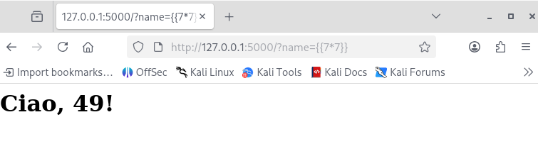
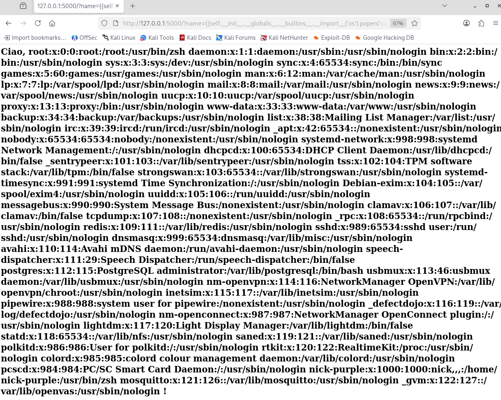
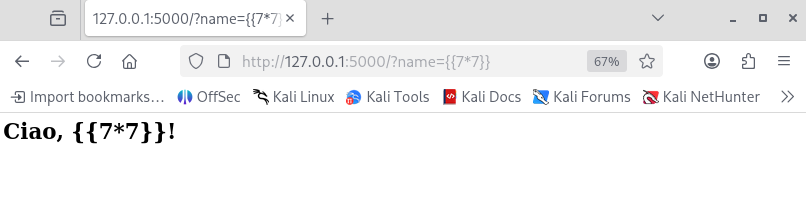

# Vulnerability Assessment: Server-Side Template Injection (SSTI)

---

## 1 Executive Summary

Durante l'analisi di sicurezza dell'applicazione web (ambiente di laboratorio), è stata identificata una vulnerabilità critica di tipo Server-Side Template Injection (SSTI).

Il difetto risiede nella gestione non sicura dell'input utente all'interno del motore di template Jinja2.

Questa vulnerabilità permette a un attaccante remoto e non autenticato di evadere la sandbox dell'applicazione ed eseguire comandi arbitrari sul sistema operativo sottostante (Remote Code Execution).

L'impatto è valutato come CRITICO poiché garantisce all'attaccante il controllo totale del server, l'accesso a file sensibili (es. `/etc/passwd`, chiavi SSH) e la possibilità di pivotare verso la rete interna.

---

## 2 Technical Analysis

#### Fase 1: Detection & Verification

L'attività di ricognizione ha evidenziato che il parametro `name` viene riflesso nella risposta HTML senza adeguata sanitizzazione.
Per confermare l'uso di un motore di template lato server, è stato iniettato un payload matematico.

- Payload: `{{ 7*7 }}`
- Risultato: Il server ha renderizzato `49`. Questo comportamento conferma che l'input viene valutato ed eseguito dal motore Jinja2 prima di essere inviato al client.



#### Fase 2: Exploitation (Remote Code Execution)

Sfruttando la capacità del template engine di accedere agli oggetti interni di Python (tramite Method Resolution Order - MRO), è stato costruito un exploit chain per accedere al modulo `os` ed eseguire comandi di sistema.

Exploit Payload:

```Python
{{ self.__init__.__globals__.__builtins__.__import__('os').popen('cat /etc/passwd').read() }}
```



Analisi dell'Evidenza:

L'iniezione del payload ha avuto successo. Il server ha eseguito il comando shell `cat /etc/passwd` e ne ha restituito l'output standard nel corpo della risposta HTTP.

Come mostrato nello screenshot sottostante, è stato possibile esfiltrare la lista degli utenti di sistema (incluso l'utente `root`), dimostrando la compromissione completa della riservatezza e dell'integrità del sistema.

---

## 3 Root Cause Analysis (Code Review)

L'analisi del codice sorgente (`ssti_vuln.py`) ha rivelato la causa radice del problema. L'applicazione utilizza la concatenazione di stringhe (f-string) per inserire l'input utente nel template prima che questo venga processato dal motore di rendering.

Codice Vulnerabile (Insecure Implementation):

```Python
# VULNERABILITÀ: L'input viene concatenato direttamente nella struttura del template.
person = request.args.get('name', 'Hacker')
template = f"<h1>Ciao, {person}!</h1>" 
return render_template_string(template)
```

In questa configurazione, qualsiasi carattere speciale (come `{{` o `}}`) inserito dall'utente viene interpretato come istruzione di codice dal motore Jinja2.

---

## 4 Remediation Plan

Per mitigare la vulnerabilità, è necessario separare rigorosamente la logica di presentazione dai dati. Non si deve mai concatenare input utente direttamente in una stringa di template.

Secure Coding Pattern:

Utilizzare il meccanismo di contesto nativo di Flask/Jinja2. Passare le variabili come argomenti nominati alla funzione di rendering. Il motore si occuperà automaticamente dell'escaping dei caratteri pericolosi, trattando l'input come semplice testo e non come codice eseguibile.

Codice Corretto (Fix):

```Python
# SOLUZIONE: Passare l'input come variabile di contesto.
person = request.args.get('name', 'Guest')
return render_template_string("<h1>Ciao, {{ person }}!</h1>", person=person)
```

---

## 5 Post-Remediation Verification

Dopo l'implementazione del piano di rientro (Remediation Plan), è stata eseguita una nuova sessione di test per verificare l'efficacia delle contromisure adottate nel codice sorgente.

1. Patch Confirmation

Il codice sorgente è stato aggiornato utilizzando le Context Variables di Jinja2, eliminando la concatenazione diretta tramite f-strings:

```Python
# Codice aggiornato e verificato
person = request.args.get('name', 'Hacker')
return render_template_string("<h1>Ciao, {{ person }}!</h1>", person=person)
```

2. Risultati dei Test di Verifica

Sono stati ripetuti i vettori di attacco precedentemente andati a buon fine.

- Test di Detection (Math Injection): L'inserimento del payload `{{ 7*7 }}` non ha più prodotto l'esecuzione del calcolo lato server.
- Risultato: L'applicazione ha restituito la stringa letterale `{{ 7*7 }}` nel browser. Questo conferma che il motore di template esegue ora l'escaping automatico dei caratteri speciali, trattando l'input esclusivamente come Plain Text.



Evidenza della Mitigazione:

Come mostrato nello screenshot, l'input malevolo viene riflesso fedelmente senza essere interpretato dal server, neutralizzando ogni tentativo di escalation verso RCE.

---

## 6 Conclusioni

La vulnerabilità SSTI è stata correttamente mitigata tramite l'adozione di pratiche di Secure Coding. Si raccomanda di mantenere l'approccio di separazione tra logica e dati per tutti i futuri sviluppi che coinvolgano motori di template.