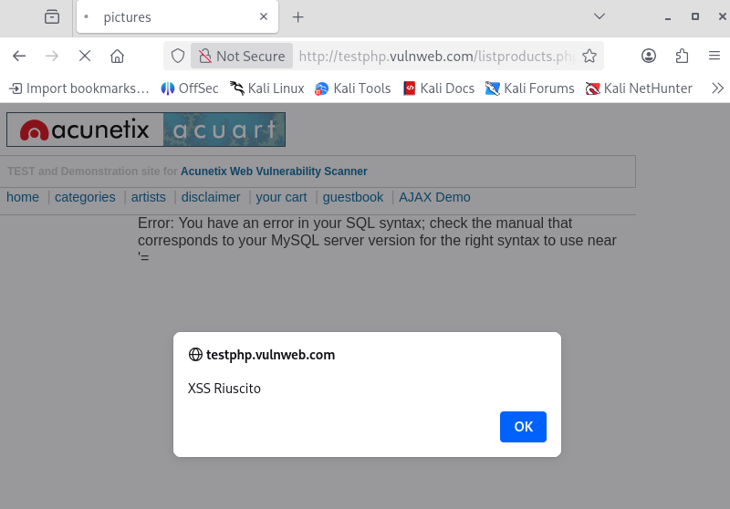
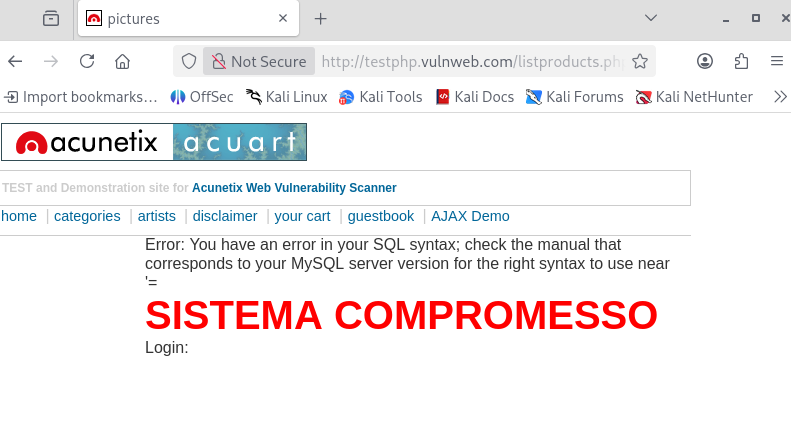

# Vulnerability Assessment: Reflected Cross-Site Scripting (XSS)

---

## 1 Executive Summary

Durante l'analisi dell'applicazione web `testphp.vulnweb.com`, è stata individuata una vulnerabilità di tipo Reflected Cross-Site Scripting (XSS).

L'applicazione non sanitizza correttamente l'input utente fornito tramite i parametri URL, riflettendolo direttamente nel codice HTML della pagina.

Questa vulnerabilità permette a un attaccante di creare link malevoli che, se visitati dalla vittima, eseguono codice JavaScript arbitrario nel contesto del browser dell'utente.

I rischi includono:

- Session Hijacking: Furto di cookie di sessione.
- Phishing: Modifica del contenuto della pagina per ingannare l'utente.
- Redirect Malevoli: Reindirizzamento dell'utente verso siti esterni.

---

## 2 Technical Analysis

#### Scenario A: URL Parameter Injection

L'endpoint `listproducts.php` accetta il parametro `cat` per filtrare i prodotti. È stato verificato che inserendo codice HTML/JavaScript nel valore del parametro, questo viene eseguito dal browser senza filtri.

Vettore d'Attacco:

L'attacco avviene tramite la manipolazione dell'URL. Un attaccante può inviare questo link via email o social engineering.

Payload (Proof of Concept):

```html
http://testphp.vulnweb.com/listproducts.php?cat=<script>alert('XSS Riuscito')</script>
```

Analisi dell'Evidenza:

Come mostrato nello screenshot sottostante, il payload iniettato nell'URL viene processato dal server e incluso nella risposta. Il browser interpreta il tag `<script>` ed esegue la funzione `alert()`, aprendo un popup con il messaggio personalizzato.



#### Scenario B: Virtual Defacement (Phishing Vector)

Oltre all'esecuzione di codice JavaScript, è stato verificato che l'applicazione permette l'iniezione di tag HTML arbitrari (HTML Injection).

Questo vettore è particolarmente critico per attacchi di Social Engineering: un attaccante può sfruttare la fiducia dell'utente nel dominio legittimo (`testphp.vulnweb.com`) per presentare falsi messaggi di errore o moduli di login fraudolenti.

Payload (Defacement & Fake Login):

```html
http://testphp.vulnweb.com/listproducts.php?cat=<h1 style="color:red;font-size:40px">SISTEMA COMPROMESSO</h1><form>Login:<input type="text"><input type="submit"></form>
```

Analisi dell'Evidenza:

Lo screenshot sottostante mostra l'alterazione visiva della pagina. L'applicazione renderizza il titolo "SISTEMA COMPROMESSO" e un campo di input, simulando una richiesta di credenziali. L'errore SQL visibile conferma ulteriormente che l'input non è stato validato come intero.



---

## 3 Remediation Plan

La vulnerabilità Reflected XSS deve essere corretta trattando tutto l'input utente come non fidato.

- Context-Aware Output Encoding (Fondamentale):
    
    Prima di riflettere qualsiasi dato utente nella pagina HTML, convertire i caratteri speciali nelle rispettive HTML Entities.

    - `<` diventa `&lt;`

    - `>` diventa `&gt;`

    - `"` diventa `&quot;`

    - `'` diventa `&#x27;`

Esempio PHP Sicuro:

```PHP
// NON fare questo:
echo "Categoria: " . $_GET['cat'];

// FAI questo:
echo "Categoria: " . htmlspecialchars($_GET['cat'], ENT_QUOTES, 'UTF-8');
```

Input Validation:

Se il parametro `cat` deve essere un numero (ID categoria), forzare il tipo a `Integer` e rifiutare qualsiasi input non numerico.

Content Security Policy (CSP):

Implementare header CSP per limitare le sorgenti da cui il browser può caricare ed eseguire script (es. disabilitare `unsafe-inline`).