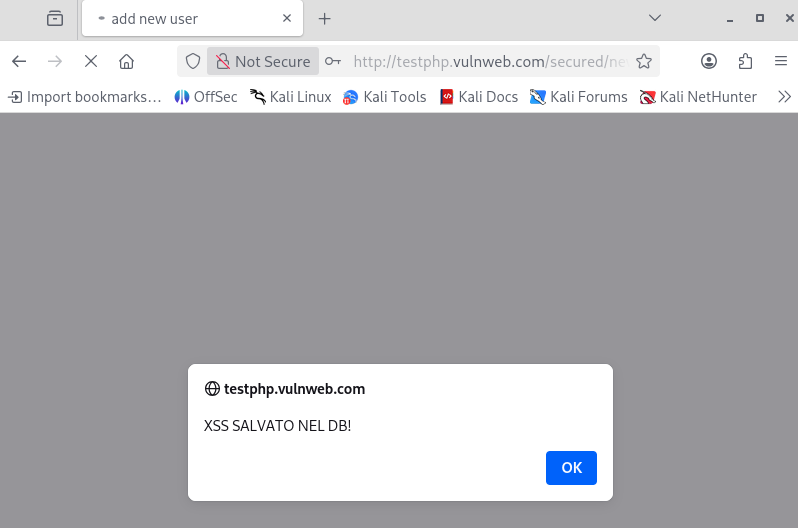

# Vulnerability Assessment: Stored Cross-Site Scripting (XSS)

---

## 1 Executive Summary

Durante l'analisi dell'applicazione `testphp.vulnweb.com`, è stata individuata una vulnerabilità critica di tipo Stored Cross-Site Scripting (XSS).

A differenza della variante "Reflected", in questo caso il codice malevolo viene salvato permanentemente nel database dell'applicazione.

La vulnerabilità risiede nel processo di registrazione utente e modifica profilo. L'applicazione memorizza l'input utente senza sanitizzazione e lo ripropone a chiunque visualizzi quel profilo (incluso l'utente stesso o un amministratore).

L'impatto è critico poiché l'attacco non richiede che la vittima clicchi su un link specifico: basta che visualizzi la pagina infetta per eseguire il codice (es. furto cookie admin).

---

## 2 Technical Analysis

#### Scenario: Profile Persistence Injection

Il modulo di registrazione permette l'inserimento di dati anagrafici. È stato verificato che il campo "Address" accetta e salva tag HTML e JavaScript.

Procedura di Exploitation:

1.  L'attaccante accede alla pagina di registrazione (`/signup.php`).

2.  Compila il form inserendo il payload malevolo nel campo Address.

3.  Invia il form. Il server salva il payload nel database.

Payload Utilizzato:

```html
Via Roma 1 <script>alert('XSS SALVATO NEL DB!')</script>
```

Analisi dell'Evidenza:

Come mostrato nello screenshot sottostante, non appena l'applicazione recupera i dati dal database per mostrarli (nella conferma di registrazione o nel pannello profilo), lo script viene iniettato nel DOM ed eseguito.

Il popup conferma che il codice JavaScript è stato persistito ed eseguito dal contesto dell'applicazione.



---

## 3 Remediation Plan

La mitigazione della Stored XSS richiede interventi rigorosi sia in ingresso che in uscita.

- Input Validation (Allow-list):
    
    Validare i dati in arrivo. Il campo "Indirizzo" non dovrebbe contenere caratteri come `<` o `>`. Rifiutare l'input se non conforme.

- Output Encoding (Cruciale):
    
    Ogni volta che i dati vengono prelevati dal database e inseriti in una pagina HTML, devono essere codificati.

    - PHP: Utilizzare `htmlspecialchars($address, ENT_QUOTES, 'UTF-8')`.

    - Questo trasforma `<script>` in `&lt;script&gt;`, che viene visualizzato come testo sicuro e non eseguito.

- Sanitization Libraries:
    
    Se è necessario permettere un po' di HTML (es. grassetto o corsivo), utilizzare librerie di sanitizzazione affidabili (come DOMPurify per JS o HTML Purifier per PHP) che rimuovono solo i tag pericolosi (script, iframe, object).