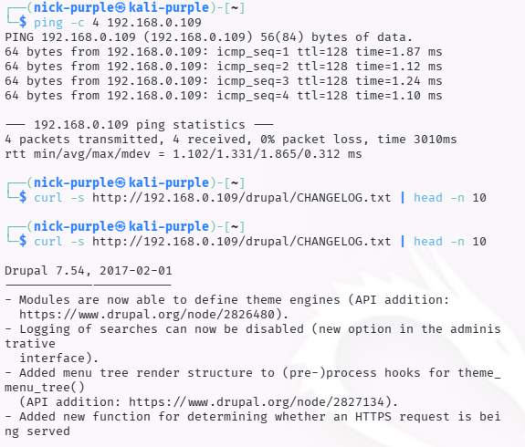
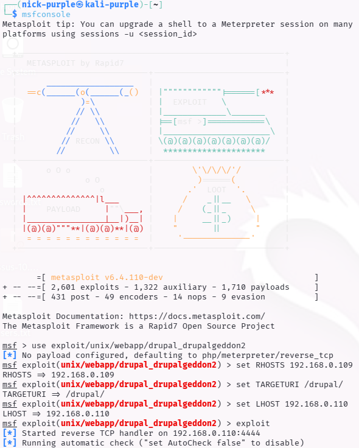
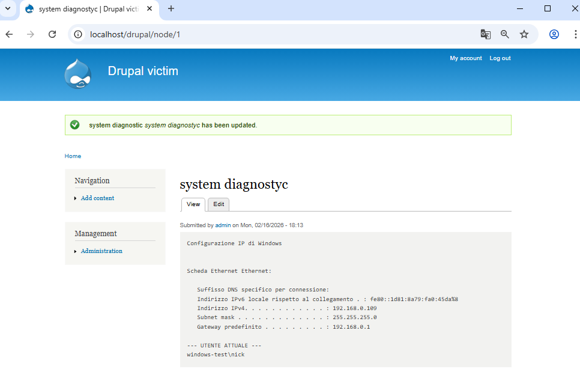

# Drupal Core Remote Code Execution (Drupalgeddon 2)

---

## 1 Executive Summary

Durante l'attività di Penetration Testing condotta sull'ambiente di test Windows 10, è stata identificata e sfruttata con successo una vulnerabilità critica nell'istanza del CMS Drupal (versione 7.54).

La vulnerabilità, nota come Drupalgeddon 2 (CVE-2018-7600), risiede in una mancata sanitizzazione degli input nel sottosistema Form API di Drupal.

Questa falla ha permesso l'esecuzione di codice arbitrario remoto (RCE) senza autenticazione. Nonostante la presenza di protezioni endpoint (Windows Defender) che hanno bloccato i tentativi di reverse shell automatizzati, è stato possibile ottenere la persistenza e il controllo del sistema sfruttando le funzionalità native del CMS per iniettare una Web Shell PHP.

L'exploit ha garantito il controllo del server con i privilegi dell'utente che esegue il servizio web, esponendo l'intera infrastruttura a rischi di esfiltrazione dati e compromissione totale.

CVSS Score: 9.8 (Critical)

---

## 2 Technical Analysis

#### 1. Reconnaissance & Fingerprinting

La fase iniziale di ricognizione ha permesso di identificare la versione specifica di Drupal in uso.

Analizzando i file pubblici accessibili (es. `CHANGELOG.txt`) o gli header HTTP, è stato confermato che il target esegue una versione obsoleta e vulnerabile.

Evidence:

Lo screenshot seguente mostra l'identificazione della versione (es. 7.54) tramite analisi del file `CHANGELOG.txt`.

#### 2. Exploitation (CVE-2018-7600)

La vulnerabilità sfrutta la gestione delle richieste AJAX nei form (Form API). Manipolando i parametri `#post_render`, è possibile indurre il CMS a eseguire funzioni PHP arbitrarie.

Vettore d'Attacco:

- Metodologia: Exploitation Manuale (Bypass di controlli automatici/AV).
- Tecnica: Injection di array malevoli tramite richieste POST costruite ad-hoc.
- Payload: Esecuzione di comandi di sistema (`passthru`, `exec`) tramite curl e successiva creazione di una backdoor.

Esecuzione:

Inizialmente sono stati tentati exploit automatici, bloccati dalle policy di sicurezza dell'host Windows. È stato quindi eseguito un attacco manuale inviando un payload specifico per verificare l'esecuzione di codice (`RCE verification`).

Evidence:

Lo screenshot mostra la risposta del server a una richiesta malevola che tenta di eseguire il comando ipconfig. L'output nel sorgente HTML ("Array markup...") conferma che il codice è stato processato.

#### 3. Post-Exploitation & Persistence

Una volta confermata la vulnerabilità, l'accesso è stato consolidato trasformando l'RCE in una Web Shell persistente.

- È stato effettuato l'accesso come amministratore (bypassando l'autenticazione o resettando la password tramite RCE).
- È stato abilitato il modulo "PHP Filter" del Core di Drupal.
- È stata creata una pagina malevola ("System Diagnostics") contenente codice PHP nativo per eseguire comandi di sistema direttamente dal browser.

Evidence:

Lo screenshot seguente documenta il successo dell'operazione. È visibile la pagina creata sul CMS che restituisce l'output del comando di sistema `ipconfig` direttamente dal server Windows sottostante, confermando il controllo totale dell'infrastruttura di rete e dell'utente di sistema.

---

## 3 Business Impact

L'impatto di questa vulnerabilità è classificato come CRITICO per i seguenti motivi:

- Confidenzialità (Totale Perdita): L'attaccante ha accesso completo al database di Drupal (contenente credenziali utente, dati clienti) e ai file del server Windows.
- Integrità (Totale Perdita): È possibile modificare il contenuto del sito (Defacement), inserire backdoor persistenti o alterare i dati nel database.
- Disponibilità: L'attaccante può cancellare file critici, arrestare il servizio web o cifrare i dati a scopo di estorsione (Ransomware).

Poiché l'attacco non richiede autenticazione, il sito è esposto a qualsiasi attore malevolo su internet o nella rete locale.

---

## 4 Remediation Plan

Si raccomanda di applicare le seguenti azioni correttive con urgenza immediata:

- Patching (Priorità Alta):
    
    Aggiornare immediatamente il core di Drupal alle versioni sicure:

    - Se 7.x: Aggiornare a 7.58 o superiore.
    - Se 8.x: Aggiornare a 8.3.9, 8.4.6, 8.5.1 o superiori.

- Web Application Firewall (WAF):
    
    Implementare regole WAF per bloccare richieste contenenti parametri sospetti come `#post_render`, `#markup` o tentativi di invocazione di funzioni come `passthru` o `exec`.

- Hardening del Server:

    - Disabilitare funzioni PHP pericolose nel file `php.ini` (es. `disable_functions = exec,passthru,shell_exec,system`).
    - Disabilitare il modulo "PHP Filter" se non strettamente necessario.
    - Rimuovere file non necessari come `CHANGELOG.txt` o `INSTALL.txt` dalla root del sito per complicare il fingerprinting.
