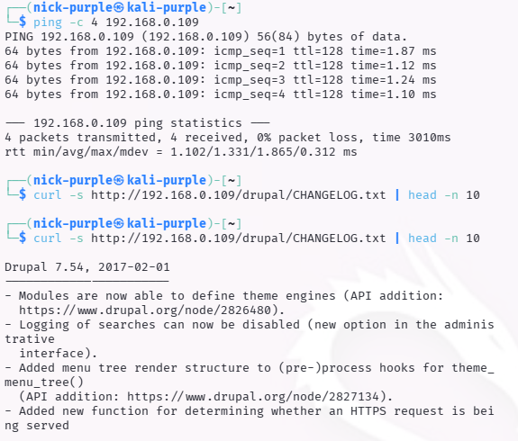
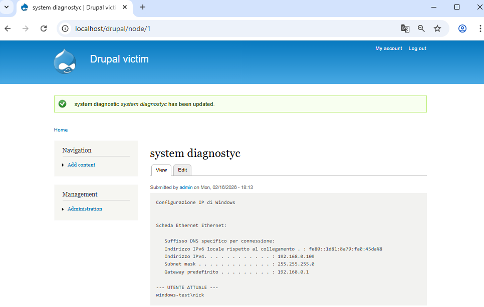

# Drupal Core Remote Code Execution (Drupalgeddon 2)

> - **Fase:** Web Attack - CMS Exploitation
> - **Visibilita:** Media - richieste HTTP POST con payload verso form Drupal, rilevabile ma spesso non bloccato da WAF generici
> - **Prerequisiti:** Istanza Drupal versione 6.x, 7.x (< 7.58) o 8.x (< 8.3.9) identificata, connessione di rete al target
> - **Output:** Remote Code Execution non autenticata, accesso dashboard admin Drupal, deploy Web Shell PHP, controllo server, finding WEB-015

---

**ID Finding:** `WEB-015` | **Severity:** `Critico` | **CVSS v3.1:** 9.8

---

## 1 Executive Summary

Durante l'attività di Penetration Testing condotta sull'ambiente di test Windows 10, è stata identificata e sfruttata con successo una vulnerabilità critica nell'istanza del CMS Drupal (versione 7.54).

La vulnerabilità, nota come Drupalgeddon 2 (CVE-2018-7600), risiede in una mancata sanitizzazione degli input nel sottosistema Form API di Drupal.

Questa falla ha permesso l'esecuzione di codice arbitrario remoto (RCE) senza autenticazione. Nonostante la presenza di protezioni endpoint (Windows Defender) che hanno bloccato i tentativi di reverse shell automatizzati, è stato possibile ottenere la persistenza e il controllo del sistema sfruttando le funzionalità native del CMS per iniettare una Web Shell PHP.

L'exploit ha garantito il controllo del server con i privilegi dell'utente che esegue il servizio web, esponendo l'intera infrastruttura a rischi di esfiltrazione dati e compromissione totale.

CVSS Score: 9.8 (Critical)

---

## 2 Technical Analysis

#### 1. Reconnaissance & Fingerprinting

La fase iniziale di ricognizione ha permesso di identificare la versione specifica di Drupal in uso.

Analizzando i file pubblici accessibili (es. `CHANGELOG.txt`) o gli header HTTP, è stato confermato che il target esegue una versione obsoleta e vulnerabile.

Evidence:

Lo screenshot seguente mostra l'identificazione della versione (es. 7.54) tramite analisi del file `CHANGELOG.txt`.

#### 2. Exploitation (CVE-2018-7600)

La vulnerabilità sfrutta la gestione delle richieste AJAX nei form (Form API). Manipolando i parametri `#post_render`, è possibile indurre il CMS a eseguire funzioni PHP arbitrarie.

Vettore d'Attacco:

- Metodologia: Exploitation Manuale (Bypass di controlli automatici/AV).
- Tecnica: Injection di array malevoli tramite richieste POST costruite ad-hoc.
- Payload: Esecuzione di comandi di sistema (`passthru`, `exec`) tramite curl e successiva creazione di una backdoor.

Esecuzione:

Inizialmente sono stati tentati exploit automatici, bloccati dalle policy di sicurezza dell'host Windows. È stato quindi eseguito un attacco manuale inviando un payload specifico per verificare l'esecuzione di codice (`RCE verification`).

#### 3. Post-Exploitation & Persistence

Una volta confermata la vulnerabilità, l'accesso è stato consolidato trasformando l'RCE in una Web Shell persistente.

- Privilege Escalation / Accesso Amministrativo: È stato ottenuto l'accesso alla dashboard di amministrazione di Drupal (bypassando l'autenticazione o resettando la password tramite RCE).
- Abilitazione Modulo Vulnerabile: È stato attivato il modulo core "PHP Filter", che consente l'esecuzione di codice PHP all'interno dei nodi di contenuto.
- Deploy della Web Shell: È stata creata una pagina dissimulata denominata "system diagnostyc". All'interno del corpo della pagina è stato iniettato un payload PHP (`<?php system("ipconfig"); ?>`) configurando il formato di testo come "PHP code".

Evidence:

Lo screenshot seguente documenta il successo dell'operazione. È visibile la pagina creata sul CMS che restituisce l'output del comando di sistema `ipconfig` direttamente dal server Windows sottostante, confermando il controllo totale dell'infrastruttura di rete e dell'utente di sistema.

---

## 3 Business Impact

L'impatto di questa vulnerabilità è classificato come CRITICO per i seguenti motivi:

- Confidenzialità (Totale Perdita): L'attaccante ha accesso completo al database di Drupal (contenente credenziali utente, dati clienti) e ai file del server Windows.
- Integrità (Totale Perdita): È possibile modificare il contenuto del sito (Defacement), inserire backdoor persistenti o alterare i dati nel database.
- Disponibilità: L'attaccante può cancellare file critici, arrestare il servizio web o cifrare i dati a scopo di estorsione (Ransomware).

Poiché l'attacco non richiede autenticazione, il sito è esposto a qualsiasi attore malevolo su internet o nella rete locale.

---

## 4 Remediation Plan

Si raccomanda di applicare le seguenti azioni correttive con urgenza immediata:

- Patching (Priorità Alta):
    
    Aggiornare immediatamente il core di Drupal alle versioni sicure:

    - Se 7.x: Aggiornare a 7.58 o superiore.
    - Se 8.x: Aggiornare a 8.3.9, 8.4.6, 8.5.1 o superiori.

- Web Application Firewall (WAF):
    
    Implementare regole WAF per bloccare richieste contenenti parametri sospetti come `#post_render`, `#markup` o tentativi di invocazione di funzioni come `passthru` o `exec`.

- Hardening del Server:

    - Disabilitare funzioni PHP pericolose nel file `php.ini` (es. `disable_functions = exec,passthru,shell_exec,system`).
    - Disabilitare il modulo "PHP Filter" se non strettamente necessario.
    - Rimuovere file non necessari come `CHANGELOG.txt` o `INSTALL.txt` dalla root del sito per complicare il fingerprinting.

---

## Mappatura MITRE ATT&CK

| Tattica | Tecnica | ID MITRE | Descrizione dell'Azione |
| :--- | :--- | :--- | :--- |
| Reconnaissance | Active Scanning: Vulnerability Scanning | `T1595.002` | Fingerprinting della versione Drupal 7.54 tramite accesso al file `CHANGELOG.txt` pubblico e identificazione della vulnerabilita CVE-2018-7600 (WEB-015) |
| Initial Access | Exploit Public-Facing Application | `T1190` | Exploitation manuale di CVE-2018-7600 tramite manipolazione dei parametri `#post_render` nel Form API di Drupal per ottenere RCE non autenticata (WEB-015) |
| Persistence | Server Software Component: Web Shell | `T1505.003` | Deploy di Web Shell PHP attraverso il modulo "PHP Filter" di Drupal, creando una pagina "system diagnostyc" che esegue comandi di sistema (WEB-015) |
| Discovery | File and Directory Discovery | `T1083` | Esecuzione del comando `ipconfig` tramite Web Shell per mappare la configurazione di rete del server Windows sottostante (WEB-015) |

---

> **Nota:** Il finding WEB-015 e stato documentato su un'istanza Drupal 7.54 installata in locale
> su una macchina virtuale Windows 10, configurata come ambiente di test per scopi didattici.
> CVE-2018-7600 e una vulnerabilita di alto profilo del 2018 (Drupalgeddon2) con patch disponibili
> da marzo 2018. Qualsiasi istanza Drupal non aggiornata alla versione 7.58 o superiore in
> ambienti di produzione rappresenta un rischio critico immediato.
