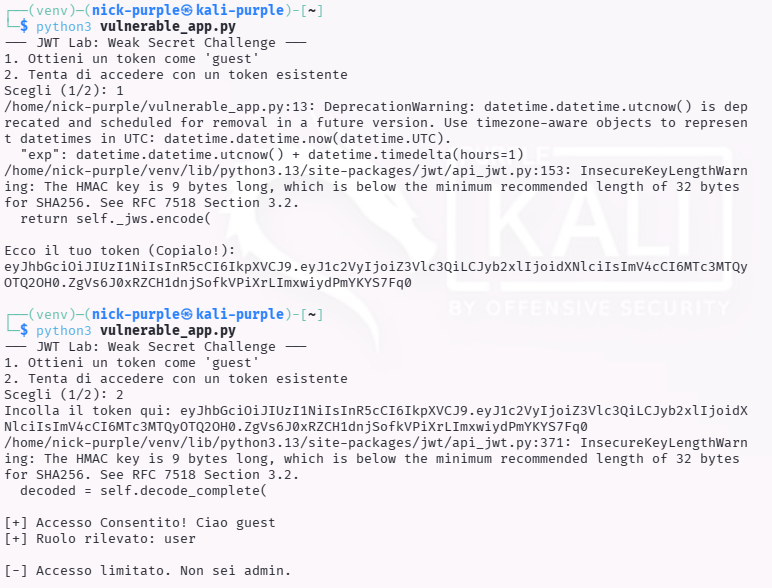
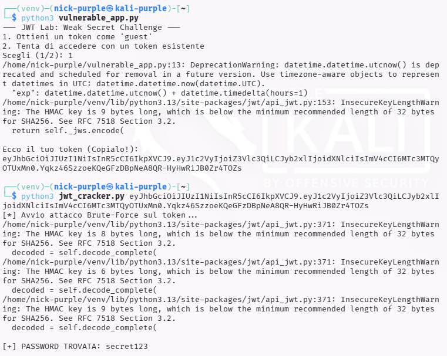
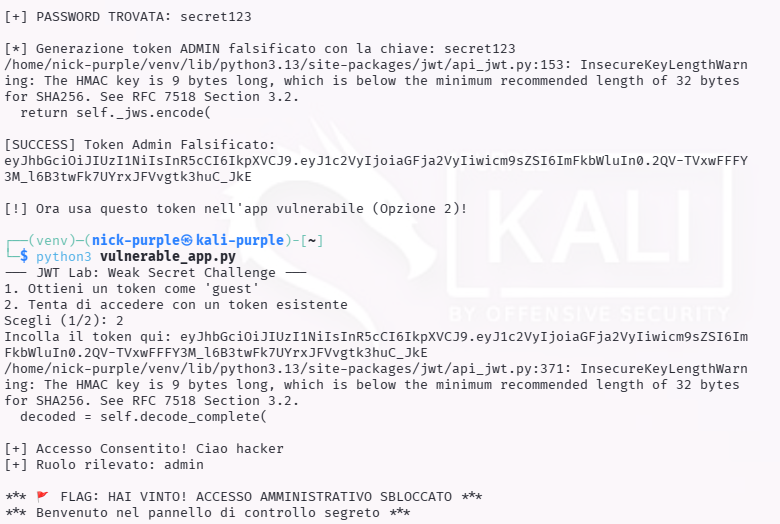

> **English** | [Italiano](README.md)

# JWT Authentication Mechanism

> - **Phase:** Web Attack - API Security (JWT)
> - **Visibility:** Low - JWT signature brute force is offline, no requests to the server during the cracking phase
> - **Prerequisites:** Valid JWT token obtained as an authenticated user (even with base permissions), brute force tool (hashcat, jwt_tool)
> - **Output:** Secret key recovered (`secret123`), forged admin token, access to privileged functionality, finding WEB-012

---

**Finding ID:** `WEB-012` | **Severity:** `Critical` | **CVSS v3.1:** 9.8

---

## 1 Executive Summary

During the analysis of the target application's authentication mechanism, a critical vulnerability was identified in the session token management (JWT - JSON Web Tokens).

The application uses a weak secret key ("Weak Secret") to digitally sign the tokens. This allowed the analyst to perform an offline brute force attack, recover the secret key, and generate arbitrary tokens.

Impact: An attacker can impersonate any user, including the administrator, gaining complete control of the application (Privilege Escalation & Account Takeover).

---

## 2 Technical Vulnerability Details
Description

The application issues JWT tokens signed with the HS256 algorithm (HMAC with SHA-256). This is a symmetric algorithm, meaning the same key is used both to sign and to verify the token.

The security of HS256 depends entirely on the complexity of the secret key (`SECRET_KEY`). The analysis revealed that the key used was a simple string found in common password dictionaries (`secret123`).

Attack Vector

- Collection: The attacker requests a legitimate token as a "guest" user.



- Analysis: The token is analyzed. The header {`"alg": "HS256"`} confirms the use of symmetric cryptography.
- Cracking: A brute-force script (`jwt_cracker.py`) is launched, attempting to verify the token signature using a list of common passwords.



- Forging: Once the password is found (`secret123`), the attacker modifies the token payload by changing the role from `user` to `admin` and recalculates the valid signature.

Proof of Concept (PoC)

Original Token (Guest):

```JSON
Header: {"alg": "HS256", "typ": "JWT"}
Payload: {"user": "guest", "role": "user"}
Signature: [Valid signature with 'secret123']
```

Forged Token (Admin):

```JSON
Header: {"alg": "HS256", "typ": "JWT"}
Payload: {"user": "hacker", "role": "admin"}  <-- MODIFIED
Signature: [New signature calculated by the attacker]
```

When the forged token is sent to the application, it is accepted as authentic and grants administrative privileges, displaying the message: FLAG: HAI VINTO! .



---

## 3 Root Cause Analysis (Vulnerable Code)

Below is the analysis of the Python code responsible for the vulnerability.

Vulnerable Code (Hardcoded Weak Secret)

The error lies in using a short, predictable string hardcoded in the source code.

```Python
# VULNERABLE
import jwt

# 1. The key is too short and simple (susceptible to brute-force)
# 2. The key is hardcoded in the code (visible if the code leaks)
SECRET_KEY = "secret123" 

def create_token(user):
    payload = {"user": user, "role": "user"}
    return jwt.encode(payload, SECRET_KEY, algorithm="HS256")
```

---

## 4 Remediation (Secure Coding)

To mitigate this vulnerability, two possible approaches are recommended.

#### Solution A: Strong Secret (If HS256 is retained)

If HS256 must be used, the key must be a high-entropy random string (minimum 32-64 characters) and must never be written in the code, but loaded from environment variables.

```Python
# SECURE (Symmetric Approach)
import jwt
import os

# Load the key from environment variables or raise an error
# In production: export JWT_SECRET='long_random_and_complex_string_!@#123'
SECRET_KEY = os.environ.get("JWT_SECRET")

if not SECRET_KEY or len(SECRET_KEY) < 32:
    raise ValueError("JWT secret key is missing or too weak!")

def create_token(user):
    # ... same logic ...
```

#### Solution B: Asymmetric Cryptography (RS256) - Recommended

The best approach for distributed systems is to use a key pair (Private for signing, Public for verifying). Even if an attacker finds the public key, they cannot create new tokens.

```Python
# SECURE (Asymmetric Approach)
# private_key.pem -> Used ONLY by the authentication server to SIGN
# public_key.pem  -> Distributed to services to VERIFY

with open("private_key.pem", "rb") as f:
    PRIVATE_KEY = f.read()

def create_token(user):
    payload = {"user": user, "role": "user"}
    # RS256 uses the private key
    return jwt.encode(payload, PRIVATE_KEY, algorithm="RS256")
```

---

## 5 Conclusions

Using weak "secrets" in JWTs defeats the entire purpose of the cryptographic signature. The ease with which offline brute force can be performed (without alerting the server with network traffic) makes this vulnerability extremely dangerous.

Immediate rotation of cryptographic keys and adoption of environment variables for secret management is recommended.

---

## MITRE ATT&CK Mapping

| Tactic | Technique | MITRE ID | Action Description |
| :--- | :--- | :--- | :--- |
| Credential Access | Brute Force: Password Cracking | `T1110.002` | Offline brute force of the HMAC-SHA256 signature of the JWT token using `jwt_cracker.py` with a dictionary, recovering the key `secret123` (WEB-012) |
| Defense Evasion | Use Alternate Authentication Material | `T1550` | Use of the forged JWT token with payload `{"role": "admin"}` and recalculated signature to access administrative functionality (WEB-012) |
| Lateral Movement | Valid Accounts: Cloud Accounts | `T1078.003` | Impersonation of the admin account through a forged JWT token, gaining complete access to the application (WEB-012) |

---

> **Note:** The JWT vulnerability was identified on a local Flask/Python lab application.
> The weak key `secret123` was deliberately chosen for demonstration purposes.
> Finding WEB-012 demonstrates that offline JWT brute force is a silent attack: no
> server-side logs, no applicable rate limiting, and no IDS can detect it during the
> cracking phase.
